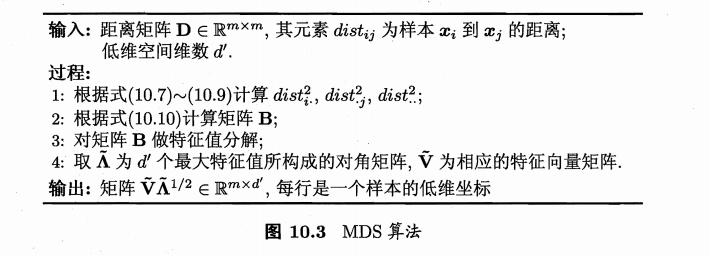

## 机器学习

**机器学习的研究目标** ：利用经验改善系统自身的性能

**机器学习的目标**：从原始数据中提取特征，学习一个映射函数$f$将上述特征（或原始数据）映射到语义空间，寻找数据和任务目标之间的关系

**训练的根本目标：** 获得泛化能力（应对未来未见测试样本的能力）

- 以数据为经验载体，利用经验数据不断提高性能的计算机系统/程序/算法

**基本假设**：每个样本都是在一个**独立同分布（independent and identically distributed）**上采样获得的。

!!! info "**一些术语**"
	版本空间、假设空间、归纳偏好

!!! note "**No Free Lunch Theorem**"

	一个算法在某一类问题上的优势，必然以在另一类相反问题上的劣势为代价。

### 机器学习的分类

- 根据训练数据是否拥有标记信息：分为**监督学习**和**无监督学习**

- 学习任务通过标记的情况：分为**分类任务**、**回归任务**和**聚类任务**

### 模型评估与选择

关注点：**经验性能$E$**（历史表现）与**泛化性能$E^*$**(未来表现得不到) iid假设下

一般训练结果会有两种情况：**过拟合**、**欠拟合**

- 模型比较： 比较检验
- 模型评价理论基础： 偏差与方差

#### 评估方法

> 通常以测试集上的“测试误差”作为泛化误差的近似

- **留出法（hold-out）**

- **交叉验证法（cross-validation）**

- **自助法（bootstrapping）**:

**调参与最终模型**

- 模型在实际使用中遇到的数据称为**测试数据**
- 模型评估与选择中用于评估测试的数据集常称为**验证集（validation set）**，在验证集上确定参数，付诸于最终模型和测试

#### 性能度量（performance measure）

- 衡量模型泛化能力的评价标准

- **回归任务**：最常用性能度量 “均方误差”

- **分类任务**：最常用错误率和精度作为性能度量（公式参照P29）

**搜索**： 正例被预测出来的比率或者预测出来的正例中正确的比率

| 真实情况\预测结果| 正例 | 反例 |
|--- |---|---|
|正例|TP（真正例） | FN（假反例）|
|反例|FP（假正例） | TN（真正例）|

$查准率 P= \frac{TP}{TP + FP}$

$查全率 R= \frac{TP}{TP + FN}$

**P-R曲线**查准率为纵轴、查全率为横轴

**平衡点（Break-Event Point, 简称：BEP）**： 曲线上“查准率=查全率”时的取值，评估P-R 曲线的性能

- BEP过于简化，我们进一步有F1 度量

$F_1 = \frac{2 \times P \times R}{P + R} = \frac{2 \times TP}{样例总数 + TP - TN}$

- 更一般形式，我们对于查准率和查全率有不同的重视程度

$F_\beta = \frac{(1+\beta^2)\times P \times R}{(\beta^2 \times P + R)}$

- $\beta = 1$:标准F1
- $\beta > 1$:查全率（逃犯追查）
- $\beta < 1$:查准率（商品推荐）

- 当我们有多个混淆矩阵时，先分别计算查准率和查全率，再做平均后做后续计算，得到**宏F1（macro-F1）**，若先将矩阵的对应元素取平均，再做后续计算，则得到**微F1（micro-F1）**

**ROC曲线**：假正例率作为横轴，真正例率作为纵轴.根据学习器的预测结果对样例（连续值预测输出）排序，按次顺序逐个把样本作为正例预测。

- 给定$m^+$个正例和$m^-$的反例，若当前点为真正例则对应标记点$(x,y+\frac{1}{m^+})$；反之则对应标记点坐标为$(x + \frac{1}{m^-},y)$

- 假正例率：$FPR = \frac{FP}{FP + TN}$
- 真正例率：$TPR = \frac{TP}{TP + FN}$

**AUC值**：ROC曲线下的面积 | 衡量了样本预测的排序质量

**代价敏感错误率**：非均等的代价求和平均

- 为错误赋予**非均等代价**
- 代价矩阵:$cost_{ij}$表示将第$i$类预测为第$j$类的代价.
- 二分类任务为例

|真实\预测| 第 0 类 | 第 1 类|
|---|---|---|
|第0类| 0|$cost_{01}$ |
|第1类|$cost_{10}$ | 0 |

- 非均等代价下，ROC曲线无法直接反映出学习器的期望总体代价，但是“代价曲线（cost curve）”可以.
- 横轴为正例概率代价$P(+)cost = \frac{p \times cost_{01} }{p \times cost_{01} + (1-p) \times cost_{10} }$, 其中$p$是样例为正例的概率
- 纵轴为归一化代价$cost_{norm} = \frac{FNR \times p \ times cost_{01} + FPR \times (1-p) \times cost_{10} }{p \times cost_{01} + (1-p) \times cost_{10} }$ 其中$FNR = 1- TPR$是假反例率
- ROC曲线上每个点，都对应代价平面上一条线段，取所有线段的下界，围成的面积为在所有条件下学习器的期望总体代价

#### 比较检验： 估计泛化性能

> 性能比较：测试性能不等于泛化性能，测试性能随测试集变化，机器学习算法本身具有随机性

统计假设检验（hypothesis test）为学习器性能比较提供了重要依据：

- 基于假设检验结果，我们可以推断，若在测试集上观察到学习器A比B好，则A的泛化性能是否在统计意义上优于B，以及这个结论的把握有多大。

**假设检验**：

泛化错误率为$\epsilon$的学习器被测得测试错误率为$\hat{\epsilon}$的概率：

$$P(\hat{\epsilon};\epsilon) = \binom{m}{\hat{\epsilon} \times m} \epsilon^{\hat{\epsilon} \times m}(1-\epsilon)^{m-\hat{\epsilon}\times m}$$

- 对$\epsilon$求偏导可知，当$\epsilon = \hat{\epsilon}$时，概率最大，符合二项分布

**二项检验**：置信度

- 简单解释：在假设为真的前提下的到观测结果的概率与我们愿意冒的风险做比较，来确定假设的置信度 

- 考虑假设$\epsilon \leq \epsilon_0$,则在$1-\alpha$的概率内所用观测到的最大错误率如下式计算：

$$\bar{\epsilon} = max \epsilon \quad s.t. \sum^{m}_{i=\epsilon_0 \times m + 1} \binom{m}{i}(1-\epsilon)^{m-i} < \alpha$$

- 假若测试错误率$\hat{\epsilon}$小于临界值$\bar{\epsilon}$，则根据二项检验可以得出结论：在$\alpha$的显著度下，假设$\epsilon \leq \epsilon_0$不能被拒绝.

- 很多时候我们会做多次训练和训练，得到多个测试错误率，此时可以使用**t-检验(t-test)**（P40）
- 进一步有**交叉验证t-检验**（P41）、**McNemar检验**、**Firedman检验**与**Nemenyi后续检验**

#### 偏差与方差 | 为什么具有这样性能

以回归任务为例：学习算法的期望预期为：

$$\bar{f}(x) = E_D [f(x;D)]$$

使用样本数目相同的不同训练集产生的方差为

$$var(x) = E_D[(f(x;D)-\bar{f}(x))^2]$$

噪声为:

$$\epsilon^2 = E_D[(y_D - y)^2]$$

期望输出与真实标记的差别称为偏差

假设噪声期望为0，期望泛化误差拆解为偏差、方差与噪声之和

$$E(f;D) = E_D[(f(x;D)-\bar{f}(x))^2] + (\bar{f}(x) - y ) ^2 + E_D[(y_d - y)^2]$$

$$E(f;D)=bias^2(x) + var(x) + \epsilon^2$$

一般来说，偏差与方差有冲突，偏差-方差窘境（bias-variance dilemma）

- 欠拟合时，偏差主导泛化错误率
- 拟合程度增强，方差逐渐主导泛化误差
- 拟合能力过强，训练数据轻微扰动会导学习器显著变化

### 线性模型

- $f(x_i;W,b)$ $W$ 为参数 $x_i$为特征 $b$为偏置项

- 支持向量机、神经网络

## 监督学习
### 回归分析

> 回归内容需要重写

####  归档材料

[20250920 | 线性模型](https://inkstarchen.github.io/LifeNote/pages/62b3ce/#%E7%BA%BF%E6%80%A7%E6%A8%A1%E5%9E%8B)
[20250922 | 附加内容](https://inkstarchen.github.io/LifeNote/pages/9c35b1/#%E9%99%84%E5%8A%A0%E5%86%85%E5%AE%B9%E7%BA%BF%E6%80%A7%E6%A8%A1%E5%9E%8B)

#### 一元线性回归

符号表示

- m: 训练集样本数
- x：输入变量/特征
- y：输出变量/目标变量
- （x，y）：一个训练样本
- $(x^{(i)},y^{(i)})$:第i个训练样本
- h:代表学习算法的解决方案或函数也称为假设

代价函数

- 损失函数在整个训练集上的平均

单变量线性回归

$$\frac{1}{2m}\sum^m_{i=1}(h_\theta (x^{(i)})-y^{(i)})^2$$

梯度下降

$$\theta_j:= \theta_j - \alpha \frac{\partial}{\partial \theta_j}J(\theta_0,\theta_1)$$

类型

- 批量梯度下降(Batch Gradient Descent, BGD) ^e0f401
	- 每一步使用整个训练集的全部样本
- 随机梯度下降(Stochastic Gradient Descent,SGD)
	- 每次只用一个样本，收敛快，但可能出现目标函数震荡不稳定线性
- 小批量梯度下降(Mini-batch Gradient Descent, MBGD)
	- 使用一部分样本，最常用

#### 多元线性回归

- 有$m$个训练数据$\{(x_i,y_i)\}^m_{i=1}$.要找到参数$\textbf{a}$,使线性函数$f(x_i) = a_0 + \textbf{a}^Tx_i$最小化均方误差函数
最小化均方误差函数$$J_m=\frac{1}{m}\sum^m_{i=1}(y_i-f(x_i))^2=(\textbf{y}-\textbf{X}^T\textbf{a})^T(\textbf{y-}\textbf{X}^T\textbf{a})$$

矩阵来表示所有训练数据和数据标签

$$X=[x_1,\cdots,x_m], \textbf{y} = [y_1,\cdots,y_m]$$

均方误差函数可以表示为:

$$J_m(a)=(\textbf{y}-X^Ta)^T(\textbf{y}-X^Ta)$$

对所有参数$a$求导可得：

$$\nabla J(a)=-2X(y-X^Ta)$$

从而推得

$$a=(XX^T)^{-1}X\textbf{y}$$

#### 逻辑回归 / 对数几率回归
- 线性回归对离群点非常敏感，导致模型不稳定，为了缓解这个问题可以考虑逻辑斯蒂回归（logistic regression）

- 研究某一事件发生得概率$P=P(y=1)$与若干因素之间的关系

$$p=\beta_0+\beta_1x_1+\cdots+\beta_q x_q$$

logit函数(逻辑变换)

$$f(p)=ln\frac{\pi(x)}{1-\pi(x)}=ln\frac{p}{1-p}$$

- 当概率在0-1取值时,Logit可以取任意实数，避免了线性概率模型的结构缺陷

logistic变换$$ln\frac{p}{1-p}\in(-\infty,+\infty)$$

logistic回归模型

- 在回归模型中引入sigmoid函数的一种非线性回归模型

$$ln\frac{p}{1-p}=\beta_0+\beta_1x_1+\cdots+\beta_qx_q$$

优势比(Odds Ratio)——事件发生与不发生的概率比

$$OR=\frac{p}{1-p}=e^{\beta_0+\beta_1x_1+\cdots+\beta_qx_q}$$

- 在回归模型中引入 sigmoid 函数，逻辑斯蒂回归模型

$$y=\frac{1}{1+e^{-Z}}=\frac{1}{1+e^{-(w^Tx+b)}}$$

其中$\frac{1}{1+e^{-Z}}$是sigmoid函数.

$\frac{p}{1-p}$被称为几率(odds)，反应了输入数据被作为正例的相对可能性.

- 逻辑斯蒂回归函数的输出具有概率意义，一般用于二分类问题
- 逻辑斯蒂回归是一个线性模型，在预测时可以计算线性函数$\textbf{w}^T\textbf{x} + \textbf{b}$取值是否大于 0 来判断输入数据的类别归属
- 求解参数的典型做法是最大化对数似然（log likelihood）函数

似然函数：假设每一个样本数据是独立同分布

$$
{\cal L}(\theta|\mathcal{D})=\mathfrak{p}(\mathcal{D}|\theta)=\prod_{i=1}^{n} \mathfrak{p}(y_{i}|x,\theta)=\prod_{i=1}^{n}\left(h_{\theta}(x_{i})\right)^{y_ {i}}\left(1-h_{\theta}(x_{i})\right)^{1-y_{i}}
$$

$$
l(\theta)=\log\left(L(\theta|\mathcal{D})\right)=\sum_{i}^{n}y_{i}\log\left(h_ {\theta}(x_{i})\right)+(1-y_{i})\log(1-h_{\theta}(x_{i}))

$$

**最大似然估计**目的是计算似然函数的最大值，而分类过程是需要损失函数最小化。因此在上式前加一个负号得到损失函数(cross entropy, 交叉熵)

$$
{\cal T}(\theta)=-1(\theta)=-\log\big{(}L(\theta|\mathcal{D})\big{)}
$$

$$
=-\big{(}\sum_{i=1}^{n}y_{i}\log\big{(}h_{\theta}(x_{i})\big{)}+( 1-y_{i})\log(1-h_{\theta}(x_{i}))\big{)}
$$

- 多分类可以将其推广为多项逻辑斯蒂回归模型，即 softmax 函数

### 决策树

#### CART（Classification And Regression Tree）

实例划分

- 通过树形结构进行分类的方法
- 每个非叶子结点表示对分类目标在某个属性上的一个判断，每个分支代表基于该属性做出的一个判断，每个叶子结点代表一种分类结果
- 决策树将分类问题分解为若干个基于单个信息的推理任务，采用树状结构来逐步完成决策判断
- 建立决策树的过程，就是不断选择属性值对样本集进行划分、直至每个子样本为同一个类别
	- 对于较大数据集，需要理论和方法来评价不同属性值划分的子样本集的好坏程度
- 决策树的构建
	- 性能好的决策树随着划分不断进行，决策树分支结点样本集的纯度会越来越高，即所包含样本尽可能属于相同类别
	- **信息熵（entropy）** 可以用来衡量样本集和纯度，越大说明不确定性越大纯度越低
		- 划分样本集前后信息熵的减少量被称为**信息增益**（information gain） 用来衡量样本复杂度减少的程度
	- 设置分类停止条件：如果划分后的不同子样本集都只存在同类样本，那么停止划分
- 一般而言，信息增益偏向选择分支多的树，一些场合容易导致模型过拟合
	- 一个直接的想法是对分支过多进行惩罚，即另一个纯度衡量指标

- 收集待分类的数据（所有属性完全标注）
- 设计分类原则
- 分类原则选择

逐层使熵减小

给定有关某概念的正例和负例的集合S.对此BOOLEAN分类的熵为：

$$Entropy(S)= -pos \log_2(pos)-neg\log_2(neg)$$其中"pos"和"neg"分别表示S中正例和负例的比例。并定义:$0\log_2(0)=0$

如果分类器有c个不同的输出，则：

$$Entropy(S)=-\sum^c_{i=1}p_i\log_2{(p_i)}$$

$p_i$表示S中属于类i的比例

实例集合S中属性A的信息增益为:

$$Gain(S,A) =Entropy(S)-\sum(|S_V|/|S|) Entropy(S_V)\quad v\in values\quad of\quad A$$

$S_V$表示S的子集，其属性A的值为V

- 选择具有最高的增益的属性，作为分裂属性.

经典的属性划分方法：
- 信息增益
	- 信息增益对可取值数目较多的属性有所偏好
- 增益率（Gain-ratio）

$$info=-\sum^n_{i=1}\frac{|D_i|}{|D|}\log_2\frac{|D_i|}{|D|}$$

$$Gain-raio=Gain(D,A)/info$$

	- 启发式：先找信息增益高于平均水平的属性，再从中选取增益率最高的.
- 基尼指数(Gini指数)
	$$Gini(D)=1-\sum^K_{k=1}p_k^2$$
	
#### 连续属性离散化（二分法） 

第一步：假定连续属性α在样本集D上出现n个不同的取值，从小到大排列，记为 $a^1,a^2,...a^n$，基于划分点 $t$，可将D分为子集 $D_i$ 和 $D_i^{+}$，其中 $D_i$ 包含那些在属性α上取值不大于t的样本，$D_i^{+}$ 包含那些在属性α上取值大于t的样本。考虑包含 $n-1$ 个元素的候选划分点集合

$$
T_{a}\,=\,\left\{\frac{a^{i}+a^{i+1}}{2}\,\mid\,1\leq i\leq n-1\right\}
$$

即把区间 $[a^{i},a^{i-1})$ 的中位点 $\frac{a^{i}+a^{i+1}}{2}$ 作为候选划分点

第二步：采用离散属性值方法，考察这些划分点，选取最优的划分点进行样本集合的划分

$$Gain(D,a)=max_{t\in T_a}Gain(D,a,t)=max_{t\in T_a}Ent(D)-\sum_{\lambda\in\{-,+\}}\frac{|D^\lambda_t|}{|D|}Ent(D^\lambda_t)$$

#### 决策树-剪枝处理
- 用“剪枝”来对付“过拟合”
基本策略
- 预剪枝
	- 降低过拟合风险
	- 显著减少训练时间和测试时间开销
	- 欠拟合风险

- 后剪枝
	- 先从训练集生成一棵完整的决策树，然后自底向上地对非叶结点进行考察，若将该结点对应的子树替换为叶结点能带来决策树泛化性能提升，则将该子树替换为叶结点
	- 时间开销大
判断决策树泛化性能是否提升的方法
- 留出法：预留一部分数据用作“验证集”以进行性能评估

### 线性判别分析 (Linear Discriminant Analysis, LDA)

- 也称为 Fisher 线性判别分析 （FDA）

> 由于投影过程中使用了类别信息，因此LDA也常被视为一种经典的监督降维技术.

**与主成分分析（PCA）的关系：**都在寻找最佳解释数据的变量线性组合

**思想：**给定一组具有标签信息的训练样例集，设法将样例投影到一条直线上，使得同类样例的投影点尽可能近，异类样例的投影点尽可能远.

**实现方法：** 使得同类样例投影点的协方差尽可能小，而类中心的距离尽可能大。

#### 实现过程

- 定义“类内散度矩阵”（within-class scatter matrix）

$$S_w = \Sigma_0 + \Sigma_1 = \underset{x\in X_0}{\sum}(x-\mu_0)(x-\mu_0)^T + \underset{x\in X_1}{\sum}(x-\mu_1)(x-\mu_1)^T$$

- 定义“类间散度矩阵”(between-class scatter matrix)

$$S_b = (\mu_0 + \mu_1)(\mu_0 - \mu_1)^T$$

此时我们的最大化目标为：

$$J= \frac{w^TS_b w}{w^TS_WW}$$

这又被称为$S_b$与$S_w$的**“广义瑞利商”（generalized Rayleigh quotient）**

注意到 最大化目标的分子分母都是关于$w$的二次项，因此其解与$w$的长度无关，只与其方向有关，不失一般性，令$w^TS_ww = 1$,则问题等价于

$$\begin{array}{c} min_w & -w^TS_bw \\ s.t. & w^TS_ww = 1. \end{array}$$

由拉格朗日乘子法，上式等价于

$$S_bw = \lambda S_w w,$$

其中$\lambda$是拉格朗日乘子，注意到$S_bw$的方向恒为$\mu_0 - \mu_1$,不妨令

> 这是因为$S_b$中的$(\mu_0 - \mu_1)^T$与$w$相乘为标量.

$$S_bw = \lambda(\mu_0 - \mu_1)$$

回代则得到:

$$w = S_w^{-1}(\mu_0 - \mu_1)$$

考虑到数值解的稳定性，实践中通常对$S_w$进行奇异值分解，即$S_w = U \Sigma V^T$,这里$\Sigma$是一个实对角矩阵，其对角线上的元素是$S_w$的奇异值,然后再由$S_w^{-1} = V\Sigma^{-1}U^T$得到$S_w^{-1}$

值得一提的是,LDA可从贝叶斯决策理论的角度阐释，并可证明，当两类数据同先验、满足高斯分布且协方差相等时，LDA可达到最优分类.

先将LDA推广到多分类任务中:

假定存在$N$个类，且第$i$类示例数为$m_i$,我们先定义“全局散度矩阵”

$$S_t = S_b + S_w = \overset{m}{\underset{i=1}{\sum}} (x_i - \mu) ( x_i - \mu)^T$$

其中$\mu$是所有示例的均值向量，将类内散度矩阵$S_w$重定义为每个类别的散度矩阵之和，即

$$S_w = \underset{i=1}{\overset{N}{\sum}} S_{w_i},$$

其中

$$S_{w_i} = \underset{x \in X_i}{\sum}(x - \mu_i)(x - \mu_i)^T$$

进一步得到

$$S_b = S_t - S_w = \underset{i=1}{\overset{N}{\sum}}m_i (\mu_i - \mu)(\mu_i - \mu)^T$$

多分类的LDA常见的实现是采用优化目标

$$\underset{W}{max} \frac{tr(W^TS_bW)}{tr(W^TS_wW)},$$

其中$W \in \mathcal{R}^{d \times (N-1)}$, $tr(\cdot)$表示矩阵的迹(trace)，上式可通过如下广义特征值问题求解：

$$S_bW= \lambda S_w W$$

$W$的闭式解则是$S_w^{-1}S_b$的$N-1$个最大广义特征值所对应的特征向量组成的矩阵.

若将$W$视为一个投影矩阵，则多分类LDA将样本投影到$N-1$维空间，$N-1$通常远小于数据原有的属性数，于是可以通过这个投影点来减小样本点的维数.

#### 内容来源

- [20250920日报 | 线性判别分析](https://inkstarchen.github.io/LifeNote/pages/62b3ce/#%E7%BA%BF%E6%80%A7%E5%88%A4%E5%88%AB%E5%88%86%E6%9E%90)
- [20250922日报 | 线性判别分析](https://inkstarchen.github.io/LifeNote/pages/9c35b1/#%E7%BA%BF%E6%80%A7%E5%88%A4%E5%88%AB%E5%88%86%E6%9E%90)

## 支持向量机

hinge 损失: $\ell_{\text{hinge}}(z) = \max(0, 1 - z)$;    

指数损失(exponential loss): $\ell_{\text{exp}}(z) = \exp(-z)$;    

对率损失(logistic loss): $\ell_{\text{log}}(z) = \log(1 + \exp(-z))$.  

### 支持向量回归(Support Vector Regression, SVR)

> 能够容忍$f(x)$与$y$之间最多有$\epsilon$的偏差

例如：$\epsilon-$不敏感损失 ( $\epsilon$ - sntensitive loss ) 函数

$$
\ell_\epsilon(z) = 
\begin{cases} 
0, & \text{if } |z| \leq \epsilon \\
|z| - \epsilon, & \text{otherwise}
\end{cases}
$$

## 降维与度量学习

### k近邻学习(k-Nearest Neighbor, kNN)

**基于假设**：任意测试样本$x$附件任意小的$\delta$距离范围内总能找到一个训练样本，即训练样本的采样密度足够大，或称为“密度采样”（dense sample）

**工作机制**：给定测试样本，基于某种距离度量来找出训练集与其最靠近的 $k$ 个训练样本，然后基于这$k$个”邻居“的信息进行预测.

- 分类任务：投票法
- 回归任务：平均法

> 懒惰学习(lazy learning)：训练过程中仅保存样本，训练时间开销为零

> 急切学习(eager learning)：在训练阶段对样本进行学习处理.

其泛化误差不超过贝叶斯最优分类器错误率的两倍

### 低维嵌入

> **问题引入：维数灾难（curse of dimensionality）**

> 高维情形下数据样本稀疏、距离计算困难.

**缓解手段**：降维（dimension reduction）

**基于假设**：与学习任务密切相关的可能仅是某个低维分布，即高维空间中的一个低维“嵌入”

若要求原始空间中样本之间的距离在低维空间中得以保持，则得到“多维缩放”（Multiple Dimensional Scaling, MDS） 

- 由不变的距离矩阵求取降维后的内积矩阵$\textbf{B}$

> 过程请查阅 (Machine Learning, P227)

一般来说，欲获得低维子空间，最简单的是对原始高维空间进行线性变换。给定 $d$ 维空间中的样本 $X = (x_1, x_2, \ldots, x_m) \in \mathbb{R}^{d \times m}$，变换之后得到 $d' \leq d$ 维空间中的样本

$$
Z = W^T X,
$$

其中 $W \in \mathbb{R}^{d \times d'}$ 是变换矩阵，$Z \in \mathbb{R}^{d' \times m}$ 是样本在新空间中的表达。

### 主成分分析（Principal Component Analysis, PCA）

对于正交属性空间中的样本点，使用一个超平面对所有样本进行恰当的表达。那么这个超平面应该具有以下性质：

- **最近重构性**：样本点到这个超平面的距离都足够近
- **最大可分性**：样本点在这个超平面上的投影能尽可能分开（方差尽可能大）

- 算法步骤（也可以看作是逐一选择方差最大方向）
	- 对于每个样本数据$x_i$进行取中心化处理：$x_i \leftarrow x_i - \frac{1}{m} \overset{m}{\underset{i=1}{\sum}} x_i$
	- 计算原始样本数据的协方差矩阵：$XX^T$
	- 对协方差矩阵$XX^T$进行特征$$值分解，对所得特征根进行排序$\lambda_1 \geq \lambda_2 \geq \cdots \geq \lambda_l$
	- 取前$k$个特征根所对应特征向量$w_i, w_2, \cdots, w_i$组成映射矩阵$W$

> 用拉格朗日乘子法求解

### 核化线性降维

- 将“原本采样的”低维空间称为 “本真”（intrinsic）低维空间

非线性降维的一种常用方式，是基于核技巧对线性降维方法进行“核化”（kernelized）,通过等式变换出核的形式.

**核主成分分析**（Kernelized PCA, KPCA）

其中 $\alpha_i = \frac{1}{\lambda} z_i^T W$。假定 $z_i$ 是由原始属性空间中的样本点 $x_i$ 通过映射 $\phi$ 产生即 $z_i = \phi(x_i), i = 1, 2, \ldots, m$。若 $\phi$ 能被显式表达出来，则通过它将样本映射高维特征空间，再在特征空间中实施 PCA 即可。式(10.19)变换为

$$
\left( \sum_{i=1}^m \phi(x_i) \phi(x_i)^T \right) W = \lambda W, \tag{10.21}
$$

> 它的计算开销较大。

### 流形学习（manifold laerning）

流形学习是一类借鉴了拓扑流形概念的降维方法.

> "流形" 是在局部与欧氏空间同胚的空间.

#### 等度量映射（Isometric Mapping， Isomap）

- “测地线”（geodesic）距离，沿曲面的最近距离

计算近邻连接图上的最短距离,可以采用Dijkstra算法或Floyd算法.得到任意两点的而距离后，可以通过MDS方法来获得坐标.

- 想要进一步得到映射，目前只能通过训练一个回归学习器来进行预测.

**近邻图的构建**(均有不足)

- 制定近邻点个数 $\rightarrow$ $k$近邻图
- 指定近邻点的距离阈值 $\rightarrow$ $\epsilon$ 近邻图

#### 局部线性嵌入(Locally Linear Embedding, LLE)

试图保持邻域内样本之间的线性关系

$$x_i = w_{ij} x_j + w_{ik}x_k + w_{il}x_l$$

- 为每个样本寻找近邻下标集合$Q_i$
- 计算出基于$Q_i$中的样本的点对$x_i$进行线性重构的稀疏$w_i$
- LLE在低维空间中保持$w_i$不变，于是$x_i$对应的低维空间坐标$z_i$可进行求解.

### 度量学习(metric learning)

直接学习一个合适的距离度量

带权重的欧氏距离

$$dist^2_{wed}(x_i,x_j) = \|x_i - x_j \|^2_2 = w_1 \cdot dist^2_{ij,1} + w_2 \cdot dist^2_{ij,2} + \dots + w_d \cdot dist^2_{ij,d} = (x_i-x_j)^TW(x_i-x_j)$$

考虑属性间的相关性，将$W$替换成一个普通的半正定对称矩阵$M$,则得到马氏距离(Mahalanobis distance)

度量学习就是对$M$进行学习

以近邻成分分析（Neighbourhood Compoent Analysis, NCA） 为例

**概率投票法**：

$$p_{ij} = \frac{exp(-\|x_i-x_j\|^2_M)}{\sum_l exp(-\|x_i-x_l\|^2_M)}$$

优化目标：最大化近邻分类器LOO正确率.

## 数据预处理

### 特征选择

> 在少量属性上构建模型。

目的： 选择相关特征，去除无关特征和冗余特征（可被其它特征计算得出）

**目标：**选出一个最优特征子集。

**涉及问题：**

- 子集搜索(subset search)
	- 前向搜索：贪心增加特征
	- 后向搜索：逐步减少无关特征
	- 双向搜索：选定相关特征的同时，减少无关特征
- 子集评价（subset evaluation）
	- 信息增益准则.(判断空间划分与样本标记差异的一种手段)

**特征选择方法分类**

- 过滤式（filter）
- 包裹式（wrapper）
- 嵌入式（embedding）

#### 过滤式选择

先对数据集进行特征选择，再训练学习器，特征选择过程与后续学习器无关.

**Relief(Relevant Features)**方法

设计了一个“相关统计量”来度量特征的重要性

- 统计量是一个分量，每个分量对应于一个初始特征。
- 特征子集的重要性由子集中每个特征所对应的特征统计量分量之和决定.
- 阈值选择、k选择

定义 **猜中近邻** 与 **猜错近邻**， 相关统计量对应于属性 $j$ 的分量为：

$$\delta^j = \underset{i}{\sum}-diff(x_i^j, x_{i,nh}^j)^2 + diff(x_i^j,x_{inm}^j)^2,$$

> Relif 是为二分类问题设计的，拓展变体 Relief-F能处理多酚类问题.

#### 包裹式选择

将最终要使用的学习器的性能作为特征子集的评价准则.

LVW (Las Vegas Wrapper)方法，在拉斯维加斯方法(Las Vegas method)框架下使用随机测量进行子集搜索，再使用交叉验证法估计学习器误差.

> 由于随即策略，和每次都要训练学习器的原因，这个方法的计算开销很大. 在有运行时间限制的情况下，可能给不出解.

#### 嵌入式选择

> 将特征选择放在训练过程中完成.

**岭回归(ridge regression)**:引入惩罚项$\lambda \|w\|^2_2$，防止过大的系数.

若采用L1范数，则称其为LASSO(Least Absolute Shrinkage and Selection Operator)

## 术语表
| 名称 | 描述 | 名称 | 描述 |
| --- | --- | --- | --- |
| **特征(feature)**| 属性 | **属性值**| 特征的离散或连续取值|
| **样本维度(Dimensionality)** |特征个数|**特征张成空间**|属性空间/特征空间/输入空间|
|**示例(Instance)/样本(Sample)**|一个对象的输入，示例不含标记| **标记张成的空间**| 标记空间/输入空间|
|**样例(Example)**|示例+标记| **训练集**| 一组训练样例|
| **测试集**| 一组测试样例| **分类任务** | 标记为离散值|
| **回归任务** | 标记为连续值 | **聚类任务** | 标记为空值，对示例进行自动分组|
| **预测任务** | 根据标记的取值情况和完整情况进一步分类| **监督学习** | 所有示例都有标记
| **无监督学习** | 所有示例没有标记 | **半监督学习** | 少量示例有标记，大量数据没有标记|
| **噪音标记学习** | 有标记，但不准确 | **归纳偏好** | 学习过程中对某种类型假设的偏好 |
| **假设空间** | 所有可能假设的集合 | **版本空间** | 假设空间的子集， 包含所有与当前训练数据一致的假设|
| **经验性能** | 经验误差与过拟合 | **泛化误差** | 模型在未来未见样本的错误率 |
| **错误率** | 错分样本的占比$E= a / m$ | **误差** | 样本真实输出与预测输出之间的差异|
|**经验误差** | 模型在训练数据上的错误率 | **测试误差** | 模型在测试集上的错误率 |
| **过拟合** | 模型在训练数据上的误差远高于测试数据 | **欠拟合** | 模型在训练数据上的误差低于测试数据 |
|**iid假设** | 历史和未来来自相同分布 | **调参(parameter tuning)** | 模型参数的调整 |
|**性能度量（performance measure）**| 模型性能的度量标准 | **ROC（Receiver Operating Characteristic）** | 受试者工作特征