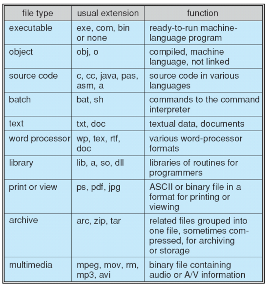
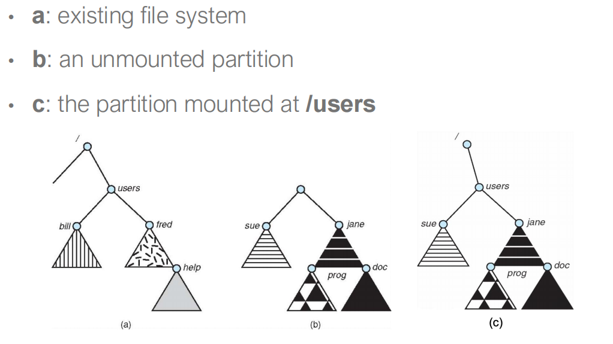
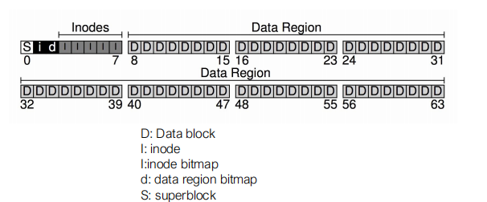
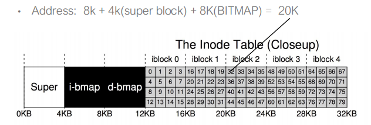
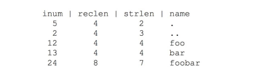
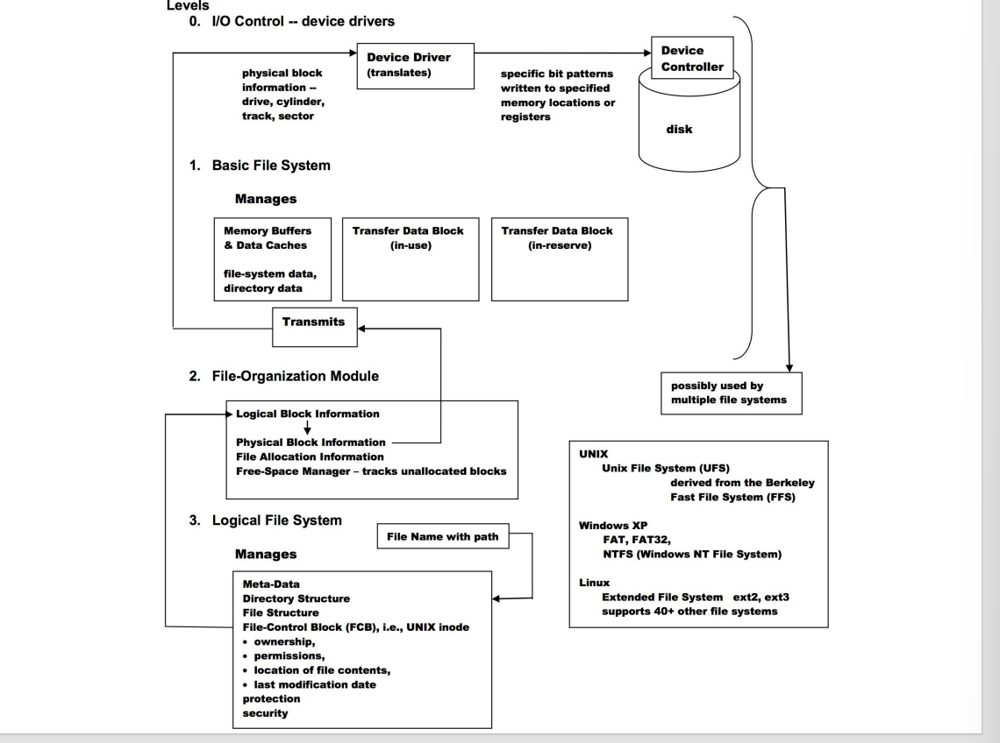

## 文件系统

**文件**是用于存储信息的一段连续逻辑地址空间

属性

- Name：
- Identifier：文件系统中唯一标识符
- Type：不同文件类型
- Location：在设备上的文件位置指针
- Size：当前文件大小
- Protection：权限控制
- Time，date and user identification：使用检测，文件保护

### 文件操作

- 创建：在文件目录分配条目，在文件系统中分配空间
	- 逻辑文件系统分配一个新FCB
- 打开：返回其它操作的手柄
	- 在System-Wide Open-File Table 中找是否正在被使用
		- 如果时则创建一个 Per-Process Open-File table entry指向系统表中的相应位置
	- 如果没有，则在目录中查找文件名，找到就将他的FCB放到系统表中
	- 同时维护一个引用计数
- read/write：维护指针
- seek：文件内重定位
- delete：释放文件空间，硬链接（直到最后一个链接删除后才删除文件）
- truncate：删除文件，但保留属性
- Copying：create and read / write

避免文件操作时的搜索文件，操作系统维护一个open-file table

而由于一些进程可能同时访问文件，文件表可以两种方式组织

- Per-process table：current location pointer， access rights
- System-wide table：location on the disk

文件表的信息

- 文件位置
- 文件计数：file-open count
- 磁盘地址位置：cache of data access information
- 访问权限:per-process access mode information

### 文件类型

File types：文件扩展名

File type：magic number of the file - elf

### 文件结构

- 无结构：比特或字节流 - linux 文件
- 简单记录结构：数据库
- 复杂结构：word文档

### 文件访问方式
- 线性访问，只对于特定的介质类型
	- 由前序决定的顺序
- 直接访问：任意访问任意位置
- 索引访问

### 磁盘结构

磁盘可以划分：比如分卷

磁盘和划分，可以在没有文件系统的情况下被使用

### 文件目录

**文件目录**是包含所有文件信息节点的集合

#### 目录操作

- 创建文件：加入目录
- 删除文件：从目录删除
- 列出文件表：展示目录中所有文件
- 搜索文件：模式匹配
- 遍历文件系统

#### 目录组织

**目的**：高效、便捷、分类

- 单层目录：被所有用户使用 | 重名和分类问题
- 双层目录：以用户划分第一层（master file directory MFD）
	- 每个用户都有一个user file directory(UFD)
	- 仍然不能分类
- 树状结构：可以分类
	- 文件能以绝对路径和相对路径来访问
	- 相对路径是相对于当前目录current directory(pwd)
	- 删除目录（rm -rf /）删除所有子目录和文件
- 有向无环图目录：有悬挂指针问题
	- 用反向指针或引用计数可以解决

### 文件共享

通过保护机制来共享文件

通过因特网共享的文件使用(Network File System NFS)

- 通过类似FTP程序
- 大多使用分布式文件系统

Client-server 模型允许用户挂载服务器的文件系统

- 一个服务器能够服务多个用户
- 全部以远程请求的形式

- UserID 来标识用户
- Group ID 来标识用户组

#### ACL

- 每个文件和目录都有一个访问控制表access control list(ACL)
- 可以进行细粒度控制

**Unix Access Control** 

- read,write,execute
- owner,group, and others

### 文件系统挂载

一系列包含程序内存镜像的连续块被称为boot loader

文件系统在可以被访问之前一定要被挂在

挂载即将一个文件系统与系统链接，通常用一个单一命名空间

挂载点：文件系统被挂载个位置

挂载会使得在挂载点的目录不可见

### 文件系统实现

#### 实例

- Strlen : length of the name 
- Reclen: length of the name plus left over space

- Linux : Ext2/3/4, Reiser FS/4, Btrfs
- Windows: FAT, FAT32, NTFS

分层文件系统(Layered File System): application programs -> logical file system -> file-organization module-> basic file system -> IO control -> devices

- Device drivers:管理IO设备
	- 给出指令"read drive 1, cylinder 72, track 2, sector 10, into memory location 1060",向硬件控制器输出特定的指令
- Basic file system：
	- 给出指令"retrieve block 123",翻译给设备驱动
		- buffer保持传输的数据
		- cache保持经常使用的数据
- File organization modul：理解文件，逻辑地址和物理块
	- 将逻辑块翻译成物理块
	- 管理空闲空间和磁盘分配
- Logical file system：管理元数据信息
	- 将文件名翻译成文件号，通过维护file control blocks（inodes in UNIX）给出文件handle和地址通过
	- 目录管理、保护、FCB
- 分层有利于减少复杂性和冗余性，但是会有额外开销

文件系统需要维护on-disk 和 in-memory 结构

- on-disk structure
	- boot control block : 包括从卷中启动操作系统的信息
	- volume control block：包括每卷的卷信息
		- of blocks, of free blocks,block size, free block pointers, free FCB count, free FCB pointers
	- directory structure: 组织目录和文件
		- A list of (file names and associated inode numbers)
	- per-file file control block：包括每个文件的信息
		- permissions, size ,dates, data blocks or pointer to data blocks
- In-memory structures：是磁盘结构的翻反映和扩展
	- Mount table: 存储 storing file system mounts, mount points, file system types
	- In-memory directory-structure ache:保存最近访问的目录的信息
	- system-wide open-file table:包括每一个FCB的拷贝
	- per-process open-file table: 包括系统打开表中合适条目的指针
	- IO Memory Buffers: 当文件系统块被从磁盘读取或写入时保存

### Vitual File Systems

提供一个面向对象方式的文件系统实现方式：为系统调用提供一个统一接口

对象类型

- superblock : 定义文件系统的类型、大小、状态和其它元数据
- inode：包括文件的元数据
- dentry：inode的命名和目录的展开
- file：实际的文件数据

## 分配方法

- 连续分配适用于线性和随机
- 链接分配适用于线性但不适用于随机
- 索引分配较为复杂

### 连续分配Contiguous Allocation

- 需要知道文件位置和大小
- 有外部碎片问题

### 链接分配Linked Allocation

- 每个文件都是磁盘块的链表
- 缺点：
	- 定位文件块需要很多IO和磁盘查找
	- 空间浪费
	- 指针可能损坏
- 改进：块簇，但是有内部碎片问题

### 索引分配Indexed Allocation

### 空闲空间管理

- Bitmap 管理方式
- 链表管理方式
	- 改进：分组和计数