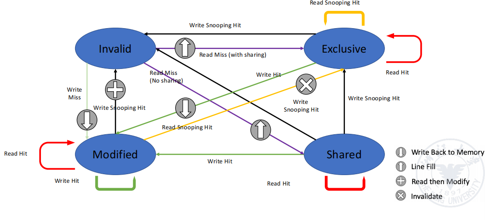
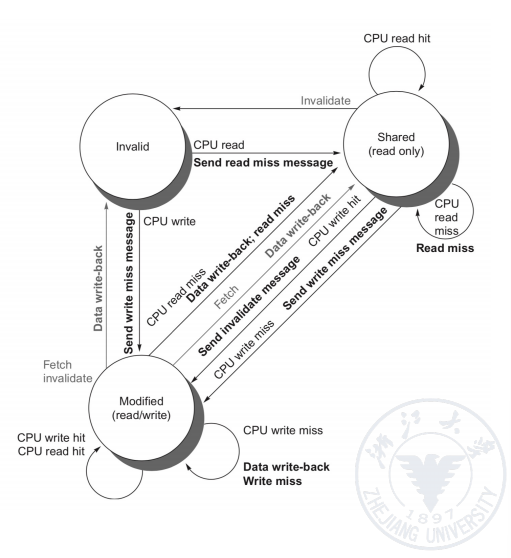
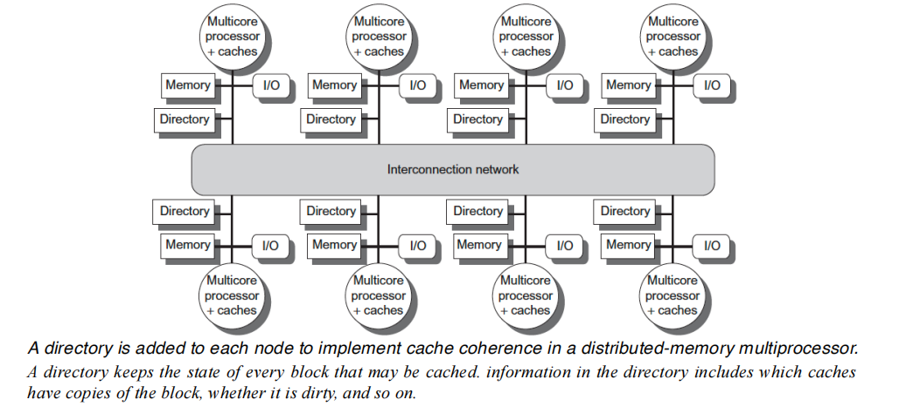

## 性能优化

> 指令集并行（Instruction-Level parallelism(ILP)）的效能已经被完全发挥：单处理器性能优化在2003年便结束了

### 多处理器

多核微处理器的难题

- 性能编程
- 负载均衡
- 优化通信和同步

应用并行分类

- 数据层并行 Data-level parallelism (DLP)
- 任务层并行 Task-level parallelism (TLP)

架构并行分类

- 指令层并行 Instruction-level parallelism (ILP)
- 向量架构(Vector architectures)/图像处理单元(Graphic Processor Units)
- 线程层并行 Thread-level parallelism (TLP)
- 请求层并行 Request-level parallelism (RLP)

## 处理器下的并行规则

### PRAM模型（Parallel Random Access Machine）

多指令多数据流（MIMID）并行机中的一种具有共享存储模型

- EREW（Exclusive Read Exclusive Write）

不允许多个处理器同时进行内存访问（读与写）

- CRCW(Concurrent Read Concurrent Write)

允许多个处理器同时进行内存访存（读与写）

写入冲突时需要冲突解决机制，如优先级、合并策略等。

- CREW（Concurrent Read Exclusive Write）
- ERCW（Exclusive Read Concurrent Write）

- mutex lock 

- spin lock

Bounded-Buffer Problem

Readers-Writers Problem

## Lock-Based Protocols

1. **互斥锁exclusive(X) mode**: 数据可读可写
2. **共享锁shared(S) mode**: 数据可读不可写

- 只有共享锁之间能够共存

- 当锁的请求等待路线之间存在环时，就会出现死锁(deadlock)的情况
- 当一个锁的情况持续被其它抢占时，就会出现饥饿(starvation)的情况

### 两阶段锁协议(Two-Phase Locking Protocol)

- 阶段一: 增长
	- 事务只能获得锁而不能释放锁
- 阶段二：收缩
	- 事务只能释放锁而不能获得锁

这是事务之间能够以获得锁的时间节点来串行排序

- Strict 2PL：事务在提交和中断前，保持他的所有互斥锁
- Rigorous 2PL：事务在提交和中断前，保持他的所有锁

### Graph-Based Protocols

- an alternative to two-phase locking

#### Tree Protocol

- 不会有死锁，且不需要回滚
- 但是并不确保可恢复性，同时可能锁定不需要获取的信息

### 死锁解决

- 提前定义(pre-declaration)：在执行之前获取他的所有锁
- 使用图控制协议

- Wait-die scheme:non-preemptive（非抢占）
	- 旧的事务会等待新事务释放对数据的控制
	- 但新事务不会等待，而是直接回滚
- Wound-wait scheme:pre-emptive（抢占）
	- 旧事务杀死新事务使其回滚，新事物会等待
- Timeout-Based Scheme
	- 事务在等待一定时间没拿到锁时会回滚

### 死锁检测

- Wait-for graph
- 死锁恢复:全部回滚，部分回滚

### 意图锁模式

- 意图共享锁(intention-shared(IS)):显式的指定低层的树
- 意图排他锁(intention-exclusive(IX)):显式的指定低层的树的排他和共享

- shared and intention-exclusive:

## 并行共享问题

### 共享的问题
#### 内存的一致性

一个处理器写入的数据，一定能全部被另一个处理器看到

**Relaxed Consistency Models**

- 运行读写乱序完成，但是使用同步指令强制排序
- Rules
	- $X\rightarrow Y$ 
		- X操作一定要在Y操作之前完成
	- **`R → W`**：读操作必须先于写操作。
		- 弱定序和释放一致性
	- **`R → R`**：读操作必须先于另一个读操作。
	- **`W → R`**：写操作必须先于读操作。
		- 全存储定序
	- **`W → W`**：写操作必须先于另一个写操作。
		- 部分存储定序

#### 缓存一致性

获得的数据一定要是最新的数据

- 原因：处理器可能有数据的不同拷贝版本
- 迁移Migration
- 赋值Replication

**cache coherence protocol**

对于UMA: Snoopy coherence protocols

- 监视数据总线对私有cache的更新，广播将其它拷贝版本无效化或更新
- Write invalidate protocol（必须先读）
	- MSI protocol
		- Modified:标识当前块在私有cache中被更新，互斥
		- Shared：标识当前块在私有cache中被共享
		- Invalid

- MESI protocol
	- 增加一个exclusive状态：只在一个cache中（独占）被读或被写则转变状态

- MOESI：
	- 增加一个owned状态：果过时信息
- Write update / write broadcast protocol

对于NUMA: Directory protocol

- 维护一个目录记录：每个特定的数据库在哪些处理器中有拷贝
- 同样是写入共享块时，通过目录点对点地无效化
- 同样MSI三状态

**Write-through**类协议

- 四个阶段

