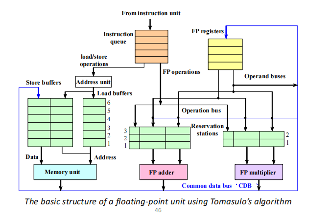
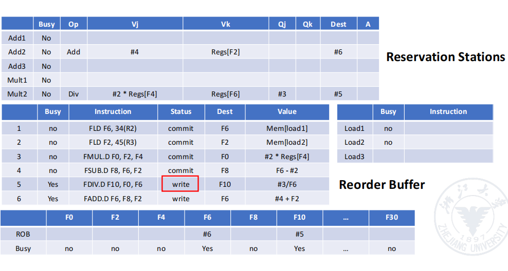

###  流水线

> 重叠执行是流水线的基础

#### 基本概念

将一个过程分成若干个子过程，每个过程用一个功能的单元实现

### 设计理念

流水线中的每个阶段的运行时间应该均等，不然会出现瓶颈。

#### 流水线的分类

- **单功能流水线**和**多功能流水线**
- 多功能流水线下：**动态流水线**与**静态流水线**
- **线性流水线**与**非线性流水线**（存在环路）
- **循序流水线**和**乱序流水线**
- **标量处理器**和**矢量流水线处理器**

### 指令并行

#### 依赖

- 数据依赖 -> 数据冒险（RAW\WAR\WAW）-> 数据前递、暂停、代码调度
- 命名依赖（在改变对象命名后，仍然使用旧名）
- 控制依赖 -> 控制冒险 -> 暂停\分支预测（动态分支预测内含状态机）

#### 动态分支预测

- 维护历史分支表(Branch History Table(BHT))：即状态机维护
- 分支目标缓存(Branch-Target Buffer/Branch-Target Cache)：用于快速获得分支目标地址

#### 乱序执行

将ID阶段分成两个阶段：Issue（IS）和Read Operands（RO）

- Issue：解析指令，检查结构冒险，顺序发射
- Read Operands：等待直到没有数据冲突，读取操作数，乱序执行

##### 计分板算法(Scoreboard Algorithm)

四阶段控制

- Issue：解析指令，检查结构冒险 | 如果输出依赖于未完成指令则不发射
- Read operands：等待直到没数据冒险 | 真实依赖可以（RAW冒险）在此阶段解决，即等待写回
- Execution：执行操作 | 当执行完毕通知记分板
- Write result：暂停直到与前一条指令没有WAR冒险

**Instruction status** : 四阶段

**Functional unit status**：表示功能单元的状态 - 九个字段

- Busy : 当前单元是否忙碌
- Op : 单元执行的操作 
- Fi : 目标寄存器
- Fj,Fk : 源寄存器数
- Qj,Qk : 制造源寄存器数据的功能单元
- Rj,Rk : 标志源寄存器是否已经读取的标志|执行时设置为no

**Register result status** : 标识那个功能单元会写每个寄存器

#### 托马斯罗方法Tomasulo’s Approach

三阶段执行

- Issue：从FP Op Queue中取指 | 加入保存站空闲（没有结构冒险），发射指令和操作数，重命名寄存器
- Execute：操作数执行，当操作数都准备好则执行，不然等待公共数据总线返回结果
- Write result：为所有等待的单元写回公共数据总线，释放保留站

Common data bus：data + destination（64 bits of data + 4 bits of Functional Unit source address）

##### 三个表

**Instruction status table** : 指令状态表

**Reservation stations table**：关注被发射的指令的状态

- Busy：功能单元是否被占据
- Op：操作
- Qj，Qk：数据从那个保留站来
- Vj，Vk：操作数的数据
- A：内存地址计算的信息

**Register status table**：记录哪些结果需要写回寄存器

#### 缺点
- 乱序执行且乱序完成，在异常中断时无法保持一致性

#### 重排序缓冲(Reorder Buffer(ROB))

在ROB中标记结果，而不是在Rervation Stations里

- 根据发射顺序在ROB中记录数据依赖
- 并依次提交
- 执行时的数据依赖都从ROB中获取，而寄存器状态表也标识ROB中的条目

