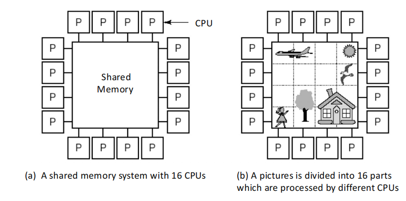
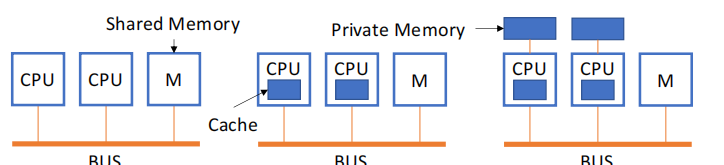
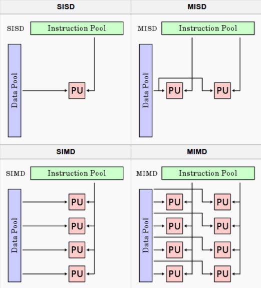

## 计算机设计的原则
- 利用并行性
- 局部性原理：数据和指令的复用
- 关注最常见的情况：Amdahl's Law

## MIMD 架构

### 多处理器系统——以共享内存为基础

- 假如这些处理器在功能权限上完全相同，则称此系统为对称多核系统 (Symmetric Multi-processor)
- 只有一个系统镜像是多核系统区分于多计算机系统的重要特点

### 内存访问模型

#### **Uniform Memory Access(UMA)**:

- 所有处理器共享物理内存，每个处理器可以有私有cache和内存

#### **Non Uniform Memory Access(NUMA)**

- 所有CPU共享一个地址空间
- 用LOAD 和 STORE 指令访问远程内存
- 访问远程内存比访问局部内存要慢
- 可以使用cache

#### **NC-NUMA and CC-NUMA**

- 前者没有cache，后者有cache

#### **Cache Only Memory Access(COMA)**

- 所有内存被视为缓存，在使用时迁移到较近的处理器
- NUMA 的特殊例子：每个处理器节点中没有存储继承，所有的cache组成一个统一地址空间

费林分类法（Flynn's Taxonomy） 

