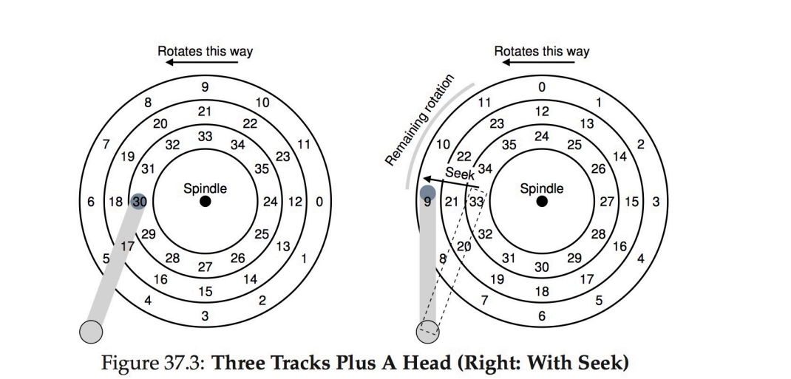
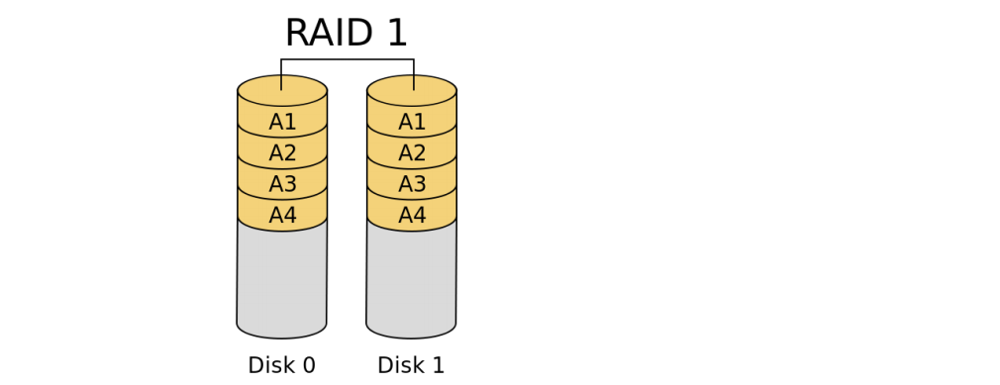
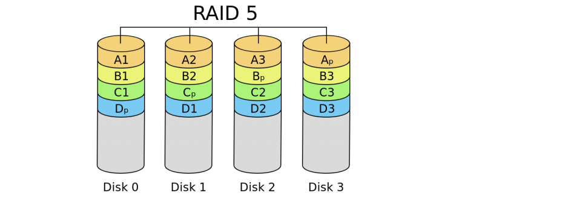

## 磁盘管理

### Mass Storage

Average I/O time: average access time + (data to transfer / transfer rate) + controller overhead

disk bandwidth:数据传输的速度

#### Nonvolatile Memory Devices

- 只能以page进行增量读写，不能指定位置覆写
- 生命周期用drive writes per day（DWPD）衡量

**NAND Flash Controller Algorithms**

- 每个块都标记为有效/无效
- 维护一个flash translation layer(FTL) table：再修改时就直接改变映射而不覆写

**Magnetic Tape**：

- 200GB - 1.5TB
- 访问很慢，但存储时间长

**磁盘结构**

- 磁盘驱动寻址被视作一个一维逻辑块数组(LBA)
- 每个逻辑块都映射到一个扇区，扇区0是最外磁道的第一个扇区

**磁盘连接形式**

- host-attached storage : 通过I/O总线
	- SCSI 是一种总线架构，支持16个设备
	- Fiber Channel 高速串行总线
	- hard disk, RAID arrays, CD, DVD, tape
- network-attached storage
	- NFS,CIFS and iSCSI 是常见的协议
	- 常常通过remote procedure calls（RPCs）来实现
	- 一般通过TCP \ UDP 在IP 网上
- storage area network
	- 最常见的是Fiber Channel

#### 磁盘调度Disk Scheduling

操作系统维护一个请求队列，每个磁盘或设备

**调度算法**

- FCFS(First-come first-served)
- SSTF(shortest seek time first)
	- 优点：平均响应时间减小
	- 缺点：计算查询时间需要开销，可能导致饥饿，响应时间波动大
- SCAN（elevator algorithm）：从一段开始查到另一端
	- 优点：响应时间波动小
	- 缺点：刚访问过的地方要等待较长时间再次访问
- C-SCAN（Circular-SCAN）：只沿一个方向扫描
- LOOK/C-LOOK：只走到最远的请求

#### 磁盘管理

- 物理格式化：将磁盘分成sectors供控制器读写
	- 每块有头信息、数据、异常码(error correction code)

- **根分区**：包含操作系统
	- 在启动的时候挂载，挂载时检查文件系统的一致性
	- Boot block 被指向启动卷或 boot loader，包含足够的代码来从文件系统加载内核

Boot block 初始化系统：

- 启动协议存在只读内存，固件中
- 启动协议加载程序存在启动分区的启动块

**Swap Space Management**: 利用二级存储管理内存空间的交换

#### RAID 廉价磁盘冗余阵列

**redundant array of inexpensive disks** 

- 通过冗余性来提高可靠性，在单个磁盘发生故障时保护数据不丢失
- 只能检测和恢复磁盘故障
- Solaris ZFS 增加额外检查来检测异常，校验和与数据元数据指针并排排列
	- 在池中申请磁盘，而不是卷和划分
	  

**RAID 0**: 将数据平分至两个或多个磁盘，除去校验位

**RAID 1** ：在另一个磁盘上保存一个镜像

**RAID 2**： 在比特层将数据分段：使用 Hamming code

- Hamming code ： （4位数据，3位校验位）

**RAID 4**: 块层级分段，用一个作为校验磁盘

**RAID 5** ：块层级的分段，校验位数据分布到所有的磁盘

**RAID 6**：块层级的分段，两个校验位块

