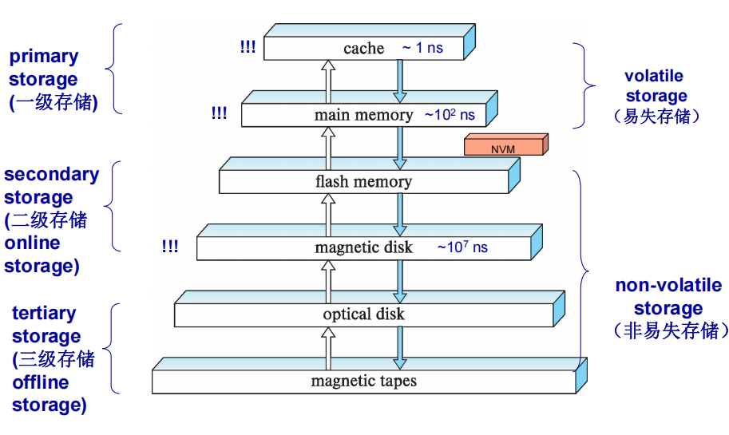
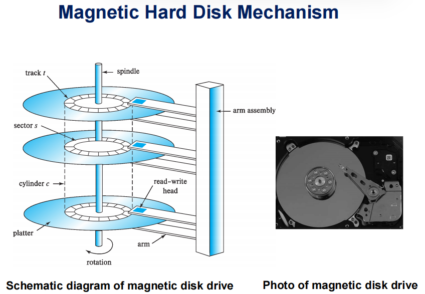
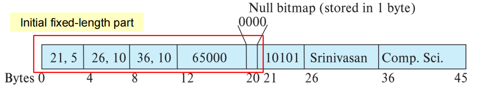
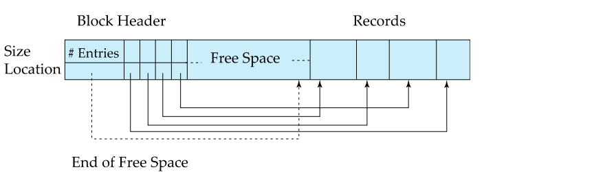
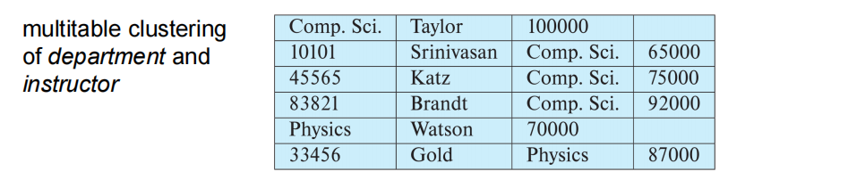
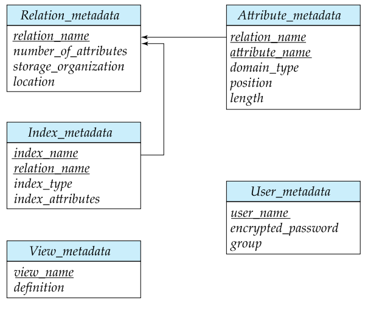

## 物理存储系统
存储可以分为两类：

- 易失性存储（volatile storage）: 电源关闭后存储数据会消失
- 不易失存储（non-volatile storage）: 
    - 电源关闭后内容能够保存
    - 包括二三级存储，以及电池备份的主存

### 存储级别

### Storage Interfaces
- Disk interface standards families
    - SATA(Serial ATA)
    - SAS(Serial Attached SCSI)(usually used for server)
    - NVMe (Non-Volatile Memory Express) interface (for SSD)

- **In Storage Area Networks (SAN, 存储局域网)**, a large number of disks are connected by a high-speed netwrok to a number of servers

- **In Netwrok Attached Storages (NAS, 附网存储)**, networked storage provides a dile system interface using networked file system protocol, instead of providing a disk system interface.

 

### Magnetic Disks
- 读写头
- 环形磁道(circular tracks)
- 扇区(sectors)
    - 扇区是数据读写的最小单元
    - 通常为512比特，每个磁道从内到外约有500-1000-2000个扇区

- 磁盘控制器(Disk controller)
    - interfaces between the computer system and the disk drive hardware

### 性能估计
- 访问时间（Access time）: 从读写请求开始到数据传输开始的时间：
    - 寻道时间（Seek time）: 读写头定位到正确磁道所使用的时间
    - 旋转等待时间（Rotational laten）：扇区移动到读写头下的时间
- 数据传输率（Data-transfer rate）:25 - 200 MB/s 
- 平均故障时间(MTTF, Mean time to failure): 磁盘正常运行的平均时间

- 磁盘块(Disk block)是一个内存分配和获取的逻辑单元
    - 通常为4-16kilobytes

- 线性访问(Sequential access)
    - 磁盘寻道只需要找到第一个块
- 随机访问(Random access)
    - 每次访问都需要重新寻道
- I/O 操作每秒(IOPS)：磁盘每秒支持的随机块访问次数
### Optimization of Disk-Block Access
- 缓存(Buffering):in-memory buffer to cache disk blocks
- 提前读(Read-adhead)
- 磁盘臂调度（Disk-arm-scheduling）
    - 电梯算法（elevator algorithm）：走到顶，再走到底
- 文件组织（File organization）：让同一文件的块尽可能连续存储
- Non-colatile write buffers
- Effective query processing algorithms

## Data Storage Structures

#### 长度固定记录（Fixed-Length Records）

---

假设：

- 记录大小固定，且小于一个磁盘块
- 每个文件都只有一类的记录，不同的关系用不同的文件
- 不允许同一记录跨块存储

删除操作:

- 选择 1: 后续记录依次向前移动
- 选择 2: 最后一条记录覆盖删除记录
- 选择 3: 维护空闲链表记录空闲空间

可变长记录(Variable-Length Records)

---
单记录结构：(offset,length)s + fixed length attributes + Null bitmap + variable length attributes

分槽页结构（Slotted Page Structure）

- Slotted page (分槽页) header contains:
    - number of record entries
    - end of free space in the block
    - location and size of each record

堆文件组织(Heap File Organization)

---

- 任意存储
- 插入和删除代价低，查找代价高
- 可以使用自由空间图（free-space map），记录每块的空闲率

顺序文件组织(Sequential File Organization)

---

- 按照某字段(search-key)的值排序存储
- 加快查找速度，但插入和删除的代价较高
- 删除时可以使用链表,插入时有空闲则插入，没空闲时则插入到溢出块(overflow block)
- 需要不时重新组织文件来保持线性顺序

多表聚簇文件组织(Multitable Clustering File Organization)

--- 

- 将多个表存储在同一文件中
- 加快多表连接操作，但堆单张表的操作变慢
- 同样可以使用链表去维护

表分区(Table Partitioning)

---

- 一个关系中的记录分成多份，存储在不同的文件中。
- 例如按年份划分存储。或按常用性管理不同的存储设备上的存储记录

### 系统目录(system catalog/Datadictionay)

- 存储了数据库对象信息，用户信息，物理文件组织信息和索引信息等.
- 可以元数据作为关系存储，数据库初始化时。

### 缓存管理

块是内存分配和数据传输的单元

- 目的：尽可能减少磁盘和内存之间的块传输次数.
- 器件：缓冲区管理器(Buffer Manager)

流程

---

- 若块已经在缓冲区中，直接返回块在主存中的地址
- 若不在缓冲区，先分配缓冲区空间，在从磁盘中读入
    - 若需要，则会替换掉其它块
    - 若被替换的块被修改过，则先写回磁盘

固定块：不允许写回磁盘的数据块

- 在读和写数据前做固定操作
- 在读写完成后取消固定操作

缓冲中的共享和互斥锁

- 同时只有一个进程可以得到互斥锁
- 共享锁和互斥锁不能同时存在

缓存替换策略：
- LRU（Least Recently Used）：替换最少使用块
- Toss Immediate:当块的最后一个元组处理完毕，立即释放该块空间.
- MRU(Most Recently Used): 锁定当前正在处理的块

磁盘块访问的优化

- 向不易失的存储写入缓冲
- 使用日志磁盘
- 使用日志文件系统：数据能够顺序写回

### 面向列的存储
- 只有部分属性被访问时，减少IO次数、利于数据压缩
- 重建元组代价高
- 元组删除和更新代价高。
