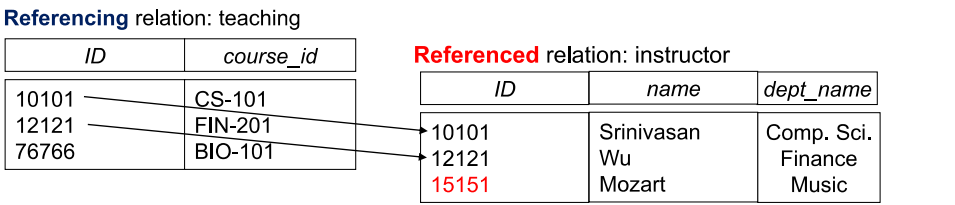
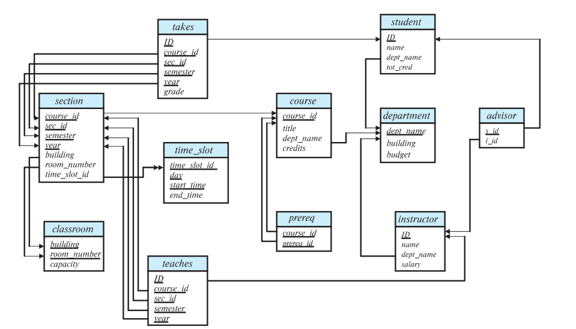

- $A_1, A_2, ..., A_n$ 是属性
- $R=(A_1,A_2,...,A_n)$是关系模型
- 属性通常为不可再分的（原子的）
- 关系没有顺序

## 键(key)
### 超键(superkey)

- **定义：**K是R的一个子集,且足够去确定唯一元组的值
- **例子: **\{ID\}和\{ID,name\}都是超键

### 候选键(candidate key)

- **定义：**超键且含有最少的属性
- **例子：**\{ID\}是候选键

### 主键(Primary Key)

- **定义：**被选中的候选键

### 外键(Foreign Key)

**一种约束：**确保一个关系中的某个属性的值必须来自另一个关系中的某个属性的值，被引用的属性必须具有唯一性或为主键

模式图(Scjhema Diagram)

## 关系代数(Relational Algebra)
!!! info "关系代数运算符"
    === "选择运算符"
        - Notation: $\sigma$
        - Example: $\sigma_{dept_name=^"Physics^"}(instructor)$

    === "投影运算符"
        - Notation: $\Pi$
        - Example: $\Pi_{ID,name,salary}(instructor)$
        - 删除重复的行

    === "合并运算符"
        - Notation: $\cup$

    === "差集运算符"
        - Notation: $-$
        - 找到所有在左侧表但不在右侧表的数据项

    === "笛卡尔积运算符"
        - Notation: $\times$
        - 全组合

    === "重命名运算符"
        - Notation: $\rho$
        - Example: $\rho_{name}(instructor\Expression)$

    === "赋值运算符"
        - Notation: $\leftarrow$
        - 例子：$r \leftarrow \sigma_{a=b}(r)$

### 复合关系运算
- 例子：$\Pi_{name}(\sigma_{dept_name=^"Physics^"}(instructor))$

- Join运算（复合运算）
    - Notation: $\bowtie$
    - 例子: $r\bowtie_{\theta} s = \sigma_{\theta}(r \times s)$
    - Inner join:
    - Outer Join: 保留源表中没有匹配的行（使用NULL填充）
        - left outer join:
        - right outer join:
        - full outer join:
    - Join condition:
        - natral: 自动匹配具有相同名称的列（且共同项只保留一份）
            - 风险：具有相同名称的不相关属性被错误连接（比如学生的部门和课程的部门相连接）
        - using(column):可以指定要合并的列名，从而避免风险
        - on：条件查询（可以替代 where  条件）
   
