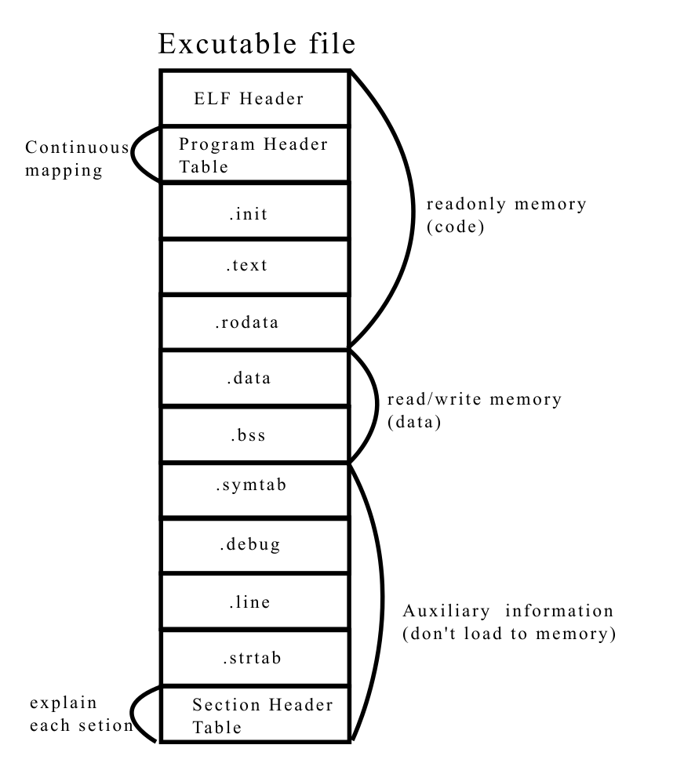
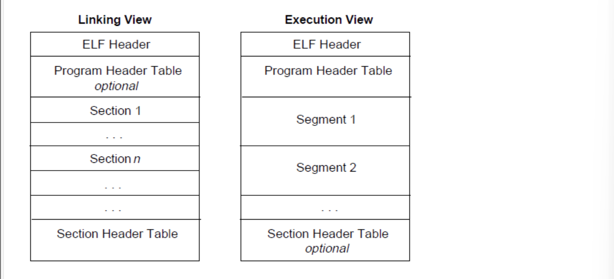
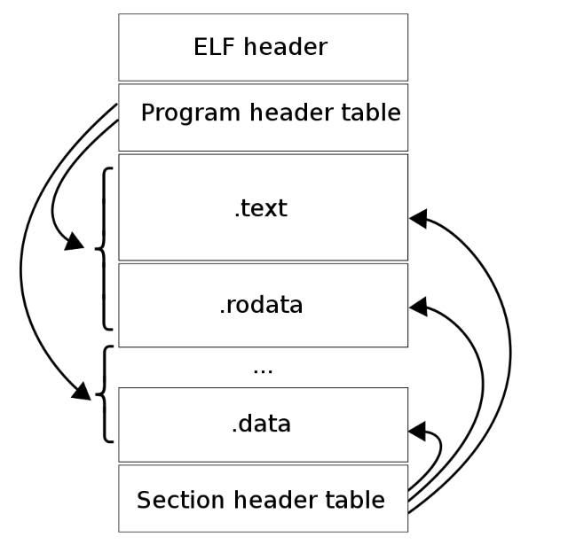

## ELF（Executable and Linkable Format）
Linux中的目标文件，主要有一下三种类型

- 可重定位文件（Relocatable File），包含由编译器生成的代码以及数据，链接器会将它与其它目标文件链接起来从而创建可执行文件或者共享目标文件.文件后缀`.o`
- 可执行文件（Executable File）
	- 什么是可执行文件？
		- 能够被操作系统识别并执行的文件，它包含了程序运行所需的机器码，以及运行时的必要资源。
	- 与可重定位目标文件的区别？
		- 包括的节不同，同时可执行文件增加了程序头部表(program header table)
	- 对于可执行文件来说，ELF文件头中的程序地址入口地址字段不再为空，而是指向了第一条指令的虚拟内存地址。
	- `.init`是一个函数，在程序加载时做初始化工作。
	- `.init, .text, .rodata`这几个节以及程序头部表和ELF文件头会加载到内存中代码段中，只读
	- `.data, .bss`这两个节加载到内存的数据段中，读写
- 共享目标文件（Shared Object File）,包含代码和数据，即库文件，文件后缀`.so`，它有以下两种使用情景
	- 链接器（Link eDitor,ld）可能会处理它和其它可重定位文件以及共享目标文件，生成另一个目标文件
	- 动态链接器（Dynamic Linker）将它与可执行文件以及其它共享目标组合在一起生成进程镜像


解析第一步
- 读取ELF Header 找到节头表
- 对于节头表中的每一个条目
	- 用`sh_name`作为偏移量去`.shstrtab`节里查找，得到节的字符串名称
	- 读取`sh_offset`和`sh_size`，获取节的位置和大小
	- 根据`sh_type`和`sh_flags`确定节存储的数据类型和权限
**ELF文件头**：给出了整个文件的组织情况，前52字节（64位系统位64），为固定结构.
- Magic Number ：`7f 45 4c 46`（`.ELF`的ASCII码），标识这是一个ELF文件
- e_shoff（节头表偏移）：指明了Section Header Table 在文件中的起始位置
- e_shnum（节头表条目数量）: 指明节头表里有多少个条目（即有多少个节）
- e_shstrndx（节头字符串索引)：指明哪个节是字符串表(.shstrtab)，这个节存储了所有节的名字（如`.text, .data`）
- 程序头部表是操作系统加载文件中的段时需要的，而节头表是链接器所需要的



**程序头部表**：负责将可执行文件中连续的内容映射到连续的内存段
**节区头部表**（Section Header Table）：包含了描述文件节区的信息。由固定大小的条目（Entry）组成，每个条目描述了一个节（Section）的信息
- 节名称(sh_name)：一个数字偏移量，指向`.shstrtab`字符串表中的某个位置,真正的节名字(如`.text`)存储在那.
- 节类型(sh_type)：描述此节的作用（例如：存放程序代码`SHT_PROGBITS`、存放符号表`SHT_SYMTAB`等)
- 节标志(sh_flags)：属性（可读？可写？可执行？)
- 节在文件中的偏移量(sh_offset)：指明这个节的实际数据内容在文件中的起始位置
- 节大小(sh_size)：这个节的大小
### 链接器工作流程

> 链接器的主要工作：解决符号引用和地址重定位的问题。编译器的视野是单个源文件，处理过程中会遇到一些他无法确定地址的符号如`extern void helper();`或`extern int global_var`

- 输出产物 可执行文件、动态共享库、重定位目标文件

- 链接器会选择一个目标文件中的某个节的部分信息吗，还是说会把所有的信息都收集？
	- 默认来说，它会收集所有目标文件中相同名字和属性的节，然后合并，将这些节作为整体复制处理。

- 读取所有输入目标文件（和静态库，本质上是多个`.o`的打包）的节头表。将所有文件的节收集和归类成统一的节 `.text, .data, .bss , .rodata`
- 符号解析：建立全局符号表,处理每个目标文件中的符号表(`.symtab`节)
```
哈希表 (key = 符号名)
┌───────────────────────┐
│ "foo" ───────────────▶ [ (a.o, Undef),
│                        (b.o, Def, 强),
│                        (c.o, Def, 弱) ]
│
│ "main" ──────────────▶ [ (a.o, Def, 强) ]
│
│ "printf" ────────────▶ [ (a.o, Undef),
│                        (libc.so, Def, 强) ]
└───────────────────────┘

```
- 
	- 什么是符号？
		- 函数和变量的名字,定义的函数或全局变量都会生成一个符号
	- 符号解析过程：
		- 导出符号，记录下每个目标文件能够提供的符号（即它定义的，其他文件可以使用的符号）。这些符号通常再特定的节中，如函数符号在`.text`节，变量符号在`.data`或`.bss`节
		- 引用符号：记录下每个目标文件需要的符号(即它声明了但未定义的符号)
		- 解决依赖：建立一个全局的符号地址表。当发现一个符号的引用，就去全局表中查找这个符号定义。
	- 全局的符号地址表的建立时机？以及其位置结构？
		- 链接器开始工作时会创建一个空的全局符号表
		- 按顺序读取目标文件
			- 解析符号表(.symtab节)
			- 对于每个符号
				- 强符号（Strong Symbol）：已经定义的函数或初始化的全局变量。直接加入全局符号表。值目前还是其在原目标文件内的偏移量
				- 弱符号（Weak Symbol）：未初始化的全局变量（位于`.comm`或`.bss` ）加入全局表，允许被后续同名强符号覆盖
				- 未定义的引用（Undefined Reference）：声明了但是未定义的函数或变量
		- 处理静态库(.a文件)
			- 检查静态库中的每一个目标文件(.o)，只有能够解决当前全局表中“未决引用”的符号的目标文件才会加入链接过程
			- 处理依赖关系，就需要循环链接，或好的组织形式
		- 结构哈希表中的每个符号表条目(Symbol Table Entry)
			- `name`:符号的名称
			- `value`:符号的值
			- `size`：符号所代表的对象的大小（例如：一个函数编译后的代码大小，或一个全局变量占用的字节数）
			- `type`：符号的类型(例如:`STT_FUNC`函数、`STT_OBJECT`数据对象、`STT_NOTYPE`未知)
			- `binding`：符号绑定信息(例如：`STB_GLOBAL`（全局符号）, `STB_WEAK`（弱符号）, `STB_LOCAL`（局部符号，通常不会进入全局表)
			- `section`:指向该符号所属的**输出节**的指针。在合并完成后，这会从“输入节”更新为“输出节”。
			- `is_defined`:表明这个符号是已定义的（`true`）还是仅被引用（`false`）
			- 
	- 如何使用节的信息？
		- 符号的值(`st_value`)在目标文件中通常 **相对于其所在节起始位置的偏移量**，链接器首先需要知道符号属于哪个节，然后当它决定这个节最终的运行时内存地址后，才能计算出符号的绝对地址。
- 重定位：修正地址
	- 重定位表(`.rel.text, .rel.data`)：在目标文件中包含一些特殊的重定位节。这些节包含了重定位条目，告诉链接器：在代码节`.text`的偏移量0x40的位置，有一个需要修正的地址引用
	- 链接器工作：
		- 已经决定了所有输出节的最终布局和起始地址（VA）
		- 遍历每个重定位条目。例如，一个条目说：“请修正 .text 节中偏移 0x40 处的四字节数据，它应该是 `printf` 函数的地址。”
		-  链接器进行计算：`printf的绝对地址 = printf所在节的地址 + printf在节内的偏移量`。
		-  链接器将这个计算出的绝对地址写回 .text 节中偏移 0x40 的位置，覆盖掉原来的占位符（通常是0）。
- 分配地址与生成输出
	- 为输出文件中的每个节分配最终的文件偏移和虚拟内存地址。
	- 根据新布局，将合并后的节的数据内容写入到输出文件的相应文职
	- 生成输出文件的程序头表和节投标
	- 写入ELF头


### 程序头部表
- 程序头部表（Program Header Table）：假如存在，将会告诉系统如何创建进程。用于生成进程的目标文件必须具有程序头部表，但是重定位文件不需要。
- 如何告诉系统创建进程呢？
	- 每个条目叫做`Program Header(PH)`
		- `p_type`： 段类型(`PT_LOAD`可加载段，`PT_INTERP`动态链接器路径等)
		- `p_offset`：文件偏移，段在ELF文件中的起始位置
		- `p_vaddr`：虚拟地址，段在进程地址空间的位置
		- `p_paddr`：物理地址（对内核模式有用，普通进程通常忽略)
		- `p_filesz`:文件中该段大小
		- `p_memsz`：内存中该段大小（比如`.bss`初始化为0，占内存大于文件大小）
		- `p_flags`：权限
		- `p_align`：对齐要求
	- loader创建进程步骤
		- 读取ELF文件头找到程序头部表
		- 遍历条目创建映射
		- 建立堆栈
		- 设置程序入口点
- 节区部分包含在链接视图中要使用的大部分信息：指令、数据、符号表、重定位信息等等


对于**执行视图**，其中的segment大多来源于链接视图中的section
		除了ELF头部表外，其它部分都没有严格的顺序
		

[Site Unreachable](https://zhuanlan.zhihu.com/p/1889248878294958253)