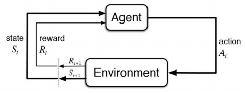
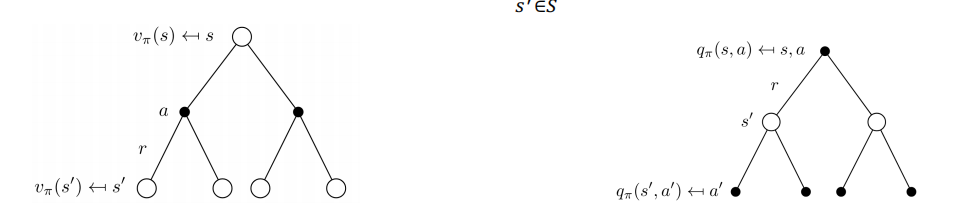
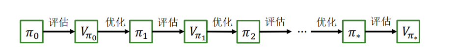

一种数学形式的基于学习的决策方法

## 基本思想
- 接收奖励反馈
- 最大化期望奖励
- 基于与环境交互学习

#### 基本概念

- 智能体(agent)：根据经验做出主观判断并执行动作
- 环境（environment）：被行为影响，并提供状态和奖励
- 状态（state）：智能体对环境的理解
- 动作（action）：对环境产生影响的方式
- 策略（policy）：给定状态，执行动作的依据
- 奖励（reward）：执行一系列动作后，从环境获得的收益

### 特点

- 序贯决策，多轮决策过程、前状态影响后状态
- 只能获取决策收益或成功与否
- 输入：每一个时间步的状态$s_t$
- 输出：每一个时间步的行为$a_t$
- 目标：学习策略$\pi_{\theta}:s_t \rightarrow a_t$,使得最大化累计奖励$\sum_t{r_t}$

### 离散马尔可夫过程

> 一个问题是否可以用强化学习解决，取决于它能否被抽象建模为一个马尔可夫决策过程

**离散随机过程**,随时间变化的随机变量

$$\{X_t\}_{t=0,1,2,\cdots}$$

>**马尔可夫性（Markov property**）：下一刻的状态$X_{t+1}$只由当前状态$X_t$决定，与更早的所有状态均无关

!!! attention "注意"
    马尔可夫性也不代表下一刻状态与更早的状态完全无关，而是都抽象在了前一时刻的状态中

- 满足马尔可夫性的离散随机过程被称为**离散马尔可夫过程**，也称为**马尔科夫链**（Markov chain）

$$Pr(X_{t+1}=x_{t+1}|X_0=x_0,X_1=x_1,\cdots,X_t=x_t)=Pr(X_{t+1}=x_{t+1}|X_t=x_t)$$

- 通常可以用元组$<S,P>$来描述
- $S$:有限数量的状态集合
- $P$:状态转移概率矩阵

$$S=\{s_1,s_2,\cdots,s_n\}$$

$$P=\left[ \begin{array}{ll} P(s_1,s_1) & \cdots & P(s_n,s_1) \\ 
\vdots & \ddots & \vdots \\ 
P(s_1,s_n) & \cdots & P(s_n,s_n) \end{array} \right]$$

- 从某个状态触发，根据其状态转移矩阵生成一个状态转移序列，称之为采样

#### 马尔可夫奖励过程(Markov Reward Process)
在离散马尔可夫过程框架中加入奖励机制：

- 引入动作集合$A$
- 定义状态转移概率：$Pr(S_{t+1}|S_t,a_t)$,其中$a_t\in A$为第t步采取的动作.
- 定义奖励函数：$R(S_t,A_t,S_{t+1})$描述了从第t步状态采取动作$A_t$转移到$t+1$步状态所获得奖励.
- 定义反馈(return)，用来反映累加奖励：

$$G_t=R_{t+1}+\gamma R_{t+2}+\gamma^2 R_{t+3}+\cdots$$

其中折扣系数(discount factor)$\gamma \in [0,1]$，对远期奖励进行惩罚

- 一般情况下，初始状态和终止状态并不包括在马尔可夫决策过程定义中
	- 可以添加虚拟的初始状态和终止状态，虚拟初始状态以一定概率转移到真正初始状态，真正终止状态以概率1转移到虚拟终止状态
- 智能体逐步采取行动，可得到一个状态序列$(S_0,S_1,\cdots)$称为轨迹（trajectory）,轨迹长度可以是无限的，也可以有终止状态$S_T$
	- 包含终止状态的问题叫分段（episodic）问题，此时从初始状态到终止状态的完整轨迹称为一个片段（episode）
	- 不包含终止状态的问题叫持续（continuing）问题

可用$MRP=\{S,A,Pr,R,\gamma \}$来刻画马尔可夫奖励过程

### 策略学习

- 智能体选择动作的模型即**策略函数**
- 随机性策略（stochastic policy），每个状态输出的是关于动作的概率分布
- 确定性策略（deterministic policy），每个状态只输出一个确定的动作
- 智能体执行一个行为，到达某种状态的概率，取决于状态转移概率矩阵

$\pi:S×A\to [0,1]$,其中$\pi(s,a)$的值表示在状态$s$下采取动作$a$的概率

-  **价值函数(Value Function)**

$V:S\to \textbf{R}$,其中$V_{\pi}(s)=\textbf{E}_{\pi}[G_t|S_t=s]$，即在第$t$步状态为$s$时，按照策略$\pi$行动后在未来所获得反馈值的期望。

$$\begin{eqnarray}
V(s) & = & \textbf{E}[G_t|S_t =s] \\ 
& = &\textbf{E}[R_t+\gamma R_{t+1} + \gamma^2 R_{t+2} + \gamma^3 R_{t+3} + \cdots |S_t = s] \\
& = & \textbf{E}[R_t + \gamma V(S_{t+1}) |S_t = s] \\
& = & r_t + \gamma \sum_{s' \in S}{p(s'|s)V(S_{t+1})}
\end{eqnarray}$$

-  **动作-价值函数(Action-Value Function)**

$q:S×A\to \textbf{R}$,其中$q_\pi (s,a)=\textbf{E}_\pi [G_t|S_t=s,A_t =a]$表示在第$t$步状态为$s$时，按照策略$\pi$采取行动$a$后，在未来所获得反馈至得期望

此时策略学习转换为如下优化问题：

**给定一个马尔可夫奖励过程$MDP=(S,A,P,R,\gamma)$,寻找一个最优策略$\pi^*$对任意$s\in S$使得$V_{\pi^*}(s)$值最大**

- 求解最优策略的一种方法是求解最优的价值函数或最优的动作-价值函数，即基于价值方法（value-based approach）

#### 马尔可夫决策过程
状态价值函数：

$$V^{\pi}(s) = \textbf{E}_{\pi}[G_t|S_t = s]$$

$$V^{\pi}(s) = \textbf{E}_{\pi}[R_t + \gamma V^{\pi}(S_{t+1}|S_t=s)]$$

状态行为价值函数：

$$Q^{\pi}(s,a)=\textbf{E}_{\pi}[G_t|S_t=s,A_t=a]$$

#### V和Q的关系(贝尔曼期望方程)

- 期望方程是一个迭代过程

$$V^\pi(s)=\sum_{a\in A} \pi(a|s) × Q^\pi(s,a)$$

$$Q_\pi(s,a)=r(s,a)+\gamma \sum_{s' \in S}P(s'|s,a) V^\pi(s')$$

$$V^\pi (s) = \sum_{a \in A}\pi (a|s)(r(s,a) + \gamma \sum_{s' \in S} P(s' | s, a)V^\pi(s'))$$

$$Q^\pi(s,a)=r(s,a) + \gamma \sum_{s' \in S}P(s' | s,a)\sum_{a' \in A}\pi(a'|s')Q^\pi(s',a')$$

#### 贝尔曼最优方程

$$V_{*}(s)=\max_{a \in A} Q_*(s,a)$$

$$Q_*(s,a) = r(s,a) + \gamma \sum_{s' \in S} p(s' | s, a) V_*(s')$$

$$V_*(s) = \max_{a \in A}{(r(s,a) + \gamma \sum_{s' \in S}{P(s' | s,a)V_*(s')})}$$

$$Q_*(s,a) = r(s,a) + \gamma \sum_{s' \in S}P(s' |s,a)\max_{a' \in A}{Q_*(s', a')}$$

#### POMDP建模
- 部分可观测马尔可夫决策过程
- O为有限观测集
- Z为基于状态S的观测函数：$Z^a_{s',o}=\textbf{P}[O_{t+1} = 0 | S_{t+1} = s', A_t = a]$

### 基于价值的强化学习
- 一种求解最优策略的思路：从一个任意的策略开始，首先计算该策略下的价值函数，然后根据价值函数调整改进策略使其更优，不断迭代直到策略收敛。
	- 通过策略计算价值函数的过程叫做**策略评估（policy evaluation）**
	- 通过价值函数优化策略的过程叫做**策略优化(policy improvement)**
	- 策略评估和策略优化交替进行的强化学习求解方法叫做通用策略迭代(Generalized Policy Iteration, GPI)
	- 几乎所有强化学习方法都可以使用GPI来解释
- 策略优化定理
	- 假设当前策略为$\pi$,对应的价值函数和动作-价值函数为$V_\pi，q_\pi$,则可以构造策略$\pi'(s)=argmax_aq_\pi(s,a)$,此时$\pi'$不必$\pi$差
“更好”
对于确定的策略$\pi$和$\pi'$，如果对于任意状态$s\in S$
$$q_\pi(s,\pi'(s))\geq q_\pi(s,\pi(s))$$
那么对于任意状态$s\in S$，有$$V_{\pi'}(s)\geq V_\pi(s)$$则策略$\pi'$不比$\pi$差

### 策略评估方法
- 动态规划
- 蒙特卡洛采样
- 时序差分(Temporal Difference)

#### 动态规划

用迭代的方法求解贝尔曼方程组：策略迭代或价值迭代

- 总是可以收敛到最佳策略
- 策略迭代由策略评估和策略优化组成
	- 策略评估用于计算状态价值函数
	- 策略优化用贪心实现

- 一般策略迭代算法(General Policy Iteration, GPI) 

动态规划将复杂的多阶段决策问题分解为一系列简单的、离散的单阶段决策问题，采用顺序求解方法，通过求解一系列小问题达到求解整个问题的目的。

- 动态规划得到结果是策略，即$\pi = (\mu_0,\mu_1.\dots)$,其中每一个$\mu_k$都是一个从状态到行为控制的映射$\mu_k(i) \in A(i)$.如果策略确定，状态$i_k$ 序列即为马尔科夫链：$P(i_{k+1} = j | i_k = i) = p_{ij}(\mu_k(i))$
- 对于有限视野的问题，即奖励在未来的有限步数内积累(N), 对于一个策略$\pi$和初始状态$i$,其期望积累奖励为(其中$\gamma^N V(i_N)$是视野中最终状态的终止奖励)
$$V_N^\pi(i) = \textbf{E}[\gamma^N V(i_N) + \sum_{k=0}^{N-1} \gamma^k r(i_k, \mu_k(i_k), i_{k+1})|i_0 = i]$$

同时状态i的最优的N阶段累计奖励为： $V^*_N(i) = \max_{\pi}{V_N^\pi(i)}$

##### 收缩映射

$$V_{t+1}(s) = TV_k(s) = \max_{a \in A}{\{r(s,a) + \gamma \sum_{s' \in S}{P(s'|s,a)V_t(s')}\}}$$

当$V_{t+1} = V_t$时，该解是贝尔曼最优方程的不动点

压缩算子

- $O$是一个算子， 如果满足$||OV-OV'||_q \leq ||V-V'||_q$,则称$O$是一个压缩算子。
- 其中$||x||_q$表示x的$L_q$范数，无穷范数为$||x||_{\inf}=\max_{i}{|x_i|}$

缺点

- 需要事先知道状态转移概率
- 无法处理状态集合大小无限的情况

#### 蒙特卡洛采样
- 基于随机采样和统计的方法

无模型的强化学习：只能通过与环境交互，通过采样的数据来学习

目标：从策略$\pi$采样的历史经验中估计$V^\pi$

使用策略$\pi$从状态$s$采样$N$个样本，并使用经验均值累计奖励近似期望累计奖励

具体实现：使用策略π采样时间步数量为T的多个回合
 $$s_0^i \rightarrow_{a_0^i}^{R_1^i} \rightarrow s_1^i \rightarrow_{a_1^i}^{R_2^i} \rightarrow \dots \rightarrow s_T^i ~ \pi$$
 

- 更新访问次数 $N(s)←N(s)+1$
- 更新 return 的总和 $S(s)←S(s)+G_t$
- 估计 return 的均值$ V(s)=S(s)/N(s)$
- 由大数定律，当$N(s)→∞$有 $V(s)→V^π(s)$

增量形式

$$\begin{eqnarray}
Q_k&=&\frac{1}{k}\sum_{i=1}^{k}r_i \\
&=& \frac{1}{k}(r_k + (k-1)Q_{k-1}) \\ 
&=& Q_{k-1} + \frac{1}{k}(r_k-Q_{k-1})
\end{eqnarray}$$

- 对于非平稳环境（环境的动态会随时间变化）
- 可以跟踪一个滑动窗口的平均值

只能应用于有限长度的马尔可夫决策过程，即所有的回合都应有终止状态

优点
- 不必知道状态转移概率
- 容易扩展到无限状态集合的问题中
缺点
- 状态集合比较大时，一个状态在轨迹中可能非常稀疏，不利于估计期望
- 实际问题中，反馈需要在终止状态才能知晓，反馈周期长

#### 时序差分

时序差分方法（Temporal Difference methods，TD）

- 更加高效

$$V(s_t) \leftarrow V(s_t) + \alpha(R_{t+1} + \gamma V(s_{t+1}) - V(s_t))$$

- 通过自举，能从不完整的回合学习
- $R_{t+1} + \gamma V(s_{t+1})$为时序差分目标
- $\delta_t = R_{t+1} + \gamma V(s_{t+1}) - V(s_t)$为时序差分误差

时序差分目标具有更低的方差

- 累计奖励取决于多步随机动作、状态转移和奖励
- 时序差分取决于单步随机动作、状态转移和奖励

多步时序差分方法

#### 资格迹方法	

资格迹方法（Eligibility Traces methods）统一了时序差分和蒙特卡罗方法；

资格迹方法通常使用超参数λ∈[0, 1]控制值估计蒙特卡罗还是时序差分，通常来说，当λ=1时资格迹方法等价于蒙特卡罗方法，当λ=0等价于时序差分方法；

- 0.4-0.6

介于两者之间的方法通常比任何一种极端方法都要好。

$TD-\lambda$资格迹方法
- $G^n_t = R_{t+1} + \gamma R_{t+2} + \dots + \gamma^{n-1} R_{t+n} + \gamma^n V(s_{t+n})$
- $G_t^\lambda = (1-\lambda) \sum_{n=1}^{inf} \lambda^{n-1} G^n_t$

- 状态和行为可被枚举
- 策略提升
	- 基于V函数：需要知道环境模型$P(s'|s,a)$
	- 基于Q函数

**表格型时序差分方法**

##### SARSA

SARSA：针对表格环境中的时序差分方法

在线策略时序差分控制(on-policy TD control)

使用当前策略进行动作采样，即SARSA算法中的两个动作”A“都是由当前策略选择的

$$Q(s_t,a_t) \leftarrow Q(s_t,a_t) + \alpha(R_{t+1} + \gamma Q(s_{t+1}, a_{a+1} ) - Q(s_t, a_t))$$

##### Q-learning

直接记录和更新动作-价值函数

离线策略(off-policy)方法

- $Q(s_t,a_t) = \sum_{t=0}^T \gamma^t R(s_t,a_t) , a_t ~ \mu(s_t)$给定策略可以不同于当前策略
- 迭代式：$Q(s_t,a_t) = R(a_t,a_t) + 、gamma Q(s_{t+1}, a_{t+1})$

- 目标策略$\pi(a_t | s_t)$ 进行值函数评估|选择后续动作$a'_{t+1}$
- 行为策略$\mu(a_t|s_t)$收集数据|选择动作$a_t$
- 可以通过观察人类或其他智能体学习策略

问题

- 状态数量太多时，有些状态可能始终无法采样到，因此对这些状态的q函数进行估计是很困难的
- 状态数量无限时，不可能用一张表（数组）来记录q函数的值。

解决思路

- 将q函数参数化(parametrize)，用一个非线性回归模型来拟合q函数，例如（深度）神经网络

优点

- 能够用有限的参数刻画无限的状态
- 由于回归函数的连续性，没有探索过的状态也可通过周围的状态来估计

## DQN

### 探索与利用

已知局部最优解与潜在最优解

- 原因：环境信息不完全，决策的真实价值无法被获取，只有统计价值

### DQN

- 表格式的Q学习并不能解决当前连续空间的问题

- 解决连续空间问题
	- 连续空间离散化：控制精度不够、需要太多的先验离散化知识
	- 可以将表格式的Q值用神经网络代替，以状态加行为作为输入，价值作为输出

学习目标：$r + \gamma \max_{a' \in A}Q(s', a')$

状态价值网络:$Q_{\omega}(s,a)$

#### Fitted Q
- 通过某些策略收集状态转移数据集$\{(s_i,a_i,r_i,s_i')\}$
	- 计算TD目标:$y_i \leftarrow r_i + \gamma \max_{a' \in A}Q_{\omega}(s_i', a')$
	- 更新网络参数： $\omega \leftarrow arg\min{\omega} \frac{1}{2} \sum_i{||Q_{\omega}(s_i, a_i) -y_i||^2}$

#### 在线Q值迭代
- 环境中根据策略采取行为$a_i$,从环境获取$(s_i,a_i,r_i,s_i')$
- 计算TD目标:$y_i \leftarrow r_i + \gamma \max_{a' \in A}Q_{\omega}(s_i', a')$
- 更新网络参数$\omega \leftarrow - \alpha \frac{dQ_\omega}{d\omega}(s_i,a_i)(Q_\omega(s_i,a_i) - y_i)$

#### 问题
- 神经网络训练需要独立同分布数据
- 更新的神经网络参数并不是梯度下降,$y_i$的计算也更新梯度
- Q值更新不稳定
	- 原因：对于同样的状态转移数据，短时间内同样的输入得到不同的TD目标作为监督信号

#### 问题1解决
- 同步并行Q-learning，异步并行Q-learning
- 经验回放缓存
	- 不通过某些策略收集数据，而是从经验回放缓存中采样
	- 经验回放缓存中数据可以来源于任何策略

#### 问题2解决
- 使用目标网络

### 经典深度Q学习

1. 基于当前策略采取行为$a_i$,观测$(s_i,a_i,r_i,s_j')$并加入到缓存$\textbf{B}$;
2. 均匀从缓存$\textbf{B}$中采样得到小组数据$\{(s_j,a_j,r_j,s_j')\}$
3. 利用目标$Q_{\omega^-}$网络计算$y_j \leftarrow r_j + \gamma \max_{a_j'}Q_{\omega^-}(s_j,a_j')$
4. $\omega \leftarrow \omega - \alpha \frac{dQ_{\omega}}{d\omega}(s_j,a_j)(Q_{\omega}(s_j,a_j)-y_j)$
5. 更新目标网络参数$\omega^-$

> 基于自举的Q学习，必然导致Q值过高估计

#### Double DQN
- 选择动作和计算价值不使用同一个网络

$$y = r + \gamma Q_{\omega^-}(s',argmax_a Q_{\omega}(s',a'))$$

#### Dueling DQN
- 将原来的Q网络拆分成两个部分：V网络和A网络

- V网络：以状态为输入、以实数为输出的表示状态价值的网络
- A网络：优势网络，它用于度量在某个状态s下选取某个动作a的合理性，它直接给出动作a的性能与所有可能的动作的性能的均值的差值。如果该差值（优势）大于0，说明动作a优于平均，是个合理的选择；如果差值（优势）小于0，说明动作次于平均，不是好的选择

- 一般来说：$Q(s,a) = V(s) + A(s,a)$

- 根据优势函数的定义$A^* (s,a) = Q^*(s,a) - V^*(s)$以及$V^*(s) = max_{a'}Q^*(s,a)$

$$max_{a'}A^*(s,a') = max_{a'}Q^*(s,a') - V^*(s) = 0$$

$$Q^*(s,a) = V^*(s) + A*(s,a) - max_{a'}A^*(s,a')$$

- 在计算时使用$Q_{\omega,\theta}(s,a) = V_{\omega}(s) + A_\theta (s,a) - max_{a'}A_\theta (s,a')$而非$Q_{\omega,\theta}(s,a) = V_{\omega}(s) + A_\theta (s,a)$,可以使$max_{a'}A_\theta (s,a')$在收敛时候趋于0

- 实际使用中，往往用均值代替最大化操作：$Q_{\omega,\theta}(s,a) = V_{\omega}(s) + A_\theta (s,a)- \sum_{a'}A_\theta(s,a')/|A|$

### 优先经验回放池PER

一般来说，具有较大TD误差的样本应该基于更高的优先级

- 方法一：采样第t个样本的概率$p_t$正比于TD误差$\delta_t$：

$$p_t \varpropto |\delta_t| + \epsilon$$

其中$\epsilon$是一个小正数，防止采样概率为0

- 方法二：采样第t个样本的概率$p_t反比于TD误差在全体样本中的排位$rank(t)$

$$p_t \varpropto \frac{1}{rank(t)}$$