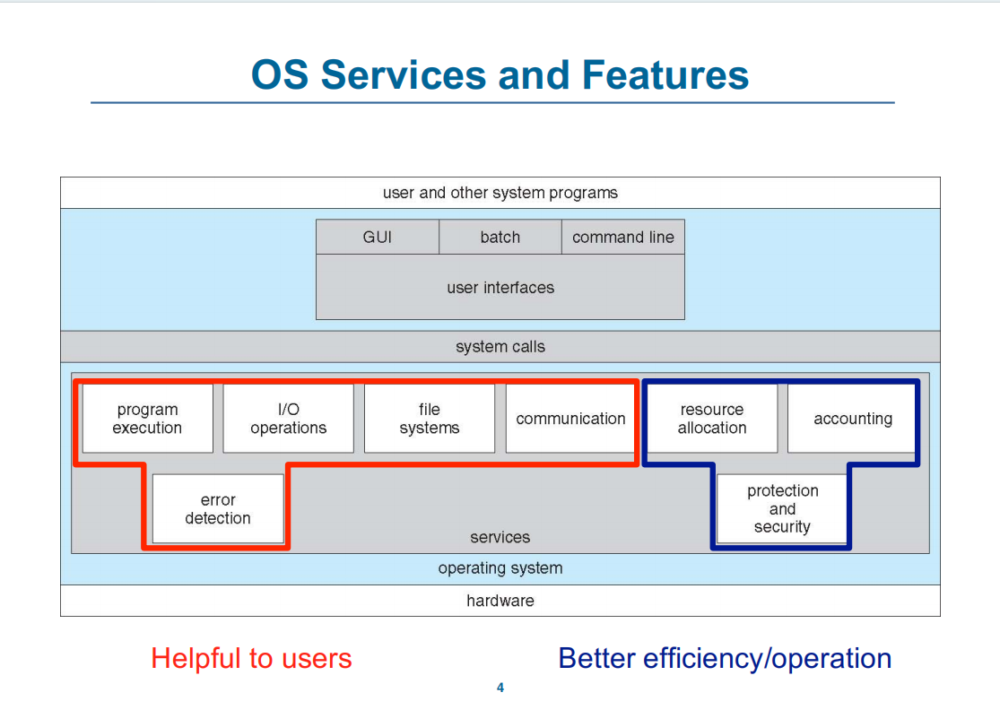
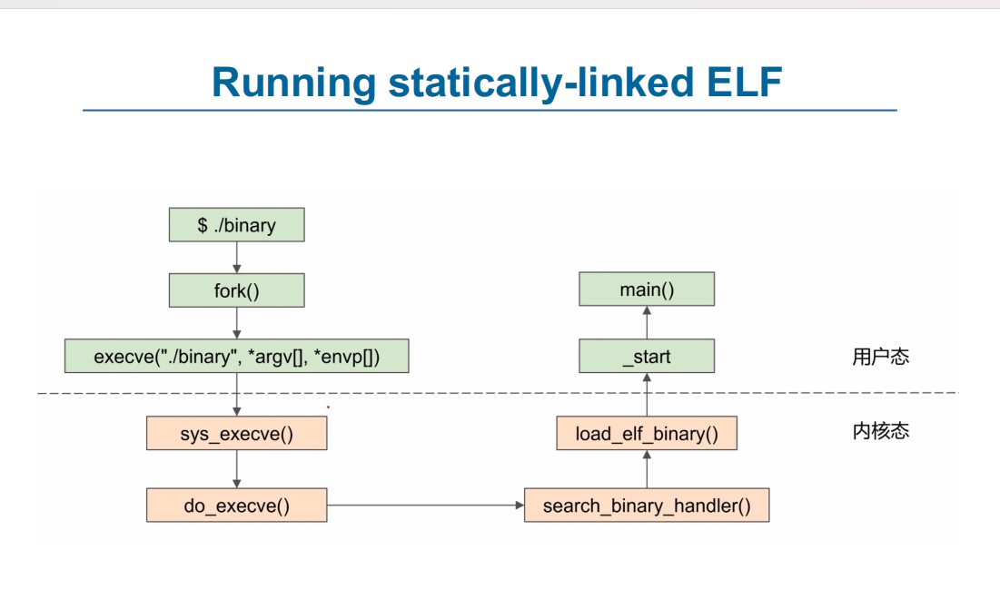
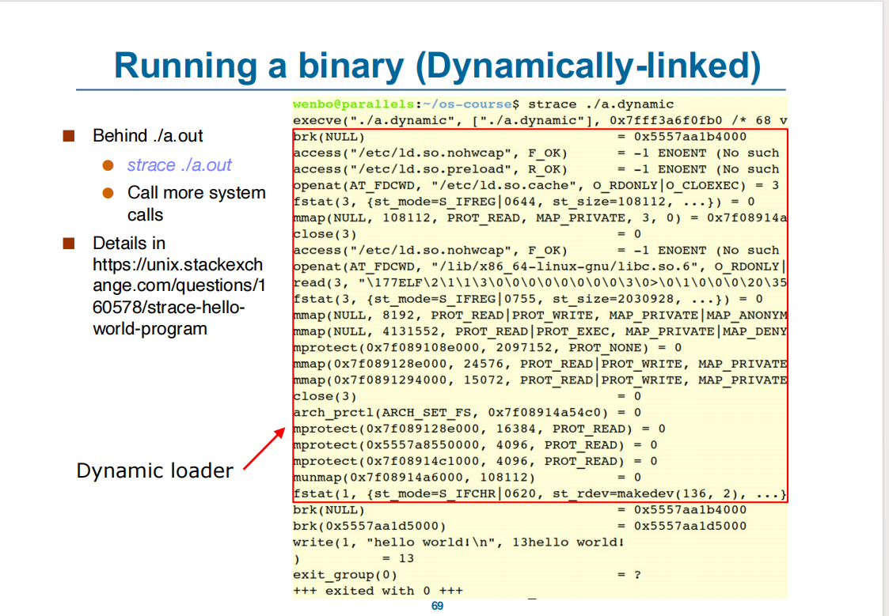
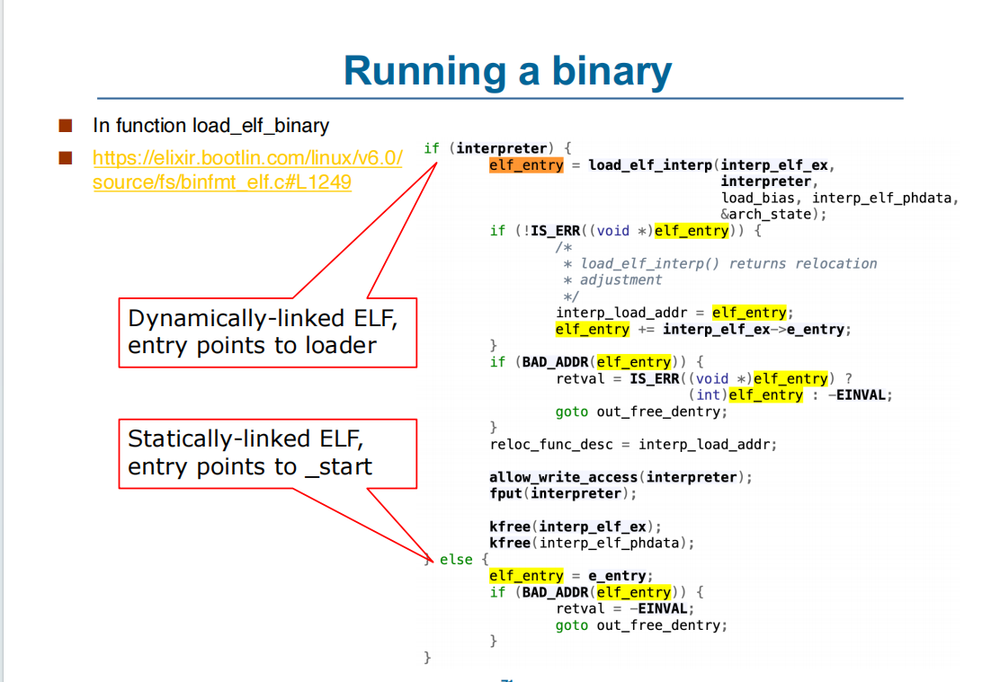
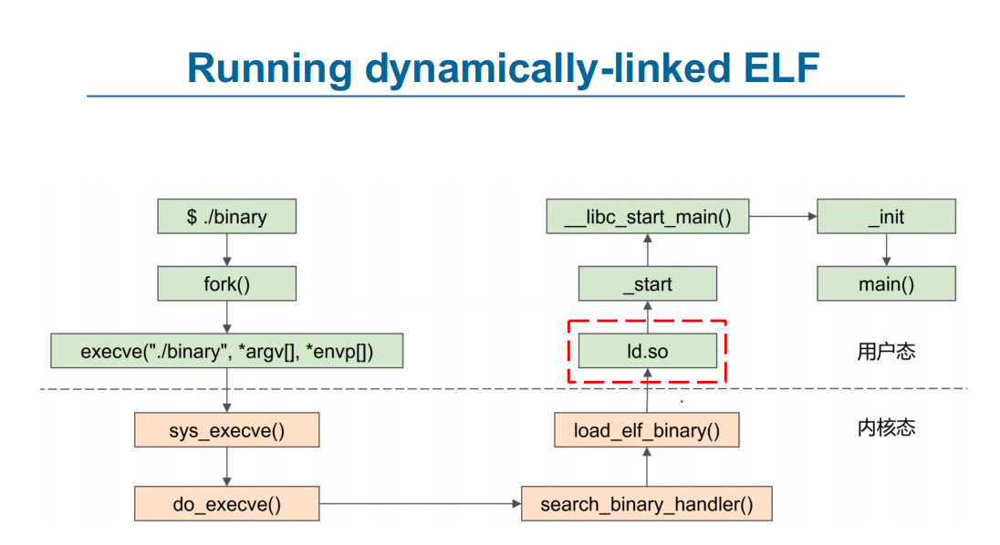
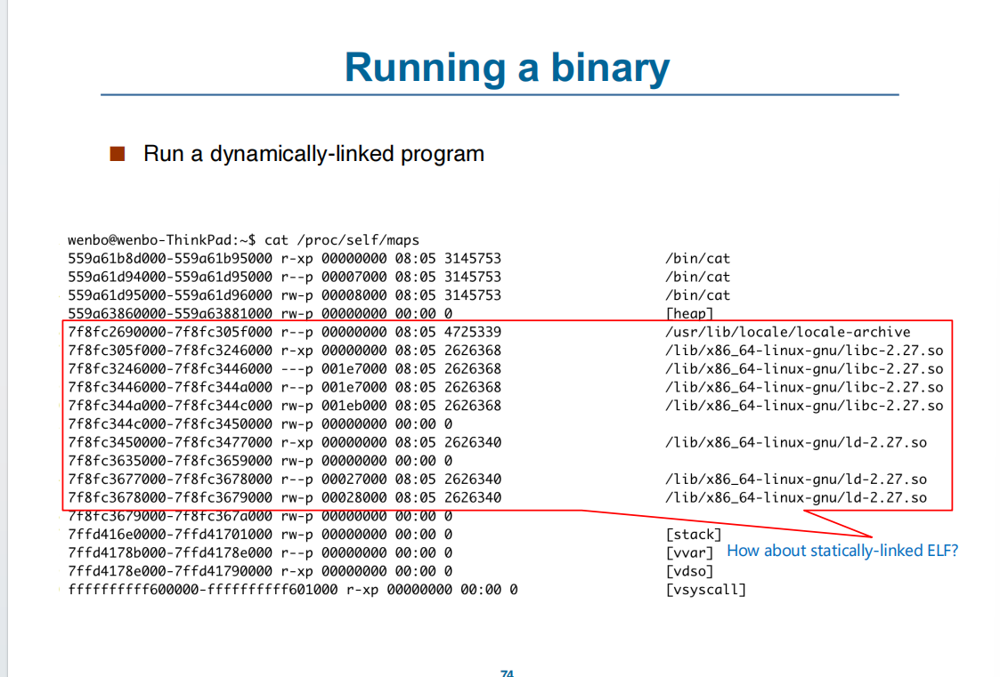
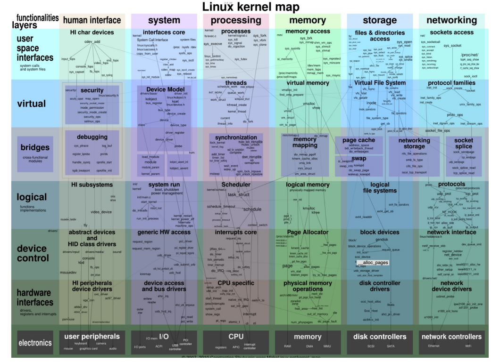

## Systemcalls
- 通常每个系统调用，都有系统调用号
`printf()` 是 `write()` 系统调用的包装

### System Call Parameter Passing
Three general methods used to pass parameters to rhe OS
- Simplest: pass the parameters in registers
- Parameters stored in a block, or table, in memory, and address of block passed as a parameter in a register
- Parameters placed, or pushed, onto the stack by the program and poped off the stack by the operating system

### 系统调用类型
- 进程控制
	- 创建、终止进程
	- end，abort
	- 加载，执行
	- 获取和设置进程的属性
	- 等待一段事件
	- 等待事件，信号事件
	- 获取和释放空间
	- 出现异常时转存内存
	- 检查bug
	- 数据共享时的锁
- 文件管理
	- 创建、删除、打开、关闭、读、写、复制文件
	- 获取和设置文件属性
- 设备控制
	- 申请和释放设备
	- 读、写、复制
	- 逻辑上连接设备
	- 获取和设置设备属性
- 维护信息
	- 获取和设置 时间日期、系统数据、进程、文件、设备属性
- 通信
	- 创建和删除通信连接
	- 传递和接受信息
	- 传递状态信息
	- 连接远程设备
- 保护
	- 控制资源权限，获取和设置权限，接受和拒绝用户的访问

### Linking
静态链接
- 所有需要的代码都被打包进一个二进制文件
动态链接
- 重用库而减少ELF文件

静态ELF文件没有`.interp section`

`exec()` syscall
- 设置 ELF 文件映射
- 设置栈和堆
ld-xxx
- 设置库

- 应用依赖于特定操作系统
	- 应用编译后，不一定能兼容执行
	- 每个操作系统有自己的系统调用和文件格式
	- 有些语言提供虚拟环境（Java）
	- 使用标准语言（C）能够在任何操作系统上运行

### 操作系统设计与实现
**用户目标**：操作系统应该易于学习和使用，安全可靠快速
**系统目标**：操作系统应该易于设计实现和维护，可靠，没有故障，有效，灵活

- 允许在不改变实现的情况下改变策略
- 系统编程用C，C++，脚本语言用python
- 底层汇编，主体为C
- 

