### Principles of Computer Design
- Take Advantage of Parallelism
- Principle of Locallity
	- Reuse of data and instructions
- Focus on the Common Case
	- Amdahl's Law

## MIMD 架构
### 多处理器系统——以共享内存为基础

- 多处理器系统有时也叫做内存共享系统
- 假如这些处理器在功能权限上完全相同，则称此系统为对称多核系统 (Symmetric Multi-processor)
- 只有一个系统镜像是多核系统区分于多计算机系统的重要特点


#### 内存访问模型

**Uniform Memory Access(UMA)**:

- 也叫symmetric(shared-memory) multiprocessors(SMP) or centralized shared-memory multiprocessors
- 所有处理器共享物理内存
- 每个处理器可以有私有cache和内存


**Non Uniform Memory Access(NUMA)**

- 也叫 distributed shared-memory multiprocessor(DSP)
- 所有CPU共享一个地址空间
- 用LOAD 和 STORE 指令访问远程内存
- 访问远程内存比访问局部内存要慢
- 可以使用cache

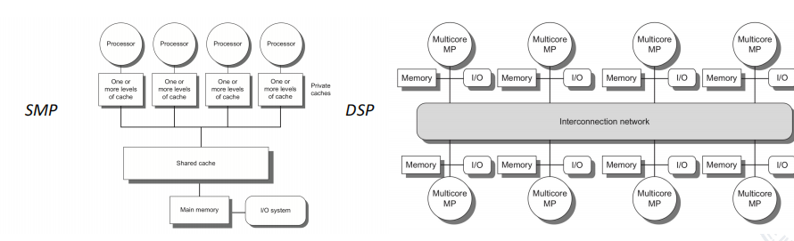

**NC-NUMA and CC-NUMA**

- 前者没有cache，后者有cache

**Cache Only Memory Access(COMA)**

- 所有内存被视为缓存，在使用时迁移到较近的处理器
- NUMA 的特殊例子：每个处理器节点中没有存储继承，所有的cache组成一个统一地址空间

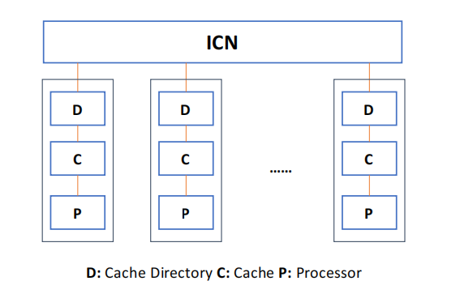

### 多计算机系统——基于信息传递

- 使用互连网络去传递信息

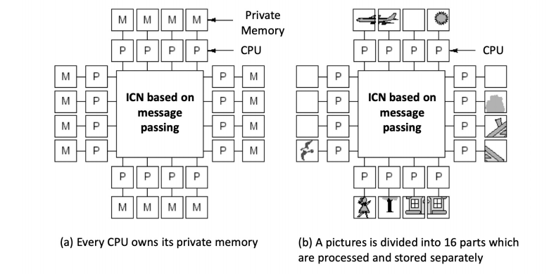

#### 进一步分类

**Massively Parallel Processors(MPP)**

- 包含成百上千处理器，开发代价高
- 使用高性能私有互连网络，能以低延迟高带宽传递数据

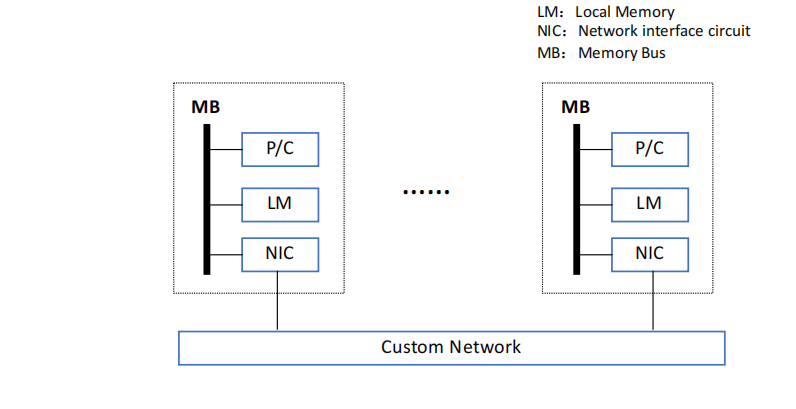

**Cluster of Workstations(COW)**

- 由大量个人电脑或工作站连接而成的商业网络
- 中心化或去中心化

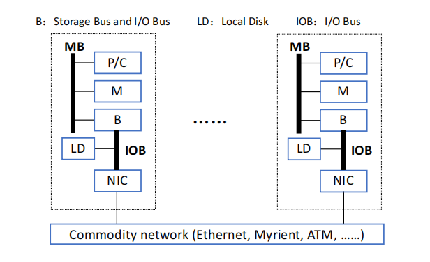

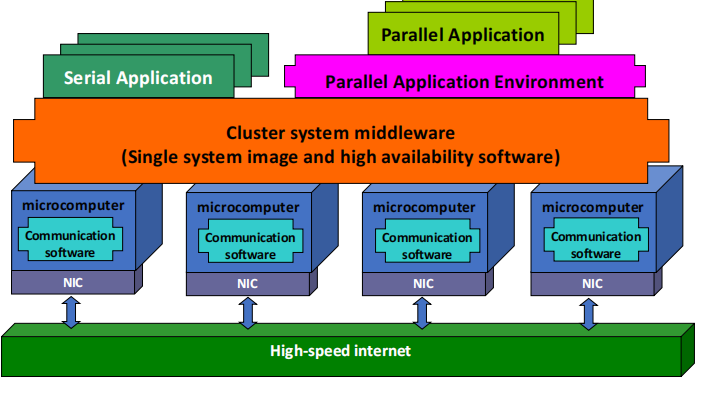

### 共享的问题
#### 内存的一致性

一个处理器写入的数据，一定能全部被另一个处理器看到


**Relaxed Consistency Models**

- 运行读写乱序完成，但是使用同步指令强制排序
- Rules
	- $X\rightarrow Y$ 
		- X操作一定要在Y操作之前完成
	- **`R → W`**：读操作必须先于写操作。
		- 弱定序和释放一致性
	- **`R → R`**：读操作必须先于另一个读操作。
	- **`W → R`**：写操作必须先于读操作。
		- 全存储定序
	- **`W → W`**：写操作必须先于另一个写操作。
		- 部分存储定序

#### 缓存一致性

获得的数据一定要是最新的数据

- 原因：处理器可能有数据的不同拷贝版本
- 迁移Migration
- 赋值Replication

**cache coherence protocol**

对于UMA: Snoopy coherence protocols

- 监视数据总线对私有cache的更新，广播将其它拷贝版本无效化或更新
- Write invalidate protocol（必须先读）
	- MSI protocol
		- Modified:标识当前块在私有cache中被更新，互斥
		- Shared：标识当前块在私有cache中被共享
		- Invalid

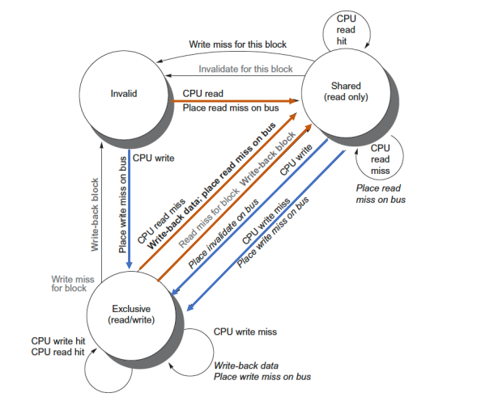

- MESI protocol
	- 增加一个exclusive状态：只在一个cache中（独占）被读或被写则转变状态


- MOESI：
	- 增加一个owned状态：果过时信息
- Write update / write broadcast protocol

对于NUMA: Directory protocol

- 维护一个目录记录：每个特定的数据库在哪些处理器中有拷贝
- 同样是写入共享块时，通过目录点对点地无效化
- 同样MSI三状态


**Write-through**类协议

- 四个阶段

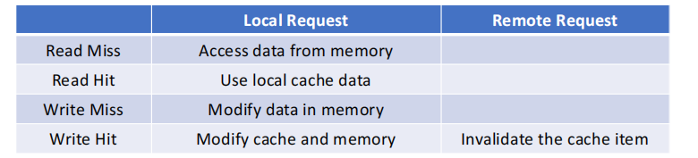

### Domain-Specific Architectures

- 使用专门内存来减少数据移动
- 在数学单元和更大地内存上花更多组员
- 使用最简单的符合的并行方式
- 减少数据大小和类型来满足领域需求
- 使用特定领域的编程语言

#### 例子：卷积神经网络

- Tensor Processing Unit

## 数据大小

- bit - Binary digit
- nibble - four bits
- byte - eight bits
- word - four bytes(32 bits) 大多数嵌入/移动处理器，eight bytes(64 bits) 大多数服务器和台式电脑
- kibibyt (KiB) \[kilobyte (KB)\) - $2^{10}$ (1024) bytes
- mebibyte (MiB) \[megabyte(MB)\) - $2^{20}$ bytes
- gibibyte (GiB) \[gigabyte(GB)\) - $2^{30}$ bytes
- tebibyte (TiB) \[terabyte(TB)\) - $2^{40}$ bytes
- pebibyte (PiB) \[petabyte(PB)) - $2^{50}$ bytes

## 性能优化

> 指令集并行（Instruction-Level parallelism(ILP)）的效能已经被完全发挥：单处理器性能优化在2003年便结束了

新的并行优化模型

### 多处理器

多核微处理器的难题

- 性能编程
- 负载均衡
- 优化通信和同步

应用并行分类
- 数据层并行 Data-level parallelism (DLP)
- 任务层并行 Task-level parallelism (TLP)

架构并行分类
- 指令层并行 Instruction-level parallelism (ILP)
- 向量架构(Vector architectures)/图像处理单元(Graphic Processor Units)
- 线程层并行 Thread-level parallelism (TLP)
- 请求层并行 Request-level parallelism (RLP)

费林分类法（Flynn's Taxonomy） 


### SIMD
#### Vector Registers
- 使用向量寄存器
- 向量处理器，专门处理向量
- 基础要求
	- 从向量寄存器中存取向量
	- 能够对不同长度的向量进行操作
	- 向量中的值可能再内存上分离存储需要->vector stride register

水平处理方法：不适合向量处理器
- $k_i \leftarrow b_i + c_i$
- $d_i \leftarrow a_i \times k_i$
- $D = A \times （B + C)$
纵向处理方法:
- $K \leftarrow B + C$
- $D \leftarrow A \times K$
纵向水平合并（分组）处理
$N = S \times n + r$

- CRAY-1
**性能优化**：

- 多个功能单元并行运行
- vector chaining technology：数据前递
- recycling mining technology
- Segmented Vector：为向量分段计算
- 多核系统

#### 数组处理器
- 也叫做并行处理器
处理单元$PE_0$to $PE_{N-1}$

**两个基本结构**

- 分布式内存：SIMD的主流
- 中心化共享内存

**并行处理器设计问题**

- 互联网络的设计
- 性能问题
- 软件问题

#### 互联网络
- 接口Interface：CPU和memory之间传递信息
- 链接Link：传递数据流的物理通道
- 交换点Switch node：信息交换和控制站

**分类**

- 静态网络：节点间的链接固定不变
- 动态网络：链接状态可以根据应用需求来改变

**目的**

- 通过有限数量的链接方法使得任意两个处理单元能够在一定步骤内完成信息交换
**单阶段互联网络**
- 结构简单开销小
- 对算法和应用的需求灵活满足
- 转换步骤小


## 性能

影响因素

- 算法
	- 决定有多少操作要执行
- 编程语言、编译器、架构
	- 决定每个操作有多少条机器指令
- 处理器和内存系统
	- 决定指令执行速度
- 输入输出系统（包括操作系统）
	- 决定IO操作速度

性能考虑

- 响应时间 : Response time(execution time)
- 吞吐量 : Throughput

### 性能计算

$Performance = \frac{1}{Execution_Time}$

- Clock Cycle Time(period) : duration of a clock cycle
- Clock Rate(frequency) : cycles per second

$CPU\_Time = CPU\_Clock\_Cycles \times Clock\_Cycle\_Time = \frac{CPU\_Clock\_Cycles}{Clock\_Rate}$

- Average cycles per instruction (CPI)

$CPI = \frac{CPU\_Clock\_Cycles}{Instruction\_Count}$

### 阿姆达尔定律Amdahl’s Law

$Improved\_Execution\_Time = \frac{Affected\_Execution\_Time}{Amount\_of\_Improv ement} + Unaffected\_Execution\_Time$

$Speedup_{overall} = \frac{Execution\_time_{old}}{Execution\_time_{new}} = \frac{1}{(1-Fraction_{enhanced}) + \frac{Fraction_{enhanced}}{Speedup_{enhanced}}}$


## Greate Architecture Ideas

- Design for Moore's law
- Use abstraction to simplify design
- Make the common case fast
- Improve performance via parallelism
- Improve performance via pipelining
- Improve performance via prediction
- Use a hierarchy of memories
- Improve dependability via redundancy

### 可靠性估计

平均故障时间：Mean time to failure(MTTF)
平均修复时间：Mean time to repair(MTTR)
故障间平均时间：Mean time between failures(MTBF) = MTTF + MTTR

Module availability = MTTF/MTBF

### 指令并行

#### 依赖

- 数据依赖 -> 数据冒险（RAW\WAR\WAW）-> 数据前递、暂停、代码调度
- 命名依赖（在改变对象命名后，仍然使用旧名）
- 控制依赖 -> 控制冒险 -> 暂停\分支预测（动态分支预测内含状态机）

#### 动态分支预测

- 维护历史分支表(Branch History Table(BHT))：即状态机维护
- 分支目标缓存(Branch-Target Buffer/Branch-Target Cache)：用于快速获得分支目标地址

#### 乱序执行

将ID阶段分成两个阶段：Issue（IS）和Read Operands（RO）

- Issue：解析指令，检查结构冒险，顺序发射
- Read Operands：等待直到没有数据冲突，读取操作数，乱序执行

##### 计分板算法(Scoreboard Algorithm)

四阶段控制

- Issue：解析指令，检查结构冒险 | 如果输出依赖于未完成指令则不发射
- Read operands：等待直到没数据冒险 | 真实依赖可以（RAW冒险）在此阶段解决，即等待写回
- Execution：执行操作 | 当执行完毕通知记分板
- Write result：暂停直到与前一条指令没有WAR冒险

**Instruction status** : 四阶段

**Functional unit status**：表示功能单元的状态 - 九个字段

- Busy : 当前单元是否忙碌
- Op : 单元执行的操作 
- Fi : 目标寄存器
- Fj,Fk : 源寄存器数
- Qj,Qk : 制造源寄存器数据的功能单元
- Rj,Rk : 标志源寄存器是否已经读取的标志|执行时设置为no

**Register result status** : 标识那个功能单元会写每个寄存器

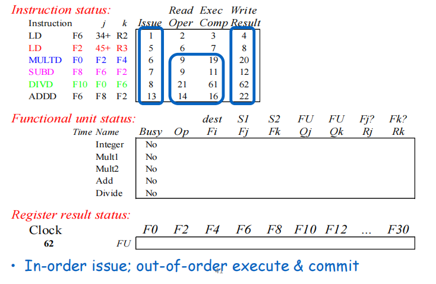

#### 托马斯罗方法Tomasulo’s Approach

三阶段执行

- Issue：从FP Op Queue中取指 | 加入保存站空闲（没有结构冒险），发射指令和操作数，重命名寄存器
- Execute：操作数执行，当操作数都准备好则执行，不然等待公共数据总线返回结果
- Write result：为所有等待的单元写回公共数据总线，释放保留站

Common data bus：data + destination（64 bits of data + 4 bits of Functional Unit source address）

##### 三个表

**Instruction status table** : 指令状态表

**Reservation stations table**：关注被发射的指令的状态

- Busy：功能单元是否被占据
- Op：操作
- Qj，Qk：数据从那个保留站来
- Vj，Vk：操作数的数据
- A：内存地址计算的信息

**Register status table**：记录哪些结果需要写回寄存器


#### 缺点
- 乱序执行且乱序完成，在异常中断时无法保持一致性

#### 重排序缓冲(Reorder Buffer(ROB))

在ROB中标记结果，而不是在Rervation Stations里

- 根据发射顺序在ROB中记录数据依赖
- 并依次提交
- 执行时的数据依赖都从ROB中获取，而寄存器状态表也标识ROB中的条目


### 异常和中断

- 异常：内部，检测到即解决，进程解决
	- 
- 中断：外部，方便时则解决，系统解决

#### 进一步优化 CPI < 1

- 需要在一个时钟周期内计算多个指令
	- 超标量处理器 ： 多发射
	- 超长指令字处理器(very long instruction word VLIW)：发射数固定，指令间并行关系由指令显式表达
	- 超级流水线处理器

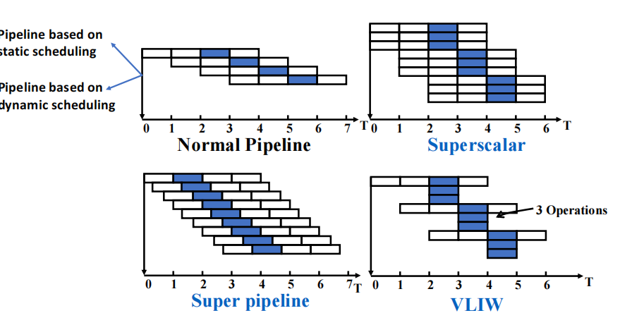

### 缓存（cache）

- 时间局部性：当数据被引用，很可能被再次引用
- 空间局部性：连续的数据很可能被引用

- 提前读入连续地址的数据

大小计算：$2^n \times (block\_size + tag\_size + valid\_size)$

#### 块存储类型

- Direct mapped：只有一个存储点
- Set associative：多路选择
- Fully associative ：任何地方可放

**地址划分**

- Tag + Index（选择set） + Offset

**替换策略**

- 随机替换
- Least-Recently Used(LRU)
- First In, First Out(FIFO)


贝拉迪异常：Belady’s Anomaly ： 增加cache大小后结果miss更多 | LRU不会引起这个异常

**写回策略**

- 暂停流水线写回
- 缓冲写回

- 跳过cache写新数据到内存
- 将新数据写回cache
#### Miss 代价
- Latency：读取第一个块数据的时间
- Bandwidth：读取剩余块的时间

引起原因：

- Compulsory（强制性）：第一次获取
- Capacity：块被舍弃，后续又获取
- Conflict：不同块，但映射到同一块缓存地址

缓存的两个架构：

- 集合缓存
- I\D分离缓存，Icache只读

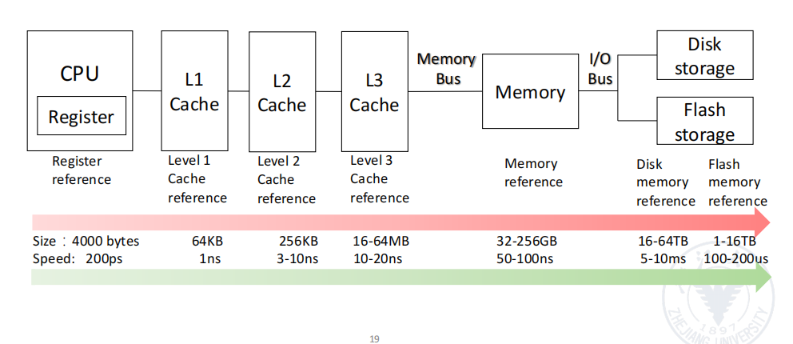

### TLB
- 页表的缓存

## 主存

**逻辑地址** ： CPU产生，也指向虚拟地址
**物理地址**：内存单元看见的地址

**静态链接**：系统库和程序代码被loader合并到程序二进制镜像中
**动态链接**：链接推迟到执行阶段

#### 内存申请

- 内存申请可以做到变量分离

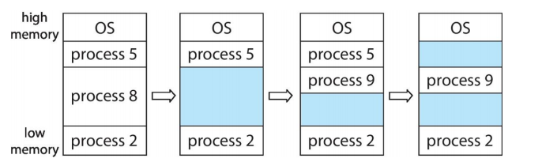

**内存申请策略**

- first-fit：第一个合适的
- best-fit：最小合适的
- worst-fit：最大合适的

- 外部碎片：可以通过重定位来解决，也可以通过分页解决
- 内部碎片：分配空间大于申请空间

### 分页（Paging）

- 将物理内存分为固定大小的块称为帧frames
- 将逻辑内存分成同样大小的块称为页

逻辑地址分成：page number + page offset

#### 页表

实际中只有 48位的地址映射

- 用寄存器存储：虽然快，但太小
- 在主存中存储，使用页表基地址寄存器（PTBR）来指向页表
- 页表长度寄存器（PTLR）来表示页表的大小
#### SV39
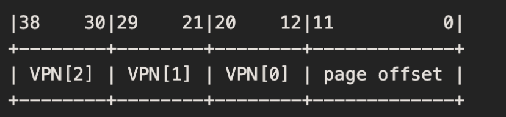

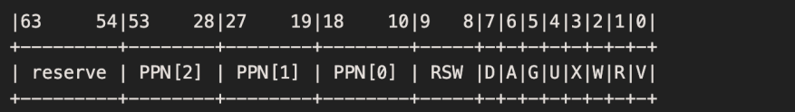

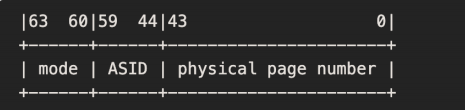

**TLB 优化**

多级页表：page directory number + page table number + page offset

反置页表：Inverted Page Table：所有进程共用同一个页表


#### Demand Paging

- 仅当其被访问时，将页存到内存中

触发**page fault**

##### Copy-on-Write

- 子进程和父进程共享页，直到需要写入页

**页替换**：根据策略找到victim

- FIFO
- Optimal:交换最长时间不被使用的页
- LRU：Counter-based / Stack-based
	- Second-chance algorithm:Generally FIFO, 硬件提供引用位
		- 引用位为0则替换，引用位为1则置零，检查下一个
	- Enhanced Second-Chance（reference，modify）
- Page-Buffering 空闲帧的池，修改页的链表

- 全局替换或局部替换

Reclaiming Pages： 全局替换策略->当空闲链表低于一定阈值旧开始页替换，这样永远有足够的空间去满足新请求

**Major page fault**:页被引用但不在内存中

**Minor page fault**：页在内存中，但映射不存在

#### Thrashing摇摆问题

- 在增加并行性和CPU利用率时如果没有足够的页，则可能产生反复的page fault

**解决办法**

- 局部页替换，不影响其它进程
- 为一个进程尽可能提供他所需要的页

### Buddy System

二的整数倍内存分配，相邻空闲块可以合并成更大的


$TLB\_reach = (TLB\_size)\times(page\_size)$

**Lazy swapper**：仅当有需要时才替换内存中的页

##### Slab Allocator

- 申请内存与再划分
- 对象的缓存：包括一个或多个slabs
- 一个slab包括一个或多个页，被分为大小相同的对象
- 三个状态：
	- Full-all used
	- Empty - all free
	- Partial - mix of free and used

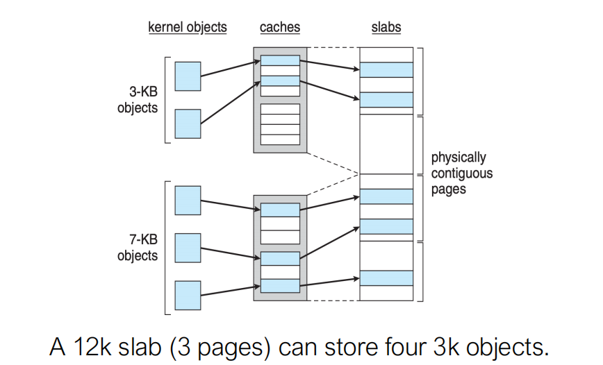

### 文件系统

**文件**是用于存储信息的一段连续逻辑地址空间

属性

- Name：
- Identifier：文件系统中唯一标识符
- Type：不同文件类型
- Location：在设备上的文件位置指针
- Size：当前文件大小
- Protection：权限控制
- Time，date and user identification：使用检测，文件保护

#### 文件操作

- 创建：在文件目录分配条目，在文件系统中分配空间
	- 逻辑文件系统分配一个新FCB
- 打开：返回其它操作的手柄
	- 在System-Wide Open-File Table 中找是否正在被使用
		- 如果时则创建一个 Per-Process Open-File table entry指向系统表中的相应位置
	- 如果没有，则在目录中查找文件名，找到就将他的FCB放到系统表中
	- 同时维护一个引用计数
- read/write：维护指针
- seek：文件内重定位
- delete：释放文件空间，硬链接（直到最后一个链接删除后才删除文件）
- truncate：删除文件，但保留属性
- Copying：create and read / write

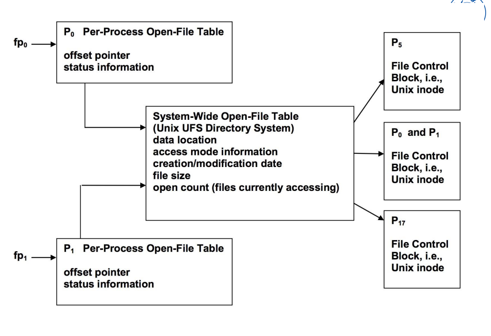

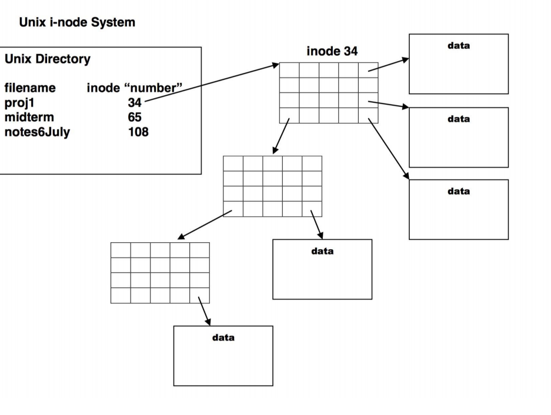

避免文件操作时的搜索文件，操作系统维护一个open-file table

而由于一些进程可能同时访问文件，文件表可以两种方式组织

- Per-process table：current location pointer， access rights
- System-wide table：location on the disk


文件表的信息

- 文件位置
- 文件计数：file-open count
- 磁盘地址位置：cache of data access information
- 访问权限:per-process access mode information

#### 文件类型

File types：文件扩展名

File type：magic number of the file - elf


#### 文件结构

- 无结构：比特或字节流 - linux 文件
- 简单记录结构：数据库
- 复杂结构：word文档

#### 文件访问方式
- 线性访问，只对于特定的介质类型
	- 由前序决定的顺序
- 直接访问：任意访问任意位置
- 索引访问

#### 磁盘结构

磁盘可以划分：比如分卷

磁盘和划分，可以在没有文件系统的情况下被使用


#### 文件目录

**文件目录**是包含所有文件信息节点的集合

##### 目录操作

- 创建文件：加入目录
- 删除文件：从目录删除
- 列出文件表：展示目录中所有文件
- 搜索文件：模式匹配
- 遍历文件系统

##### 目录组织

**目的**：高效、便捷、分类

- 单层目录：被所有用户使用 | 重名和分类问题
- 双层目录：以用户划分第一层（master file directory MFD）
	- 每个用户都有一个user file directory(UFD)
	- 仍然不能分类
- 树状结构：可以分类
	- 文件能以绝对路径和相对路径来访问
	- 相对路径是相对于当前目录current directory(pwd)
	- 删除目录（rm -rf /）删除所有子目录和文件
- 有向无环图目录：有悬挂指针问题
	- 用反向指针或引用计数可以解决

#### 文件共享

通过保护机制来共享文件

通过因特网共享的文件使用(Network File System NFS)

- 通过类似FTP程序
- 大多使用分布式文件系统

Client-server 模型允许用户挂载服务器的文件系统

- 一个服务器能够服务多个用户
- 全部以远程请求的形式

- UserID 来标识用户
- Group ID 来标识用户组

##### ACL

- 每个文件和目录都有一个访问控制表access control list(ACL)
- 可以进行细粒度控制

**Unix Access Control** 

- read,write,execute
- owner,group, and others

#### 文件系统挂载

一系列包含程序内存镜像的连续块被称为boot loader

文件系统在可以被访问之前一定要被挂在

挂载即将一个文件系统与系统链接，通常用一个单一命名空间

挂载点：文件系统被挂载个位置

挂载会使得在挂载点的目录不可见


#### 文件系统实现

##### 实例


- Strlen : length of the name 
- Reclen: length of the name plus left over space


- Linux : Ext2/3/4, Reiser FS/4, Btrfs
- Windows: FAT, FAT32, NTFS

分层文件系统(Layered File System): application programs -> logical file system -> file-organization module-> basic file system -> IO control -> devices


- Device drivers:管理IO设备
	- 给出指令"read drive 1, cylinder 72, track 2, sector 10, into memory location 1060",向硬件控制器输出特定的指令
- Basic file system：
	- 给出指令"retrieve block 123",翻译给设备驱动
		- buffer保持传输的数据
		- cache保持经常使用的数据
- File organization modul：理解文件，逻辑地址和物理块
	- 将逻辑块翻译成物理块
	- 管理空闲空间和磁盘分配
- Logical file system：管理元数据信息
	- 将文件名翻译成文件号，通过维护file control blocks（inodes in UNIX）给出文件handle和地址通过
	- 目录管理、保护、FCB
- 分层有利于减少复杂性和冗余性，但是会有额外开销

文件系统需要维护on-disk 和 in-memory 结构

- on-disk structure
	- boot control block : 包括从卷中启动操作系统的信息
	- volume control block：包括每卷的卷信息
		- of blocks, of free blocks,block size, free block pointers, free FCB count, free FCB pointers
	- directory structure: 组织目录和文件
		- A list of (file names and associated inode numbers)
	- per-file file control block：包括每个文件的信息
		- permissions, size ,dates, data blocks or pointer to data blocks
- In-memory structures：是磁盘结构的翻反映和扩展
	- Mount table: 存储 storing file system mounts, mount points, file system types
	- In-memory directory-structure ache:保存最近访问的目录的信息
	- system-wide open-file table:包括每一个FCB的拷贝
	- per-process open-file table: 包括系统打开表中合适条目的指针
	- IO Memory Buffers: 当文件系统块被从磁盘读取或写入时保存

#### Vitual File Systems

提供一个面向对象方式的文件系统实现方式：为系统调用提供一个统一接口

对象类型

- superblock : 定义文件系统的类型、大小、状态和其它元数据
- inode：包括文件的元数据
- dentry：inode的命名和目录的展开
- file：实际的文件数据

### 分配方法

- 连续分配适用于线性和随机
- 链接分配适用于线性但不适用于随机
- 索引分配较为复杂

#### 连续分配Contiguous Allocation

- 需要知道文件位置和大小
- 有外部碎片问题

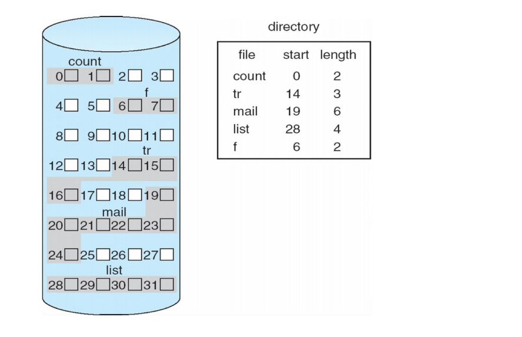

#### 链接分配Linked Allocation

- 每个文件都是磁盘块的链表
- 缺点：
	- 定位文件块需要很多IO和磁盘查找
	- 空间浪费
	- 指针可能损坏
- 改进：块簇，但是有内部碎片问题

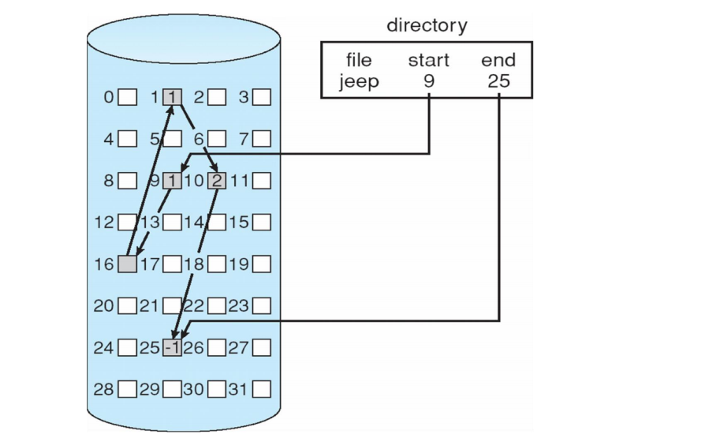

#### 索引分配Indexed Allocation

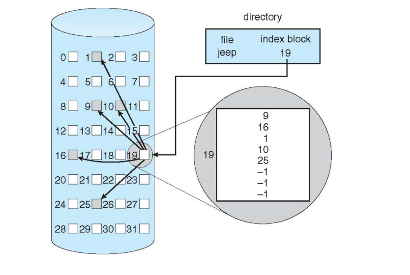

### 空闲空间管理

- Bitmap 管理方式
- 链表管理方式
	- 改进：分组和计数

### Mass Storage


Average I/O time: average access time + (data to transfer / transfer rate) + controller overhead

disk bandwidth:数据传输的速度

#### Nonvolatile Memory Devices

- 只能以page进行增量读写，不能指定位置覆写
- 生命周期用drive writes per day（DWPD）衡量

**NAND Flash Controller Algorithms**

- 每个块都标记为有效/无效
- 维护一个flash translation layer(FTL) table：再修改时就直接改变映射而不覆写

**Magnetic Tape**：

- 200GB - 1.5TB
- 访问很慢，但存储时间长

**磁盘结构**

- 磁盘驱动寻址被视作一个一维逻辑块数组(LBA)
- 每个逻辑块都映射到一个扇区，扇区0是最外磁道的第一个扇区

**磁盘连接形式**

- host-attached storage : 通过I/O总线
	- SCSI 是一种总线架构，支持16个设备
	- Fiber Channel 高速串行总线
	- hard disk, RAID arrays, CD, DVD, tape
- network-attached storage
	- NFS,CIFS and iSCSI 是常见的协议
	- 常常通过remote procedure calls（RPCs）来实现
	- 一般通过TCP \ UDP 在IP 网上
- storage area network
	- 最常见的是Fiber Channel

#### 磁盘调度Disk Scheduling

操作系统维护一个请求队列，每个磁盘或设备

**调度算法**

- FCFS(First-come first-served)
- SSTF(shortest seek time first)
	- 优点：平均响应时间减小
	- 缺点：计算查询时间需要开销，可能导致饥饿，响应时间波动大
- SCAN（elevator algorithm）：从一段开始查到另一端
	- 优点：响应时间波动小
	- 缺点：刚访问过的地方要等待较长时间再次访问
- C-SCAN（Circular-SCAN）：只沿一个方向扫描
- LOOK/C-LOOK：只走到最远的请求

#### 磁盘管理

- 物理格式化：将磁盘分成sectors供控制器读写
	- 每块有头信息、数据、异常码(error correction code)

- **根分区**：包含操作系统
	- 在启动的时候挂载，挂载时检查文件系统的一致性
	- Boot block 被指向启动卷或 boot loader，包含足够的代码来从文件系统加载内核

Boot block 初始化系统：

- 启动协议存在只读内存，固件中
- 启动协议加载程序存在启动分区的启动块

**Swap Space Management**: 利用二级存储管理内存空间的交换

#### RAID 廉价磁盘冗余阵列

**redundant array of inexpensive disks** 

- 通过冗余性来提高可靠性，在单个磁盘发生故障时保护数据不丢失
- 只能检测和恢复磁盘故障
- Solaris ZFS 增加额外检查来检测异常，校验和与数据元数据指针并排排列
	- 在池中申请磁盘，而不是卷和划分
	  
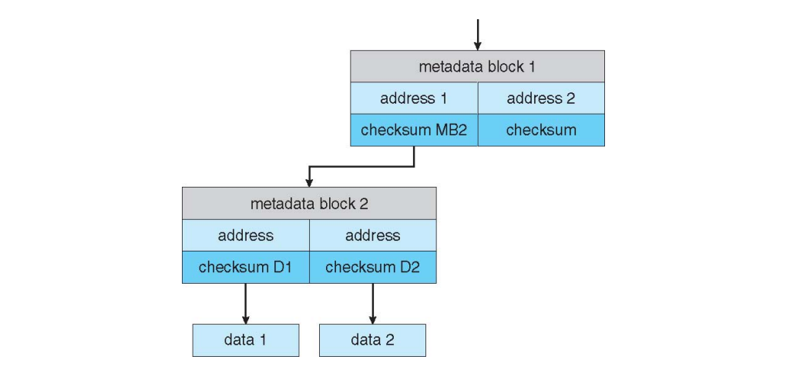

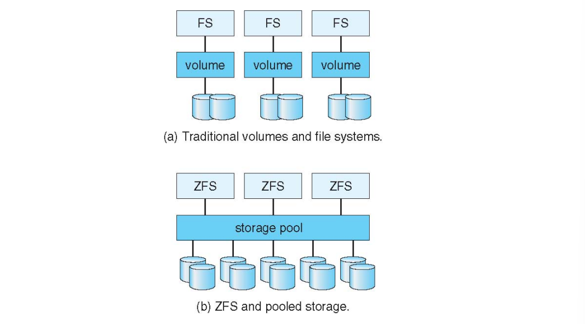

**RAID 0**: 将数据平分至两个或多个磁盘，除去校验位

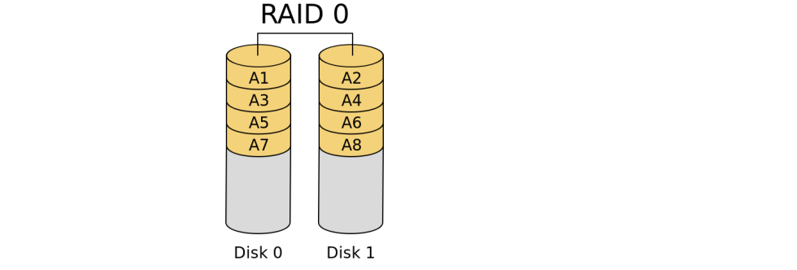

**RAID 1** ：在另一个磁盘上保存一个镜像


**RAID 2**： 在比特层将数据分段：使用 Hamming code

- Hamming code ： （4位数据，3位校验位）

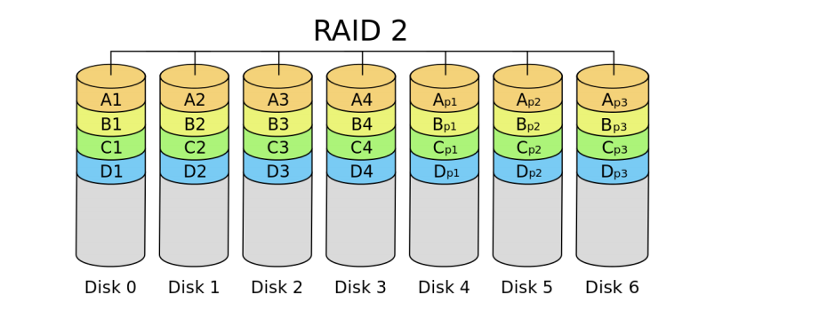

**RAID 4**: 块层级分段，用一个作为校验磁盘

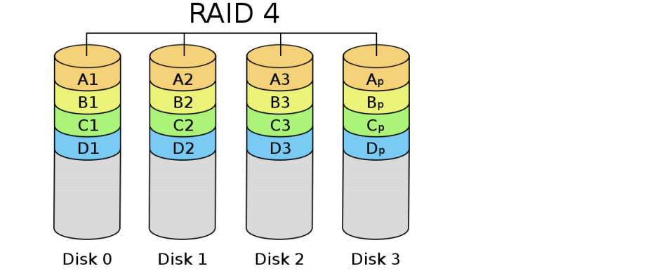

**RAID 5** ：块层级的分段，校验位数据分布到所有的磁盘


**RAID 6**：块层级的分段，两个校验位块

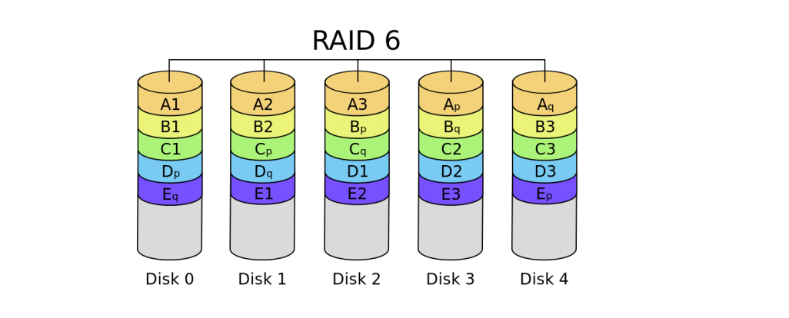

### I/O Hardware

基本概念

- 总线bus：和部件之间交流
- 端口port：和设备的连接点
- 控制器controller：控制设备

两种访问方式：轮询（polling）和中断（interrupt）

- 轮询：如果设备忙碌则等待，向设备控制器发送指令，读取寄存器状态直到指令被执行完毕，读取执行状态，可能重置设备状态

```c title="轮询" linenums = "1"
static char ns16550a_getchar(){
	if (uart[UART_LSR) & UART_LSR_DA) {
		return uart[UART_RBR);
	} else {
		return -1;
	}
}

static void ns16550a_putchar(char ch) {
	while ((uart[UART_LSR) & UART_LSR_RE) == 0);
	uart[UART_THR) = ch;
}
```

- 中断：设备驱动向控制器发送指令，然后返回。处理器指令被中断，先处理IO

**SMP IRQ Affinity**


- 有些CPU架构有专门的 I/O 指令：x86：in,out,ins,outs
- 设备一般有为数据和控制I/O准备的寄存器
- 通常1-4比特，或是先进先出的缓冲

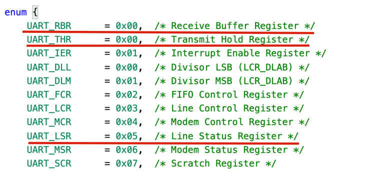

#### Direct Memory Access

直接在I/O和内存之间传输数据

- 但是也会引发安全问题

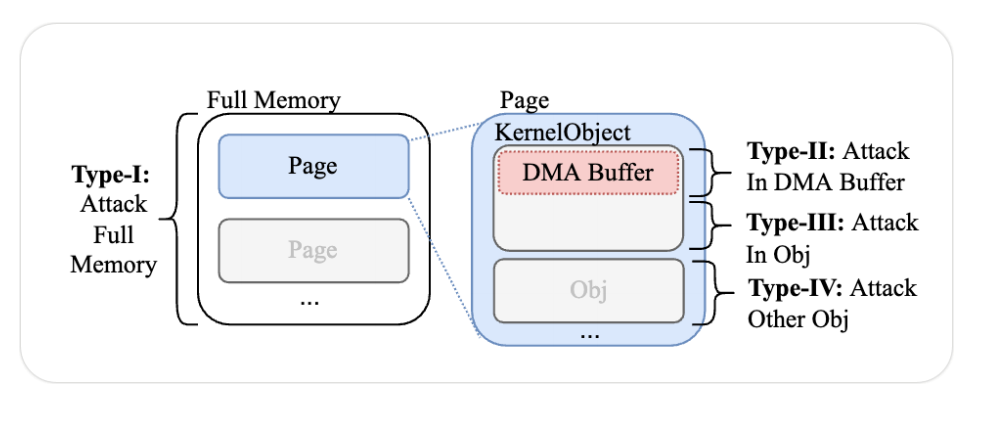

- 向DMA控制器发送指令

**IOMMU**：将设备地址翻译成物理地址


##### IO设备类型

- block I/O：在块中访问数据（例如磁盘驱动）read,write,seek
- character I/O:(Stream)
- memory-mapped file access
- network sockets
	- 将互联网协议和具体的互联网操作分离

Clocks and Timers ： 提供当前时间、经过时间

**Synchronous I/O**: 同步IO

- blocking IO: 进程悬挂直到IO完成
- non-blocking IO： 当能返回数据时就返回

锁：强制锁（一定要检查锁，遵循规则），咨询锁（有义务检查，但不强制）

**Asynchronous IO** ：异步IO

- 当IO执行时，进程也在执行

##### 子系统

- IO调度
- 缓冲
- 缓存
- Spooling
- Device reservation

IO保护：使用系统调用来执行IO

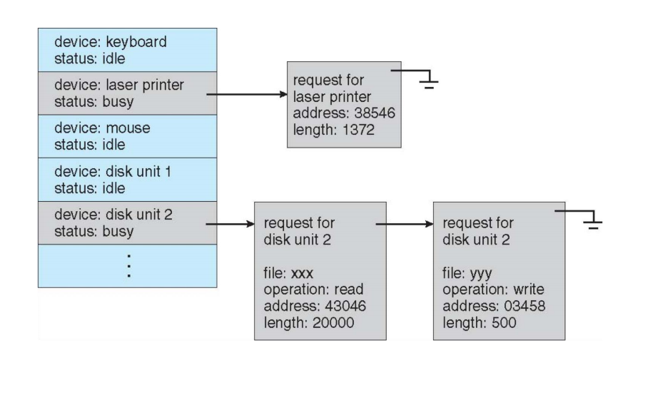


执行过程

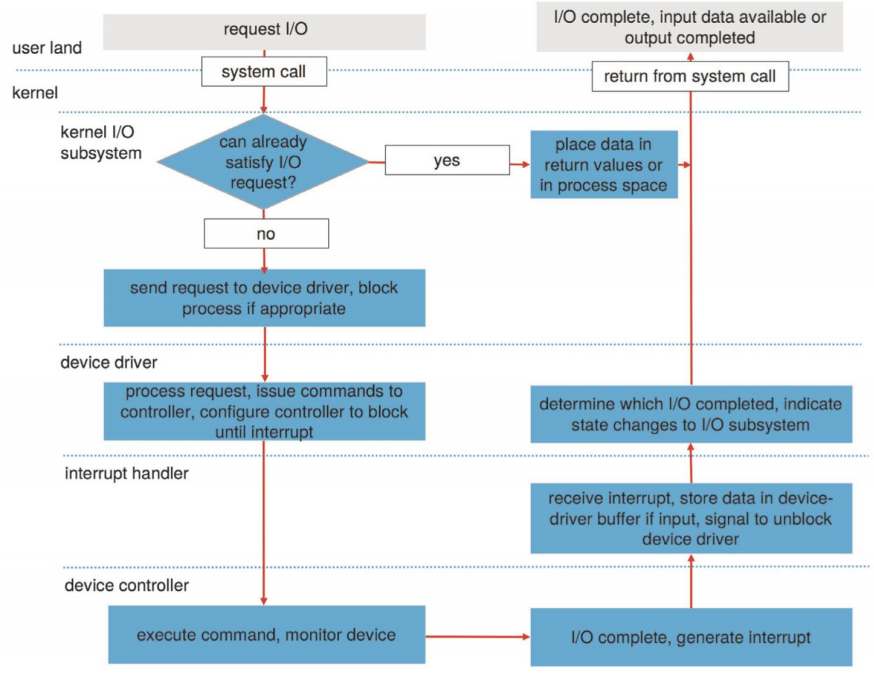

网络通信

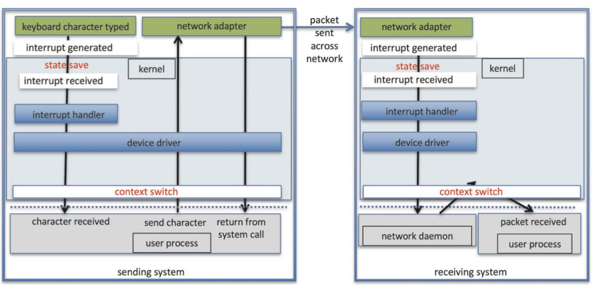

#### 性能优化

- 减少上下文切换和避免拷贝：使用DMA

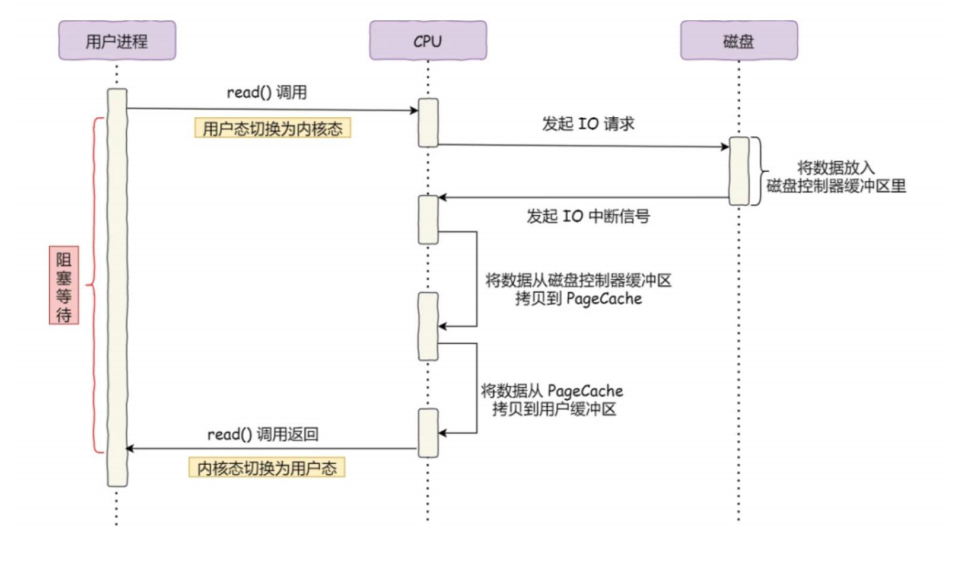

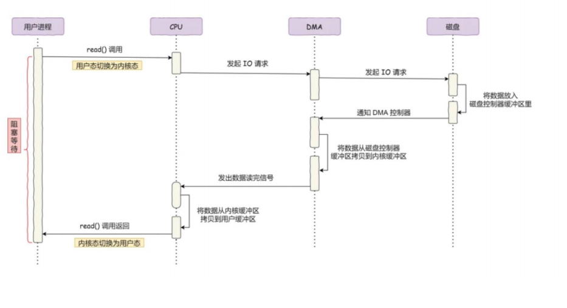

- 共享缓存区

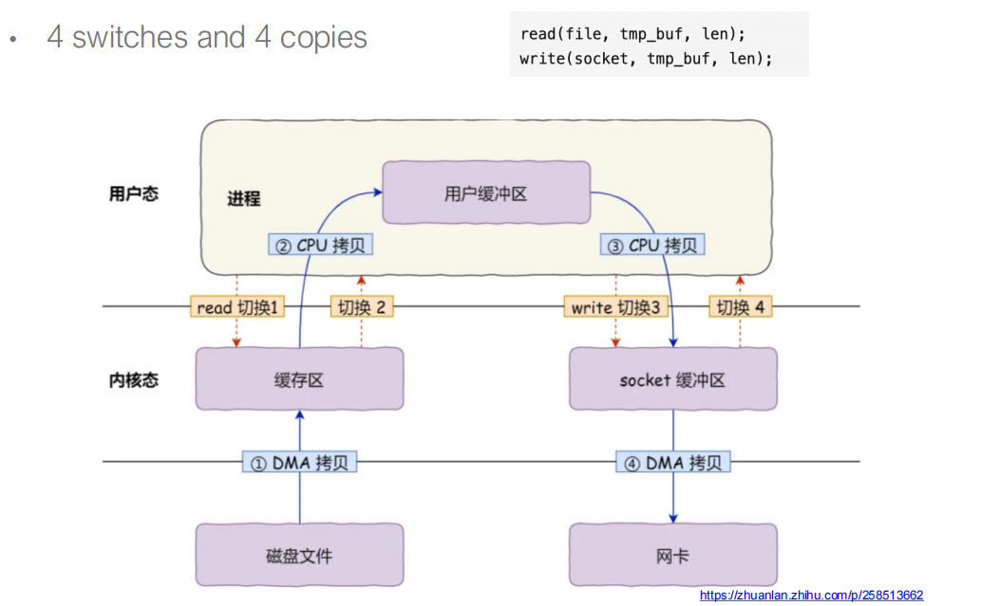

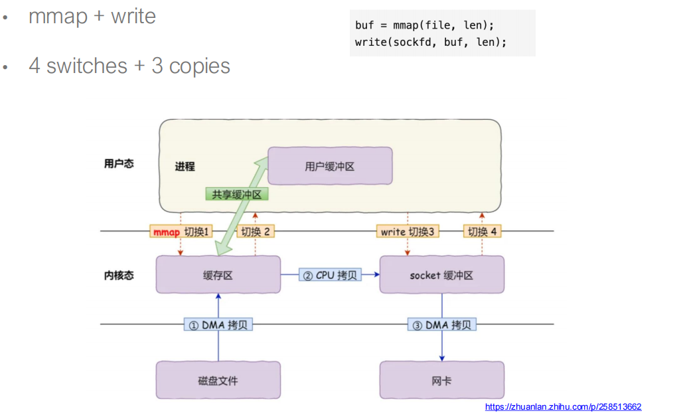

- 使用sendfile

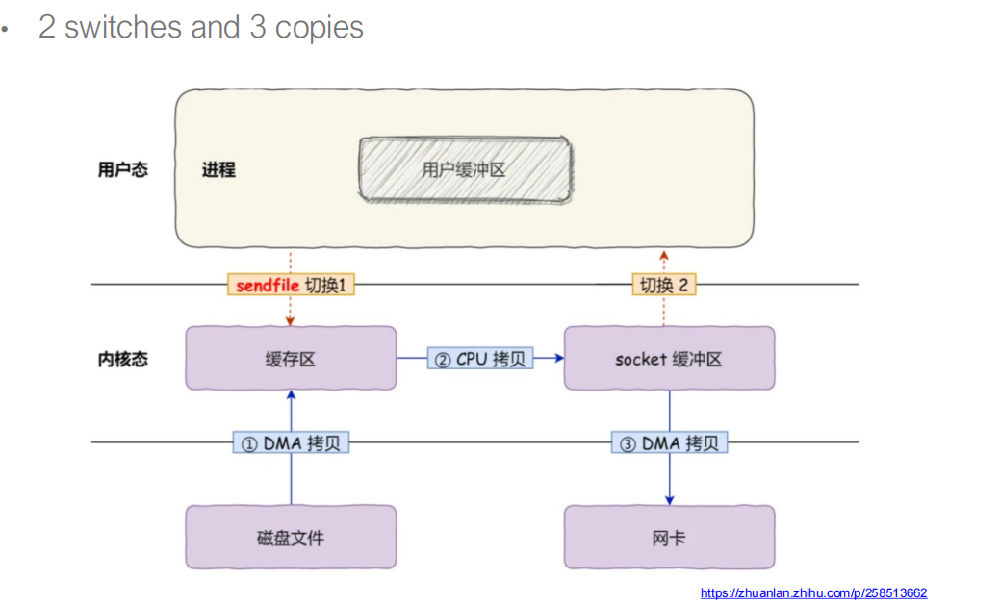

**Pagecache**：缓存最近从MMIO得到的数据

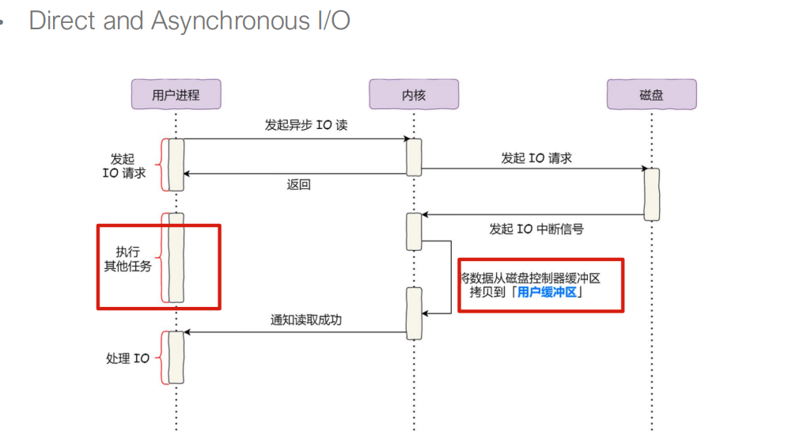

## 寻址模式

- Implicit Addressing：操作数的位置被隐含指定
	- 例如：累加器的值被默认使用
- Immediate Addressing：操作数被直接包含则指令中
- Direct Addressing：指令中包含了操作数的确切地址
- Indirect Addressing：指令中包含的地址是一个指向实际操作数的地址的指针，需要两次跳转
- Relative Addressing：PC+偏移量
- Base Addressing：地址+偏移量
- Indexed Addressing：使用寄存器中的内容+偏移量来进行寻址

对于特定的处理器结构进行处理
- Stack Addressing：使用堆栈的指针进行寻址

##  流水线
### 基本概念
The pipelining divides a process into several sub processes, each of which is implemented by a special functtional unit。
### 设计理念
The time of each stage in the pipelining should be equal as much as possible, otherwise the pipelining will be blocked and cut off. A longest stage will become the bottleneck of the pipelineing.
#### 流水线的分类
- 单功能流水线和多功能流水线
- 多功能流水线下：动态流水线与静态流水线
- 线性流水线与非线性流水线（存在环路）
- 循序流水线和乱序流水线
- 标量处理器和矢量流水线处理器
- 重叠执行是流水线的基础
### 部件
Every functional part should have a buffer register.
### 适用于
Pipelininig technology is suitable for a large number of repetitive sequential processes. Only when the tasks are continuously probided at the input, the efficiency of pipelining can be brought into full play.
### Extra Cost
The pipelining needs the pass time and the empty time.

## Cache 组织形式
#### VIVT(Virtually-Indexxed Virtually-Tagged) 虚拟高速缓存

用虚拟地址作为index和tag去访问cache，若命中且Cache line中的数据有效，则进一步根据offset去找到数据。若未命中，则将虚拟地址转换成物理地址，从主存中读取数据，返回给CPU和Cache
- 优点
	- 不用每次都将虚拟地址转换成物理地址，节约CPU等待时间。
- 缺点
	- 使用虚拟地址作为Tag，会引起歧义性和别名的问题
		- 歧义性：多个虚拟地址映射到同一个物理地址
		- 别名：一个虚拟地址由于进程切换等原因映射到不同的物理地址
#### VIPT（Virtually-Indexed Physically-Tagged） 物理标记的虚拟高速缓存

用虚拟地址做index，物理地址做tag，需要进行转译工作。
- 进程切换时不需要对Cache进行invalidate操作（因为匹配过程中需要借助物理地址）
- 但仍然存在别名问题
#### PIPT(Physically-Indexed, Physically-Tagged) 物理高速缓存

缺点：速度较慢
address translation: 地址转译


## GPU图像处理单元

CUDA ： Compute Unified Device Architecture

- 一个线程和每个数据元素相连
- 线程成块组织
- 块以grid来组织

**GPU**内存结构
- GPU memory 被所有 Grids 共享
- Local memory 被一个线程块中的所有线程共享
- Private memory 被单一CUDA 线程使用

Differences from vector machines
• No scalar processor
• Uses multithreading to hide memory latency
• Has many functional units, as opposed to a few deeply pipelined units like a vector processor