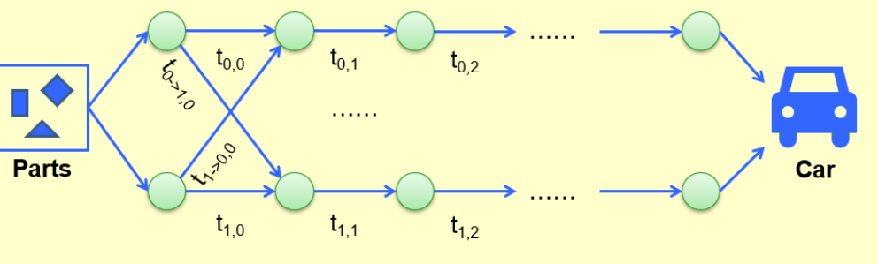
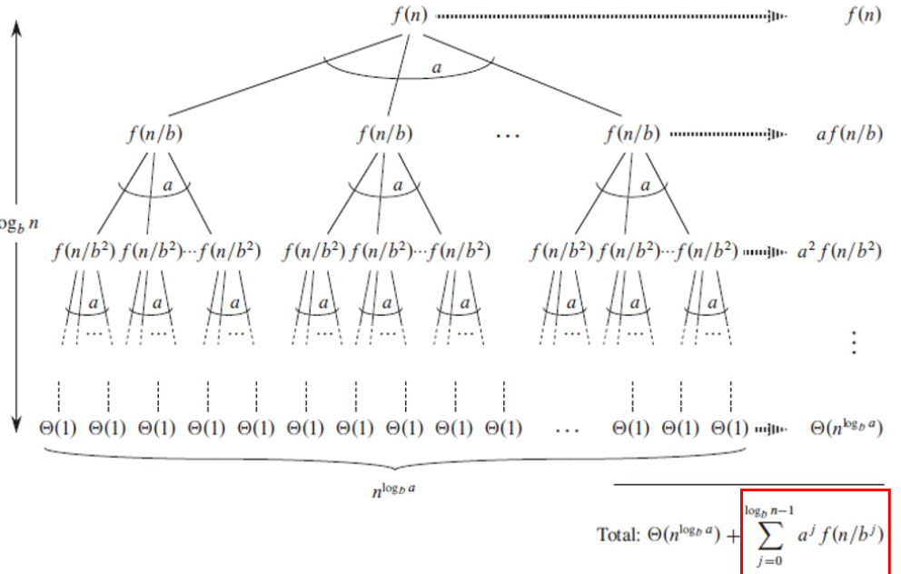

## 枚举
- 穷举所有的情况，利用约束减少枚举的情况

## 递归算法
- 写出递推公式：将原问题划分为子问题
- 明确递归终止条件
- 防止递归过深，可以引入缓存存储中间结果

## 分治算法
- 将原问题分解为若干个子问题，并递归求解子问题，最后将子问题的解组合成原问题的解

## 回溯算法
- 通过决策树遍历选择，在不满足条件的时候回溯，撤销选择带来的影响

## 贪心算法
- 每一步都做最优的选择
- 能否使用贪心算法取决于问题的最优子结构的性质

## 动态规划
- 将每一步计算的结果存在表格中供后续查询使用
可以使用的范围
- 满足最优子结构性质
- 满足重叠子问题
- 无后效性：子问题的解只与当前状态有关，与后面的阶段无关
- 重点是定义状态和找到状态转移方程

### 例子

#### 斐波那契数
```c linenums="1"
int Fibonacci (int N){
	int i, Last, NextToLast, Answer;
	if(N <= 1) return 1;
	Last = NextTo Last = 1;
	for(i = 2; i <= N; i ++){
		Answer = Last + NextToLast;
		NextToLast = Last;Last = Answer;
	}
	return Answer;
}
```

#### 矩阵乘法
状态转移方程

$$
m_{ij} = \left \{
\begin{array}{ll}
0 && if\quad i=j \\
\min_{i \leq l < j}\{ m_{il} + m_{l+1 j}+r_{i-1}r_lr_j\} && if \quad j > i
\end{array}\right.
$$

实际实现

```c  linenums="1"
void OptMatrix(const long r[], int N, TwoDimArray M){
	int i,j,k,L;
	long ThisM;
	for(i = 1; i <= N; i++) M[i][i] = 0;
	for(k = 1; k < N; k++)
		for(i=1; i <= N-k; i++){
			j = i + k; M[i][j] = Infinity;
			for(L=i; L<j; L++){
				ThisM = M[i][L] + M[L+1][j] + r[i-1]*r[L]*r[j];
				if(ThisM < M[i][j])
					M[i][j] = ThisM;
			}	
		}
}
```

#### Optimal Binary Search Tree

$$T_{ij}::=OBST\quad for \quad w_i,……,w_j(i<j);c_{ij}::= cost \quad of \quad T_{ij}(c_{ii}=0)$$

$$r_{ij}::=root\quad of\quad T_{ij};w_{ij} ::=weight\quad of \quad T_{ij}=\sum^{j}_{k=i}p_k(w_{ii} = p_i)$$

转移方程

$$c_{ij}=p_k + cost(L) +cost(R)+weight(L)+weight(R)$$

$$=p_k+c_{i,k-1}+c_{k+1,j}+w_{i,k-1}+w_{k+1,j}=w_{ij}+c_{i,k-1}+c_{k+1,j}$$

#### All-Pairs Shortest Path

- 定义:$$D^k[i][j] = min\{length \quad of \quad path \quad i->\{l \leq k\}->j\}$$

and $D^{-1}[i][j]=$$Cost[i][j]$. Then the length of the shortest path form $i$ to $j$ is $D^{N-1}[i][j]$.

状态转移方程

$$D^k[i][j] = min\{D^{k-1}[i][j], D^{k-1} [i][k]+ D^{k-1}[k][j]\},k\geq 0$$

#### Product Assembly



```c linenums="1"
f[0][0]=0;
f[1][0]=0;
for(stage=1; stage <= n; stage++){
	for(line =0; line<=1; line++){
		f_stay = f[line][stage-1] + t_process[line][stage-1];
		f_move = f[1-line][stage-1] + t_process[1-line][stage-1];
		if(f_stay < f_move){
			f[line][stage] = f_stay;
			L[line][stage] = line;
		}
		else{
			f[line][stage] = f_move;
			L[line][stage] = 1-line;
		}
	}
}
```

## 分治法

### Divide and Conquer
- Diviide the problem into a number of sub-problems
- Conquer the sub-problems by solving them recursively
- Combine the solutions to the sub-problems into the solution for the original problem


$$General\quad recurrence:T(N) = aT(N/b) + f(N)$$



#### 主定理 Master Theorem

主定理适用于求解的递归式算法的时间复杂度：

$$T(n) = aT(\frac{n}{b}) + O(n^k\log^pN)$$

其中：

- $n$ 是问题规模大小
- $a$ 划分出的子问题的数目
- $\frac{n}{b}$ 是每个子问题的规模大小
- $f(n)$ 是将原问题分解成子问题和将子问题的解合并成原问题的解的时间。 

!!! note "分析"

	1. $T(n) = \Theta(n^{\log_b a})$，如果对某个常数 $\epsilon > 0$ 有 $f(n) = O(n^{\log_b a - \epsilon})$

	2. $T(n) = \Theta(n^{\log_b a} \log^{k+1} n)$，如果 $f(n) = \Theta(n^{\log_b a} \log^k n)$ 且 $k \geq 0$

	3. $T(n) = \Theta(f(n))$ ， 如果对某个 $\epsilon > 0$ 有 $f(n) = \Omega(n^{\log_b a + \epsilon})$，并且 $f(n)$ 满足正则性条件
	
	> 正则性条件为：对某个常数 $c < 1$ 和所有足够大的 $n$，有 $a\,f(n/b) \leq c\,f(n)$。


#### 空间最小距离对

```c
sorted by y coordinates
for(i =0; i < NumPointsInStrip; i++)
	for(j = i+1l j < NumPointsInStrip; j++)
		if(Dist_y(P_i, P_j) < δ)
			break;
		else if(Dist(P_i,P_j) < δ)
			δ=Dist(P_i,P_j);
```

## 随机算法

Naive Solution

```c
int Hiring (EventType C[], int N){
	int Best = 0;
	int BestQ = the quality of candidate 0;
	for (i = 1; i <= N; i++){
		Qi = interview(i);
		if(Qi > BestQ){
			BestQ = Qi;
			Best = i;
			hire(i);
		}
	}
	return Best;
}
```

Radomized Permutation Algorithm

```c
void PermuteBySorting(ElemType A[],int N){
	for(i = 1;i <= N;i++)
		A[i].P = 1 + rand()%(N^3);
	Sort A, using P as the sort keys;
}
```

Online Hiring Algorithm- hire only once

```c
int OnlineHiring(EventType C[], int N, int k){
	int Best = N;
	int BestQ = -infty;
	for(i=1; i<=k; i++){
		Qi = interview(i);
		if(Qi > BestQ) BestQ = Qi;
	}
	for(i=k+1; i<=N;i++){
		Qi = interview(i);
		if(Qi > BestQ){
			Best = i;
			break;
		}
	}
	return Best;
}
```

$$Pr[S]=\sum_{i=k+1}^NPr[S_i] = \sum^N_{i=k+1}\frac{k}{N(i-1)} =\frac{k}{N}\sum^{N-1}_{i=k}\frac{1}{i}$$

#### 快排

随机选一个|进行判断短的至少有$n/4$|再选一个
在前面的考察时间取舍，来换取后面时间的安全。
选择次数的期望为2,选中好的基准点的概率为$1/2$

- 定义:Type j: the subproblem $S$ is of type j if$N(\frac{3}{4})^{j+1}\leq |S|\leq N(\frac{3}{4})^j$
- Claim: 最多有$(\frac{4}{3})^{j+1}$个子问题

$$E[T_{typej}]=O(N(\frac{3}{4})^j)×(\frac{4}{3})^{j+1}=O(N)$$

## 贪心算法

- 优化问题，每做出一次决定，剩下一个子问题去解决。
- 原问题一定有贪心实现的最优解
- 证明最优子结构存在
哈夫曼编码（算法）
- 永远选择最小的一对树进行合并
