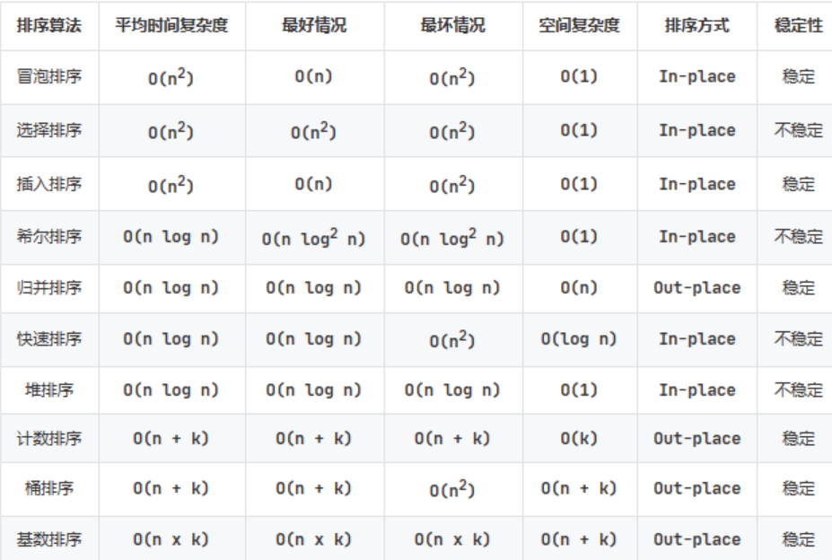

## 冒泡排序
- 逐步将排序靠前的元素上浮，比较交换
- 若从右侧开始，则左侧逐渐完成排序
- 不改变相等元素的相对位置，稳定排序
- 适用于较为有序，少量数据情况

## 选择排序
- 选择排序位，遍历剩余元素，选出排序最靠前的与排序位交换
- 不稳定排序，适用于数据量少，空间要求大

## 插入排序
- 逐步将无序段的元素插入到有序段
- 移动开销由数据结构决定

## 堆排序
- 借助最大堆，最小堆结构，使用元素构建堆结构，依次输出

## 桶排序
- 划分区间，各自排序，再依次输出

## 基数排序
- 按位加入桶，然后输出

## 计数排序
- 建立最小到最大值的数组，计数，依次输出

## 归并排序
- 划分区间到最小块，两两合并
- 两个待合并块，加一个合并块

## 希尔排序
- 用Gap得到字串，进行排序
- 不断缩小Gap，直到对整个序列进行排序

## 快速排序
- 选定哨兵，元素大的小的各自分向哨兵左右
- 用新的空结构，头尾来实现，以防左右大小不一