## E-R 模型（Entity Relationship Model）
- 一个实体被一系列属性描述

 

**实体描述法**

---

- 矩形表示实体集
- 属性在矩形中列出
- 主键属性被下划线划出

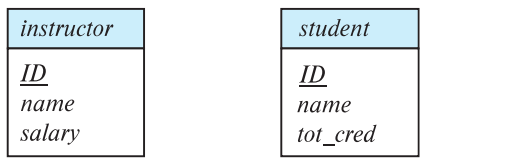

**带属性的关系集**

---

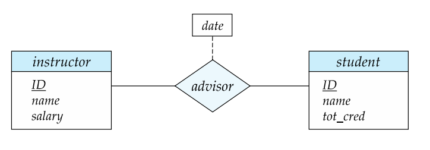

**三元关系集**

---

- 只允许有一个箭头，多个则会引起歧义

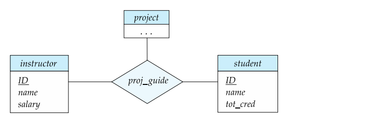

**带角色的关系图**

---

 
**关系符号**

---

- $\leftarrow$: 单一参与
- $-$：部分多个参与
- $=$: 完全多个参与

复杂属性的表示

--- 

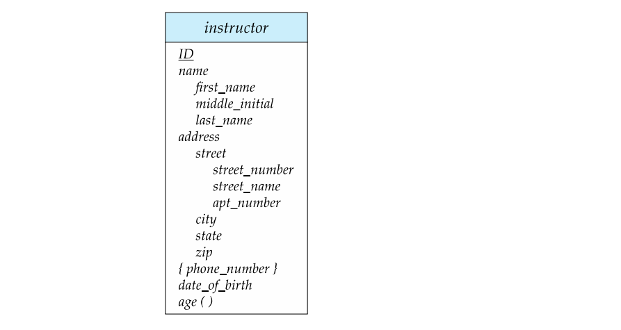

**One-to-One Relationship**

---

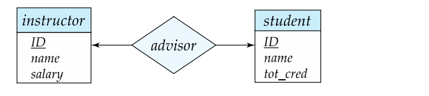

**One-to-Many Relationship**

---

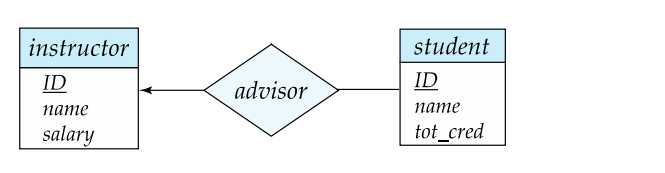

**Total and Partial Participation**

---

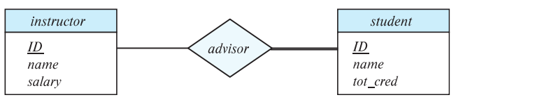

**标记表示约束**

---

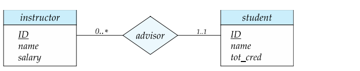

**二元关系集的主键选择**
 
---

- Many-to-Many: union of the primary keys
- One-to-Many | Many-to-One: primary key of the 'Many' side
- One-to-One: primary key of either one

**弱实体关系**

---

- 弱实体集的存在依赖于另一个实体，这一实体被称为标识性实体(identifying entity)
- 由双矩形来表示实体
- 用虚线来标记分辨符(discriminator or partial key)
- 弱实体集的主键由依赖主键加上分辨符组成

**图例**

---

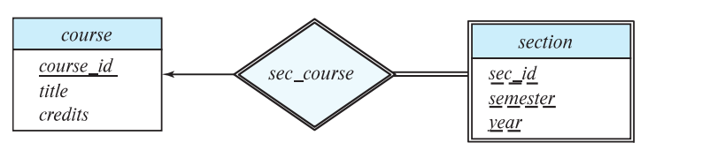

- 表示关系集合，Many-to-Many，只需要将最小主键取出来就行

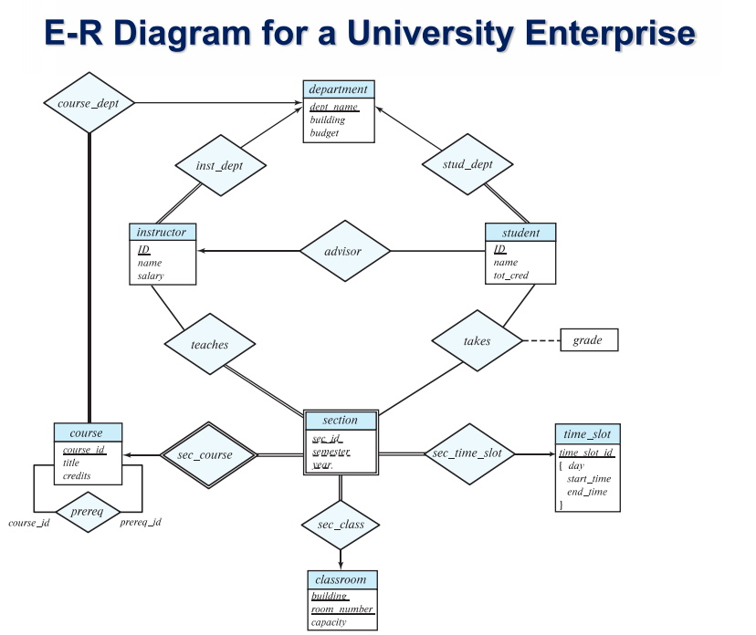

### 特化与概化(Specialization & Generalization)

**特化样例**

---

- 自上而下的分割过程
- 重叠特化：可以同时是两者
- 不相交特化：只能选择其中之一

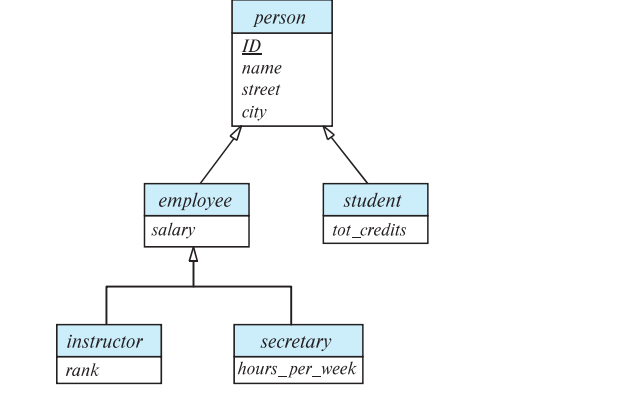

- 聚合：可以将特定的关系看作一个实体，允许关系之间的关系存在

**三元关系转二元关系**

---

- 为R中的每一个关系$(a_i,b_i,c_i)$，创建一个实体$e_i$,并创建三个关系，依次加入.

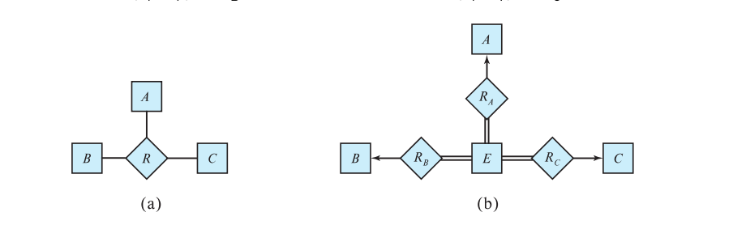

### 标识表

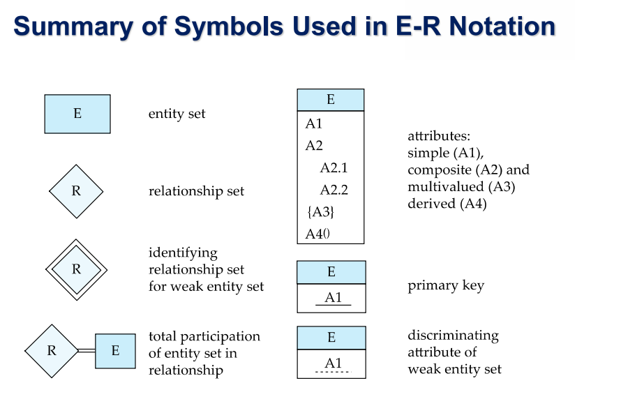

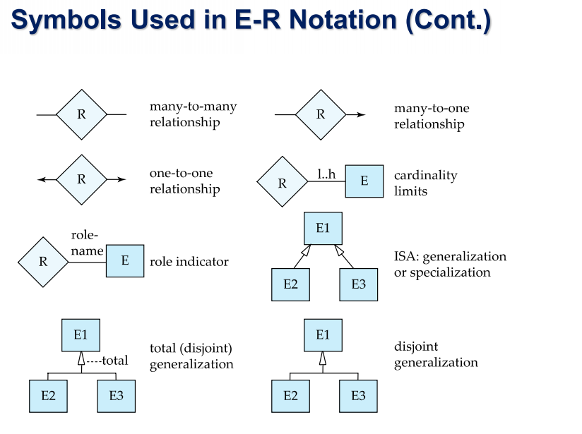

## 范式理论(Normalization Theory)

 

函数依赖

---

- 有自反，增补，传递法则
- 集合、分解、伪递移法则

- $\alpha \rightarrow \beta$：前者属性相同，则后者属性相同
- $K$ is a superkey for relation schema $R$ if and only if $K \rightarrow R$
- $K$ is a candidate key for $R$ if and only if
    - $K \rightarrow R$, and
    - for no $\alpha \in K, \alpha \rightarrow R$
- $\alpha \rightarrow \beta$ is trivial if $\beta \in \alpha$

- 依赖保持检查，$t = (result \cap R_i)^+ \cap R_i$

闭包

--- 

- 包含**函数依赖闭包**和**属性集闭包**

- 属性集闭包的作用：测试超键、测试函数依赖找出多余的属性、计算闭包

- $F$中在逻辑隐含的所有函数依赖的集合，称为$F$的闭包(closure).
- Example:
    - $F=\{A \rightarrow B, B \rightarrow C\}$
    - $F^+ = \{A \rightarrow B, B \rightarrow C, A$
     $\rightarrow C, AB \rightarrow B, AB \rightarrow C \}$

无损分解

---

- 无损分解的代数表达形式：$\Pi_{R_1}(r) \Join \Pi_{R_2}(r) = r$

- A decomposition of $R$ into $R_1$ and $R_2$ is lossless decomposition if at least one of the following dependencies is in $F^+$:
    - $R_1 \cap  R_2 \rightarrow R_1$
    - $R_1 \cap  R_2 \rightarrow R_2$

#### Boyce-Codd Normal Form(BCNF)

BCNF范式定义

---

- A relation schema R is in BCNF with respect to a set $F$ of functional dependencies, if for all functional dependencies is in $F^+$ of the form

$$\alpha \rightarrow \beta$$

where $\alpha \in R$ and $\beta \in R$, at least one of the following holds:
- $\alpha \rightarrow \beta$ is trival
- $\alpha$ is a superkey for $R$

- 一个函数依赖的要么是平凡的，要么左侧是超键
- 并非永远保持函数依赖

BCNF范式转换

--- 

- Let $R$ be a schema $R$ that is not in BCNF.
- Let $\alpha \rightarrow \beta$ be the FD that causes a violation of BCNF.
- We decompose $R$ into two realtions:
    - $(\alpha \cup \beta)$
    - $R \setminus (\beta \setminus \alpha)$

#### First Normal Form(1NF)

第一范式定义

---

- A relational schema $R$ is in first normal form if the domains of all attributes of $R$ are atomic.
- Non-atomic values complicate storage and encourage redundant(repeated) storage of data/

#### Third Normal Form(3NF)

第三范式定义

---
- 永远有一个依赖保持和无损的分解
- A relation schema $R$ is in third normal form (3NF) if for all:

$\alpha \rightarrow \beta$ in $F^+$

at least one of the following holds:

- $\alpha \rightarrow \beta$ is trivial
- $\alpha$ is a superkey for $R$
- Each attribute $A$ in $\beta - \alpha$ is contained in a candidate key for $R$.

第三范式的出现缘由

---

- BCNF is not dependency preserving and losslessness
- efficient checking for FD violation on updates is important.

第三范式的转换

---

- 为每一个函数都构建一个关系集
- 为原先集中的候选键构建关系集
- 删除冗余的关系集

#### Fourth Normal Form(4NF)

4NF范式定义

---

- BCNF 在多值依赖上的推广

- A relation schema $R$ is in 4NF with respect to a set $D$ of functional and multivalued dependencies if for all multivalued dependencies in $D^+$ of the form $\alpha \rightarrow \rightarrow \beta$, where $\alpha \in R$ and $\beta \in R$, at least one of the following hold:
    - $\alpha \rightarrow \rightarrow \beta$ is trivial 
    - $\alpha$ is a superkey for $R$

### Multivalued Dependencies(MVDs)

- 记号:$\alpha \rightarrow \rightarrow \beta$
- 简单理解，一列相同，后两列集合交换

### 正则覆盖(Canonival Cover)

无关属性

---
 
- An attribute of a functional dependency in $F$ is extraneous if we can remove it without changing $F^+$

正则覆盖

--- 

- 一个正则覆盖就是隐含了原所有的函数依赖，且没有无关属性，同时左侧不会重复
    - Each left side of functional dependency in $F_c$ is unique. That is there are no two  dependencies in $F_c$.
        - $\alpha_1 \rightarrow \beta_1$ and $\alpha_2 \rightarrow \beta_2$ such that
        - $\alpha_1 = \alpha_2$

