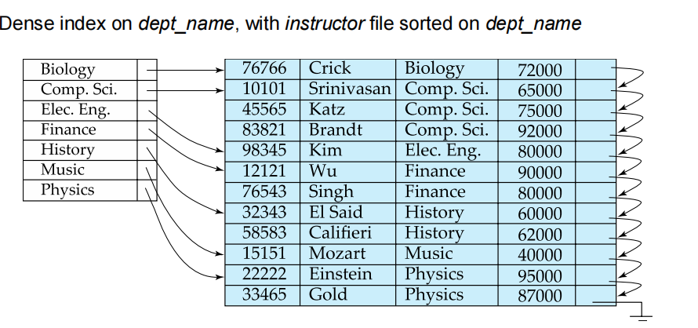
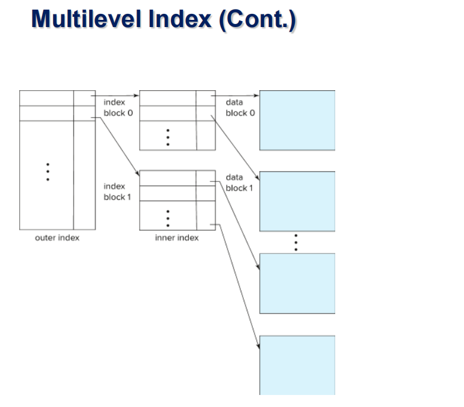
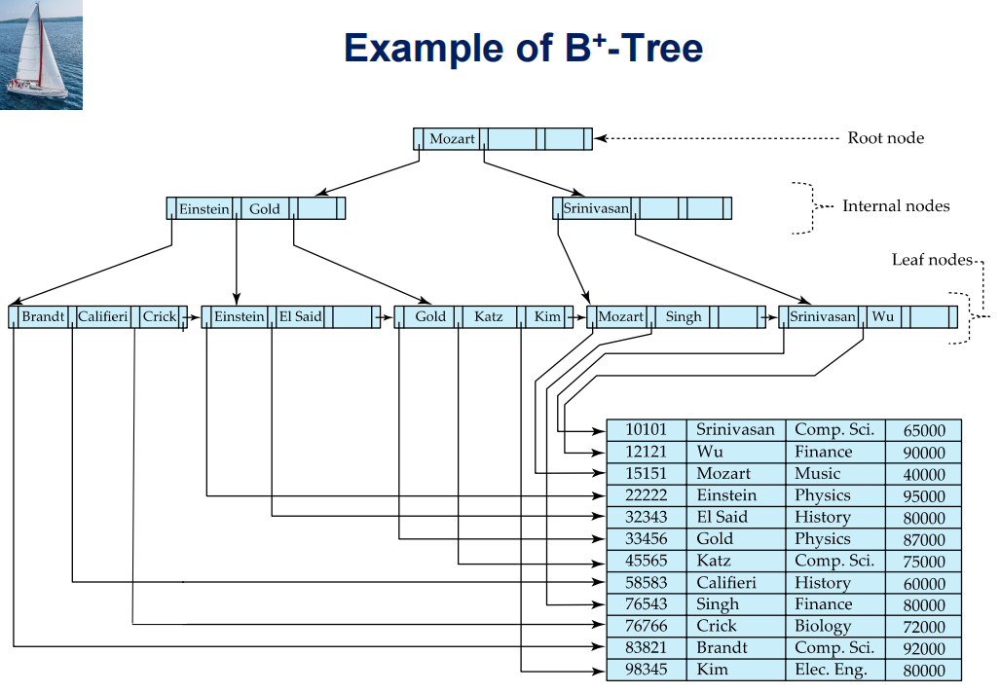
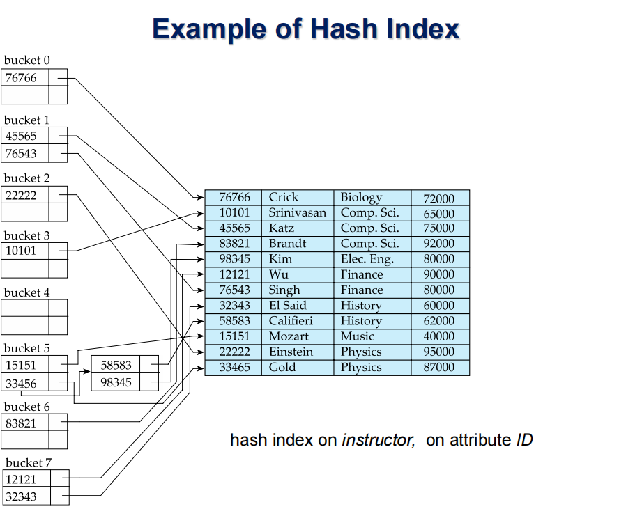
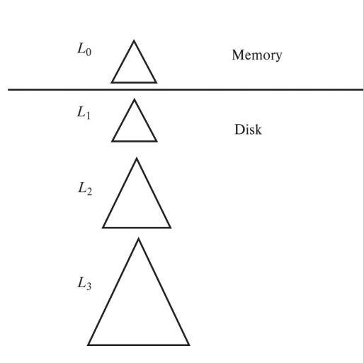

### Ordered Indices
- Clustering index(primary index): 文件线性顺序
- nonclustering index(Sencondary index)：非文件先行顺序的索引顺序
    - 必须稠密，否则会找不到某些值

 
例子

---

每一个搜索键都是索引

Sparse Index Files

- 减少索引的数量，不为每个值都建立索引

#### Multilevel Index
- 问题： 索引和内存存储方式不匹配
- 解决： 将磁盘存储顺序作为一级索引，在此基础上构建sparse index
    - outer index: 稀疏索引
    - inner index：文件索引顺序

 
实例

---

#### 索引更新：删除
稀疏索引

- 如果search-key 在索引中，且下一个search-key 不在索引中，则删除索引，用下一个代替
- 如果下一个search-key 在索引中，则删除索引

#### 索引更新：插入
稀疏索引

- 如果每个文件块都有entry被保存为索引，则不用更新
- 否则新文件块中的第一个search-key 作为索引

#### B+ Tree索引

- 问题： 如果使用的是记录的指针，则若记录移动位置，所有的二级索引的记录都要移动位置。
- 解决：使用搜索键，而不是记录的指针。如果有需要可以假如record_id来保证唯一性

##### 批量插入

- Aternative 1：bULK lOADING
    - 外部排序后，顺序插入

- Aternative 2：Bottom-up B+ tREE CONSTRUCTION
    - 外部排序，和旧数据共同重新创建树
#### Non-Unique Keys
- 如果search-key不唯一，可以构造一个复合的搜索键$(a_i, A_p)$使得其唯一

### Hash Indices

#### Static Hashing
- bucket + hash function
- 优化：让桶的数量能够动态修改

 
example

---

#### Dynamic Hashing
- 周期性重新进行哈希算法
    - 增大哈希表的大小
- 线性哈希
    - 当桶溢出时，按线性顺序分裂桶
- 可扩展哈希
    - 当存不下时扩展hash表，只分裂溢出的桶

#### Log Structured Merge Trees(LSMT)

 
原理：

---

- 插入操作：逐层合并树，批量执行
- 删除操作：增加删除entry，合并时匹配则去除

 
实例

---

#### Buffer Tree
- 每个节点增加一个buffer，用于存储操作
- 若此节点的buffer满了则下推
- 积攒满了操作再批量执行

### Bitmap Indices
- 用01表示该记录是否有某属性
- 对多属性查询有优势，但单属性查询无优势
