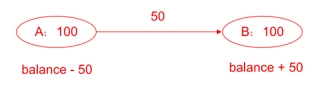
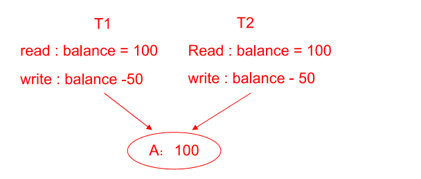
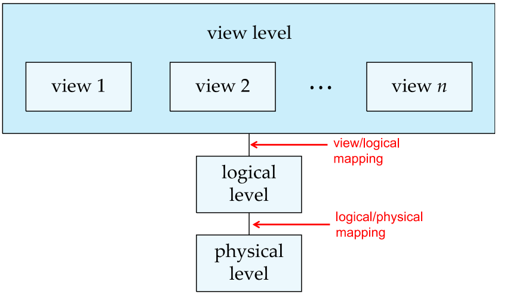
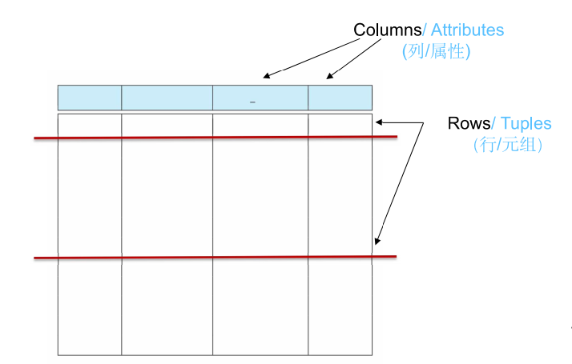
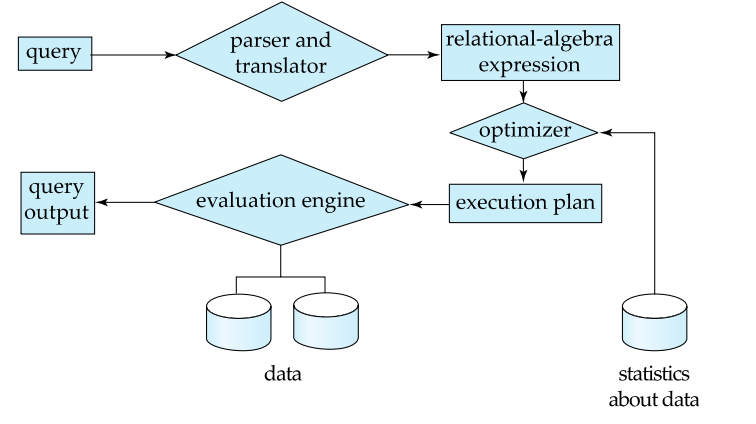

数据库管理系统的适用场景：

- 高价值数据需要存储，且体量大，多并发情况

数据库系统要解决的问题：

<div class="grid" markdown>

<div class="card" markdown>
- 数据冗余与不一致(Data redundancy and inconsistency)
    - 数据以不同的格式存在不同的文件中，可能存在数据冗余和不一致.
- 存取数据困难(Difficulty in accessing data)
    - 由于没有规范化的接口，每次一个新任务需要数据的时候都需要写一个新的程序去完成
- 数据孤立(Data isolation)
    - 格式不统一，多个文件
- 完整性问题(Integrity problems)
    - 程序无法显式声明完整性约束, 无法有效地对数据添加约束
- 原子性问题(Atomicity of updates)
    - 程序可能从数据库的非法状态退出
- 并发访问异常(Concurrent access by multiple users)
    - 不同程序同时对一个数据进行操作，导致复合数据不一致.
- 安全性问题(Security problems)
    - 认证(Authentication)、权限(Privilege)、审计(Audit)
</div>

<div class='card' markdown>


---


</div>
</div>

## 抽象层次(Levels of Abstraction)

<div class="grid" markdown>
<div class='card' markdown>
[物理层](./physical-level.md)：

- 描述记录如何被存储

逻辑层：

- 描述数据如何在数据库中存储，以及数据之间地关系

视图层：

- 应用程序隐藏数据类型的细节，以及出于安全性的考虑隐藏部分信息。
</div>


{.card width=300px}
</div> 


## 数据模型
- 一系列用于描述数据，数据关系，数据语义和一致性约束地概念工具.

### [关系模型](./relation_schema.md)
{:width=400px}

## 模式和实例(Schema and Instances) 
- 模式：数据库总体设计； 类比于程序语言中的类型和变量
- 实例：变量中实际的值

> 物理数据独立性(Physical Data Independence): 允许数据库系统对物理数据进行修改，而不影响应用程序。

## 数据库语言(Database Languages)
### 数据定义语言(Data Definition Language(DDL))
- 包括：元数据(metadata)
- 数据库模式(Database schema)
- 完整性约束(Integrity constraints)
    - 主键(Primary key)
- 索引
- 授权(Authorization)

---
例子:
```sql
create table instructor(
    ID  CHAR(5) PRIMARY KEY,
    name VARCHAR(20),
    dept_name VARCHAR(20),
    salary DECIMAL(8,2),
    primary key(ID),
    foreign key(dept_name) references department
);
```

### 数据操作语言(Data Maipulation Language(DML))

#### 过程式(Procedural DML)
- 需要用户指定需要获取的数据，以及如何获取数据

#### 陈述式(Declarative DML)
- 需要用户指定需要的数据，但不需要指定如何去获取数据 

## 数据库设计(Database Design)
### 数据库引擎(Database Engine)
#### 存储管理(The storage manager)
- 和操作系统的文件管理器交互
- 高效存储、取回和更新数据

包括以下组件:
- Authorization and integrity manager
    - 负责权限和完整性检查
- Transaction manager
    - 负责事务的提交和回滚
- File manager
    - 负责文件管理
- Buffer manager
    - 负责缓冲管理

#### 查询处理(The query processor component)
<div class="grid" markdown>
<div class='card' markdown>
- DDL解释器(DDL interpreter)
    - 负责解释DDL声明语句和记录在数据字典中的定义
- DML编译器(DML compiler)
    - 负责翻译DML声明语句成执行器能够理解的形式
- 查询执行引擎(Query evaluation engine)
    - 执行底层操作语句
</div>
<div class='card' markdown>

</div>
</div>

#### 事务处理(The transaction management component)
- 负责保证数据库是一致的，即使运行时发生错误


### 视图
创建子视图需要做视图展开，做子查询。

- 对视图进行的某些更新操作无法被唯一翻译（多值或无值的情况）
#### 物化视图（Materialized Views）
- 优势：
	- 方便于做子视图的创建
	- 对视图的操作修改不影响实际的存储
	- 查询速度快（无需进行前一个视图的查询过程）
- 劣势：
	- 额外的空间
	- 数据不统一（原数据库数据更新，无法反应到物化视图上，视图间也是如此）


### 事务

- Commit work：提交事务，所有更新被永久保存
- Rollback work：回滚事务，所有更新被撤销

### 约束

- not null
- primary key
- unique
- check (P)
- foreign key(外键约束)
- Cascading Actions（级联操作）

### 权限控制

- 授权
- 撤销权限
- 角色控制

## [数据库设计方法](./base_design.md)
- E-R模型
- 范式理论(Normalization Theory) 


## [索引](./indexes.md)

- 顺序索引（Oredered Indexes）
    - 聚簇索引(Clustering Index)
    - 非聚簇索引(nonclustering Index)

- 多层索引
- B+树索引
- Hash索引
- LSMT索引
- Buffertree

## [查询开销估计与优化](./query.md)

## 多粒度

## 幻读
- Index-locking protocol： 为查询的所有叶子页都加上共享锁，插入更新则加上排他锁
- Next-key locking protocol：锁上所有满足索引查询的值，同时锁上索引中下一个键值

## [恢复管理器](./recoverymanager.md)