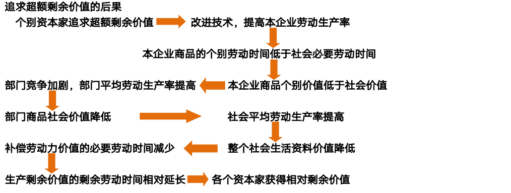

## 世界观、方法论和哲学

**世界观**: 对整个世界的总体看法和根本观点。

**方法论**：认识和改造世界所遵循的根本方法的学说和理论体系。

**哲学**: 系统化、理论化的世界观，又是方法论

!!! info "哲学基本问题"
    思维和存在的问题：第一性问题，同一性问题
    
    由此引申出**(历史)唯物主义**和**(历史)唯心主义**, **可知论**和**不可知论**

唯物主义的历史形态: 古代朴素唯物主义->近代形而上学唯物主义->现代辩证唯物主义

唯心主义的历史形态: 主观唯物主义->客观唯物主义

**辩证法**:用联系的、发展的观点看世界，发展的根本原因在于事物的内部矛盾

**形而上学**:用孤立的、静止的观点看世界，否认事物内部矛盾的存在和作用

## 马克思主义的产生

- **经济社会历史条件**：资本主义与经济的发展
- **阶级基础和实践基础**：无产阶级但对资产阶级的斗争日益激化，对科学理论的指导提出了强烈的需求

马克思最重要的理论贡献：唯物史观和剩余价值理论

- 马克思主义的三个基本组成部分
	- 马克思主义哲学
	- 马克思主义政治经济学
	- 科学社会主义

- 基本立场：以无产阶级的解放和全人类的解放为己任，以人的自由而全面发展为美好目标，以人民为中心，坚持一切为了人民，一切依靠人民，全心全意为人民谋幸福

**实践观点**是马克思主义认识论的首要的和基本的观点

### 物质与运动
物质的唯一特性是**客观实在性**：不依赖于人类的意识而存在，并能为人类的意识所反映的客观存在。

- 运动是物质的存在方式和根本属性：运动是物质的运动，物质是运动着的物质——物质与运动一体不可分离
	- 时间和空间是物质运动的存在方式——同样时间与空间和物质的运动相统一不可分割
- 运动是绝对的，静止是相对的
- 实践是自然存在与社会存在区分和统一的基础，是理解和解释一切现象的钥匙

**人类实践的客观实在性**：物质资料生产方式是人类社会存在和发展的基础。

**社会的物质性表现**：

- 人类社会依赖于自然界，是整个物质世界的组成部分
- 人们谋取物质生活资料的实践活动是物质的活动
- 物质资料的生产方式是人类社会存在和发展的基础，集中体现着人类社会的物质性

### 意识观

**定义**：意识是物质世界长期发展的产物，是人脑的机能和属性。

**意识的形成三阶段**：无生命的反映特性->低等生物的刺激感应性->高等动物的感觉和心理,最终发展为人的意识

社会实践特别是劳动在意识的产生和发展中起着决定性作用

!!! warning "注意"
    意识具有主观性特性：反映形式不同；不同意识主体的差别性；在映像上对客观有时甚至是虚幻的或歪曲的反映

#### 物质与意识的辩证关系

- 物质决定意识
- 意识对物质具有反作用
	- 意识具有目的性和计划性
	- 意识具有创造性
	- 意识具有指导实践改造客观世界的作用
	- 意识具有调控人的行为和生理活动的作用
- 主观能动性和客观规律的统一：尊重客观规律是前提和基础，发挥主观能动性
	- 从实际出发前提，努力认识和把握事物的发展规律
	- 实践是发挥人的主观能动性作用的基本途径
	- 发挥主观能动性还依赖于一定的物质条件与物质手段

### 唯物主义辩证法

- 客观辩证法：客观事物或客观存在的辩证法|运动和发展规律
- 主观辩证法：人类认识和思维活动的辩证法

辩证思维的主要方法：归纳与演绎、分析与综合、抽象与具体、逻辑与历史

#### 两个总特征：普遍联系和永恒发展

##### 联系
!!! note 
    联系的观点和发展的观点是唯物主义辩证法的基本观点和总特征

- 联系具有客观性：事物的联系是事物本身固有的，不是主观臆想的
- 联系具有普遍性：
	- 任何事物内部的不同部分和要素之间都是相互联系的
	- 任何事物都不能孤立存在，都同其它事物处在一定联系中
	- 整个世界是相互联系的统一整体
- 联系具有多样性
- 联系具有条件性
	- 条件对事物发展和人的活动具有支持或制约作用
	- 条件是可以改变的
	- 改变和创造条件必须尊重事物发展的客观规律

##### 发展
- 发展的实质是新事物的产生和旧事物的灭亡
- 新生事物在辩证否定旧事物的基础上产生，有旧事物不具有的新内容

#### 五大范畴
- 任何事物都是内容与形式的统一：从构成要素和表现方式上反映事物的一对基本范畴
- 本质与现象：揭示事物内在联系和外在表现的一对范畴
- 原因与结果：揭示事物引起和被引起关系的一对范畴
- 偶然与必然：揭示事物产生、发展和衰亡过程中的不同趋势的一对范畴
- 现实与可能：反映事物的过去、现在和将来关系的一对范畴

#### 唯物辩证法的三大基本规律
##### 对立统一规律

从根本上回答了事物为什么会发展的问题

- 对立统一规律是事物发展的根本规律
	- 矛盾具有斗争性（无条件的绝对的）和同一性（有条件的相对的）对应于两种基本属性：对立和统一
	- 矛盾的普遍性和特殊性
		- 主要矛盾与次要矛盾：对事物发展起不同作用
            - 主要矛盾在矛盾体系中处于支配地位，对事物发展起决定作用
		- 主要方面与次要方面
            - 主要矛盾的主要方法决定矛盾的性质
		- 两点论与重点论相结合
	- 矛盾分析方法的核心要求：具体矛盾具体分析，具体情况具体分析是马克思主义活的灵魂
    - 问题是事物矛盾的表现形式，增强问题意识、坚持问题导向，就是承认矛盾的普遍性、客观性
##### 量变质变规律
- 量变是质变的必要准备
- 质变是量变的必然结果
- 量变与质变是相互渗透的
- 揭示了事物发展的形式和状态，体现了事物发展的渐进性和飞跃性的统一

##### 否定之否定规律
- 否定是事物的自我否定
- 否定式事物发展的环节
- 否定是新旧事物联系的环节
- 辩证否定的实质是“扬弃”
- 从内容上看，是自己发展自己、自己完善自己的过程；从形式上看，是螺旋式上升或波浪式前进的过程，是前进性和曲折性的统一

> 世界不是既成事物的集合体，而是过程的集合体

## 实践与认识

> 实践观点是马克思主义认识论的首要的和基本的观点

### 实践的本质

- 人类能动地改造世界的客观物质性活动

三个基本特征

- 客观实在性：实践是改造世界的客观物质活动
- 自觉能动性：人的实践活动是一种有意识有目的的活动
- 社会历史性：受到社会历史条件的制约

基本结构

- 实践主体、实践客体、实践中介

实践形式的多样性

- 物质生产实践、社会政治实践和科学文化实践

实践在认识活动中的决定作用：

- 实践是认识的来源：实践产生了认识的需要，为认识的形成提供了可能
- 实践是认识发展的动力
- 实践是认识的目的
- 实践是检验认识真理性的唯一标准

**认识的本质**：主体在实践基础上对客体的能动反映（这其中也包含臆测的部分）
主客体之间是改造与被改造的关系，而不只是反映与被反映的关系。

感性的认识（感觉、知觉和表象）通过实践达成理性认识，二者辩证统一

从感性认识到理性认识的两个基本条件：

- 投身实践，深入调查，尽可能获取丰富和合乎实际的感性材料
- 经过思考的作用，去粗取精，去伪存真

##### 从认识到实践

- 认识具有反复性和无限性
    - 决定了主观与客观、认识与实践的统一是具体的、历史的。
- 认识世界的目的是为了改造世界
- 认识的真理性只有在实践中才能得到检验和发展

> 认识是一个反复循环和无限发展的过程。这是一个波浪式前进和螺旋式上升的过程。
 
马克思主义认识论是党的群众路线工作方法的哲学基础

### 真理与价值

- 真理具有客观性 |->认识是多元的，而真理是一元的

真理是对客观事物及其规律的正确反映

- 对于特定实践活动中的特定的认识对象来说只能有一种认识是特定的认识客体状态、本质和规律
相一致的，这种认识就是真理。

- 真理具有绝对性和相对性
	- 绝对性：不依赖于人和人的意识
	- 相对性：任何真理所反映的范围有限度，人类的认识广度是有限度的

> 马克思主义作为客观真理，是绝对性和相对性的统一。

#### 真理与谬误

- 真理与谬误的区别：在于认识是否正确反映了客观事物及其规律
- 真理与谬误相互对立
- 真理与谬误的对立又是相对的，它们在一定条件下能够相互转化

#### 逻辑证明
- 逻辑证明，是指运用已知的正确概念和判断，通过一定的推理，从理论上确定另一个判断的正确性的逻辑方法
- 逻辑证明只能回答前提与结论的关系是不是符合逻辑的问题，而不能回答结论是不是符合客观实际的问题。

#### 实践标准

- 确定性：唯一性和最终性
- 不确定性：任何实践都会受到主客观条件的制约，实践是社会的历史的实践

### 价值
- 主体性
	- 价值关系的形成依赖于主体的存在和创造
- 客观性
	- 在一定条件下客体对于主体的意义不依赖于主体的主观意识而存在
- 多维性
	- 同一客体相对于主体的不同需要会产生不同的价值
- 社会历史性

价值评价的三个基本特点

- 评价以主客体的价值关系为认识对象
- 评价结果与评价主体直接相关
- 评价结果的正确与否依赖于对客体状况和主体需要的认识。

价值观：是人们关于价值本质的认识以及对人和事物的评价标准、评价原则和评价方法的观点的体系。

真理和价值在实践中的辩证统一

- 价值尺度必须以真理为前提。
- 人类自身需要的内在尺度，推动着人们不断发现新的真理

## 唯物史观

- 社会存在决定社会意识

- 社会存在： 自然地理环境、人口因素、物质生产方式（社会历史发展的决定力量）
- $物质生产方式 = 生产力 + 生产关系$
- 社会意识：社会心理、社会意识形式
- 社会意识形式：意识形态、非意识形态

社会意识与社会存在辩证统一

社会意识具有相对独立性：社会意识与社会存在发展的不完全同步性和不平衡性

- 物质资料生产活动及生产方式是人类社会赖以存在和发展的基础，是人类其它一切活动的首要前提
- 物质生产活动及生产方式决定着社会的机构、性质和面貌，制约着人们的经济生活、政治生活和精神生活及全部社会生活
- 物质生产活动及生产方式的变化发展决定整个社会历史的变化发展，决定社会形态从低级向高级的更替发展

### 人类社会发展的基本规律

#### 生产力与生产关系矛盾运动的规律

生产力是人类在生产实践中形成的改变和影响自然以使其适合社会需要的物质力量，生产力具有客观现实性和社会历史性

生产关系是人们在物质生产过程中形成的不以人的意志为转移的经济关系

生产力决定生产关系（性质与变化），而生产关系对生产力具有能动的反作用

两种基本类型
- 以生产资料公有制为基础的生产关系
- 以生产资料私有制为基础的生产关系

生产力基本要素：劳动资料、劳动对象、劳动者

> 科学技术是先进生产力的集中体现和主要标志，是第一生产力

生产力的性质取决于生产的物质技术性质
#### 经济基础与上层建筑矛盾运动的基础

经济基础是指由社会一定发展阶段的生产力所决定的生产关系的总和

- 社会的一定发展阶段上往往存在多种生产关系，但决定一个社会性质的是其占支配低位的生产关系。
- 经济基础与经济体制具有内在联系。经济体制是社会基本经济制度所采取的组织形式和管理形式，是生产关系的具体实现形式

上层建筑是建立在一定经济基础之上的意识形态以及与之相应的制度、组织和设施

上层建筑：观念上层建筑（意识形态）、政治上层建筑（政治法律制度及设施和政治组织）

**国体**是指社会各阶级在国家中的地位
**政体**是指统治阶级实现其阶级统治的具体组织形式

- 经济基础决定上层建筑
- 上层建筑对经济基础具有反作用
- 经济基础与上层建筑的相互作用构成二者的矛盾运动
- 经济基础和上层建筑之间的内在联系构成了上层建筑一定要适应经济基础状况的规律

#### 社会基本矛盾

> 社会基本矛盾是历史发展的根本动力

- 生产力和生产关系的矛盾
- 经济基础和上层建筑的矛盾

- 阶级和阶级斗争是人类社会发展到一定阶段才会出现的社会现象
- 阶级斗争是阶级社会发展的直接动力
- 马克思主义的阶级分析方法是认识阶级社会的科学方法
- 社会革命的实质是革命阶级推翻反动阶级的统治，用新的社会制度代替旧的社会制度，解放生产力，推动社会发展

人民群众是历史的创造者

- 人民群众是社会物质财富的创造者
- 人民群众是社会精神财富的创造者
- 人民群众是社会变革的决定力量

人民群众创造历史的活动受到一定社会历史条件的制约

- 经济条件制约
- 政治条件制约
- 精神文化条件制约

杰出人物是历史人物中对推动历史发展做出重要贡献或起重要作用的人

历史人物，在历史上发挥什么样的作用，都要受到社会发展客观规律的制约，而不能决定和改变历史发展的总进程和总方向。

## 资本主义的本质及规律

- **资本主义的本质及规律**：商品经济、价值规律、资本积累、资本周转、剩余价值理论、经济危机、国家政治制度和意识形态

### 商品经济和价值规律

**自然经济的生产目的**：是直接满足生产者个人或经济单位的需要

**商品经济**：是以交换为目的而进行生产的经济形式

- 基本特征：为了交换而生产
- 物质基础：社会化大生产
- 社会历史条件：社会分工、生产资料和劳动产品属于不同的所有者

#### 商品二因素

- 使用价值->物品能够满足人们某种需要的属性->商品的自然属性
- 价值->凝结在商品中的无差别一般人类劳动->商品的社会属性

- 交换价值首先表现为一种使用价值同另一种使用价值相交换的量的关系或比例
- 价值是交换价值的基础，交换价值是价值的表现形式

- 作为商品，必须同时具有使用价值和价值两个因素。

#### 劳动二重性
- 具体劳动->生产一定使用价值的具体形式劳动->劳动的自然属性
- 抽象劳动->撇开一切具体形式的、无差别的一般人类劳动，即人的脑力和体力的耗费->劳动的社会属性

> 劳动的二重性决定了商品的二因素

决定商品价值量的不是生产商品的个别劳动时间，而是社会必要劳动时间

- 社会必要劳动时间：在现有的社会正常的生产条件下，在社会平均的劳动熟练程度和劳动强度下制造某种使用价值所需要的劳动时间
- 劳动生产率：劳动者生产使用价值的效率

劳动生产率水平越高，单位时间内生产的商品数量越多，生产每件商品所需要的社会必要劳动时间就越少，单位商品的价值量就越小，反之就越大。

> 在相同的劳动时间里，复杂劳动创造的价值大于简单劳动创造的价值

**商品价值形成的四个阶段**：简单的或偶然的价值形式->总和的或扩大的价值形式、一般的价值形式以及货币形式

货币的本质：长期交换过程中形成的固定地充当一般等价物的商品

货币的出现：

- 使商品内在的使用价值和价值的矛盾发展成为外在的商品和货币的矛盾
- 没有也不可能解决商品经济的基本矛盾，即私人劳动和社会劳动的矛盾

价值规律：

- 商品的价值量由生产商品的社会必要劳动时间决定
- 商品交换以价值量为基础，按照等价交换的原则进行

价值规律的作用是自发的：

- 自发地调节生产资料和劳动力在社会各生产部门之间地分配比例
- 自发地刺激社会生产力地发展
- 自发地调节社会收入的分配

> 资本主义的基本矛盾：生产资料的资本主义私人占有和生产社会化之间矛盾

#### 劳动力成为商品与货币转化为资本

资本主义经济制度的产生：资本主义萌芽、资本原始积累：暴力掠夺土地，货币财富。

资本主义雇佣劳动制度的形成是以劳动力成为商品为前提的。

劳动力成为商品的基本条件：劳动者是自由的，劳动者没有别的商品可以出卖

劳动力的价值：

- 维持劳动者本人生存所必需的生活资料的价值
- 维持劳动者家属的生存所必需的生活资料的价值
- 劳动力接受交予贺寻龙所支出的费用

劳动力商品的特点

- 使用价值是价值源泉，它在消费过程中能够创造新的价值，而且这个新的价值比劳动力本身的价值大

#### 资本主义所有制的本质
- 资本家凭借对生产资料的占有，在等价交换原则的掩盖下，雇佣工人从事劳动，无偿占有雇佣工人创造的剩余价值，资本与雇佣劳动的关系由此具有了剥削与被剥削的对抗性质。

资本主义生产过程：

- 生产物质资料
	- 劳动者的劳动
	- 劳动对象
	- 劳动资料

- 生产剩余价值
	- 是超过劳动力价值的补偿这个一定点而延长了的价值形成过程
		- 必要劳动：用于再生产劳动力的价值 <- 工人获得相应报酬
		- 剩余劳动：用于无偿地为资本家生产剩余价值 <- 工人本应该获得报酬但被资本家无偿占有

- 资本是可以带来剩余价值的价值
	- 生产资料（不变资本（c））
		- 厂房、机器等
		- 原材料、燃料等
	- 劳动力 - 工资 - 可变资本（v）（还包含一定量的剩余价值）

- 资本主义劳动过程的两个特点
	- 工人在资本家的监督下劳动，他们的劳动隶属于资本家
	- 劳动的成果或产品全部归资本家所有

- 资本主义生产过程的主要方面是价值增殖过程，即剩余价值的生产过程

商品的价值构成公式$W=c + v + m$
剩余价值率，剩余价值与可变资本的比率：$m' = \frac{m}{v}$

生产剩余价值的两种基本方法
- 绝对剩余价值的生产
	- 在必要劳动时间不变的条件下，由于延长工作日的长度和提高劳动强度而产生的剩余价值
- 相对剩余价值的生产
	- 在工作日长度不变的条件下，通过缩短必要劳动时间而相对延长剩余劳动时间所生产的剩余价值

资本主义再生产的特点是扩大再生产

资本构成：

- 从自然形式看：由生产资料和劳动力构成（技术构成）
- 从价值形式看：由不变资本和可变资本构成（价值构成资本有机构成（C:V））

> 随着资本积累而产生的失业是由资本追逐剩余价值引起资本有机构成的提高所导致的

#### 资本循环与周转

资本循环三阶段

- 购买阶段——货币资本职能（准备生产m）
- 生产阶段——生产资本职能（生产m）
- 售卖阶段——商品资本职能（实现m） 

生产力的发展和追逐超额剩余价值->资本有机构成提高->对劳动力需求减少但劳动力供给不变或增加->产生相对过剩人口（流动、潜在、停滞）->矛盾日益加剧->资本主义制度的必然灭亡

影响资本周转的主要因素

- 资本的周转时间
- 生产资本的构成

社会总产品
- 社会在一定时期（通常为一年）所生产的全部物质资料的总和，在价值形态上又叫社会总产值

资本主义工资本质是劳动力的价值或价格

> 剩余价值是对可变资本而言，利润是对全部垫付资本而言，剩余价值是利润的本质，利润是剩余价值的转化形式，掩盖了资本主义剥削的实质。

不同部门之间的竞争，资本自由转移的结果使利润趋于平均化，价值就转化为生产价格

平均利润率是剩余价值总量对社会总资本的比率

#### 剩余价值理论的意义

- 解释了资本主义生产关系的剥削本质，阐明了资产阶级与无产阶级之间阶级斗争的经济根源，指出了无产阶级革命的历史必然性。

资本主义的基本矛盾是生产社会化和生产资料资本主义私人占有之间的矛盾

- 社会化
	- 生产资料的共同使用
	- 生产过程是分工协作
	- 劳动产品由市场交换
- 私有制
	- 生产资料的私人占有
	- 生产过程由个人控制
	- 劳动产品由个人支配

生产过剩是经济危机的本质特征

- 工厂被迫减产或停产
- 金融企业倒闭
- 社会经济生活混乱

资本主义的基本矛盾是经济危机的根本原因
- 生产无限扩大的趋势与劳动人民有支付能力的需求相对缩小的矛盾
- 单个企业内部生产的有组织性和整个社会生产的无政府状态之间的矛盾。

资本主义国家的选举制度的实质政治作用时协调统治阶级内部利益关系和矛盾的重要措施

### 资本主义国家的职能和本质

宪法原则

- 私有制原则
- 主权在民
- 分权与制衡
- 人权原则

## 资本主义的发展及其趋势
- 私人垄断资本主义（生产集中和资本集中）
	- 垄断组织的本质：通过联合实现独占和瓜分商品生产和销售市场，操纵垄断价格，以攫取高额垄断利润
- 金融资本和金融寡头
- 金融资本：由工业垄断资本和银行垄断资本融合在一起而形成的一种垄断资本
- 金融寡头：操纵国民经济命脉，并在实际上控制国家政权的少数垄断资本家或垄断资本家集团（同政府的“个人联合”（亲自担任或指派代理人担任政府要职））
- 垄断利润：垄断资本家凭借其在社会生产和流通中的垄断地位而获得的超过平均利润的高额利润
- 垄断价格（高价、低价）：抑制了市场上价格的自由波动，垄断价格长期贝利生产价格和价值

#### 国家垄断资本主义
形成原因
- 社会生产力的发展，要求资本主义生产资料在更大范围内被支配
- 经济波动和经济危机的深化
- 缓和社会矛盾，协调利益关系

**宏观调控**：国家运用财政政策、货币政策等经济手段，对社会总供给和总需求进行调节，以实现经济快速增长、充分就业、物价稳定和国际收支平衡的目标。

**微观调控**：国家运用法律手段规范市场秩序，限制垄断，保护竞争，维护社会公众的合法权益。

金融自由化和金融创新

- 金融资本占比越来越大
- 金融业就业人数逐步增加
- 虚拟经济愈发脱离实体经济

### 经济全球化及其影响

#### 经济全球化的表现

- 生产全球化，分工
- 贸易全球化，商品和劳务自由流动
- 金融全球化。世界各国、各地区在金融业务、政策等方面相互协调、相互渗透、相互竞争不断价钱。

#### 经济全球化的动因

- 科学技术的进步和生产力的发展为经济全球化提供了坚实的物质基础和根本的推动力。
- 跨国公司的发展为全球化提供了适宜的企业组织形式
- 各国经济体制的变革和国际经济组织的发展是经济全球化的体制和组织保障

#### 经济全球化的影响

有利

- 为发展中国家提供先进技术和管理经验。
- 为发展中国家提供更多就业机会
- 推动发展中国家的贸易发展
- 促进发展中国家跨国公司发展

不利

- 发达国家与发展中国家在经济全球化进程中的地位和收益不平等、不平衡
- 加剧了发展中国家资源短缺和环境污染
- 一定程度上增加了经济风险。

#### 当代资本主义的新变化

- 主要表现
	- 生产资料所有制的变化。
		- 资本占有的社会化程度大大提高
	- 劳动关系和分配关系的变化
		- 资本主义国家工人阶级的生活状况得到一定改善
	- 社会阶层和阶级结构的变化
		- 体力劳动工人减少，白领工人增多，实现了从传统劳动方式向现代劳动方式的转变
	- 经济调节机制和经济危机形态的变化
		- 对全球经济产生打击
	- 政治制度的变化
		- 缓和矛盾冲突

- 变化的原因和实质
	- 科学技术革命和生产力的发展是资本主义发生变化的根本推动力量
	- 工人阶级争取自身权利和利益的斗争，是推动资本主义发生变化的重要力量
	- 社会主义制度初步显示的优越性对资本主义产生了重要影响。
	- 主张改良主义的政党对资本主义制度的改革。

从根本上说是人类社会发展一般规律和资本主义经济规律作用的结果。其变化是在资本主义制度基本框架内的变化，并不意味着资本主义生产关系的根本性质发生了变化。这些变化并没有触动资本主义统治地根基，并没有资本主义制度的性质，也没有改变马克思主义关于资本主义的基本原理的科学性。

#### 资本主义的历史地位
有一定的历史进步性

- 将科学技术转变为强大的生产力
- 资本追求剩余价值的内在动力和竞争的外在压力推动了社会生产力的迅速发展。
- 资本主义的意识形态和政治制度作为上层建筑在战胜封建社会自给自足的小生产的生产方式，保护、促进和完善资本主义生产方式方面起着重要作用，从而推动了社会生产力的迅速发展，促进了社会进步。

局限性

- 资本主义的基本矛盾阻碍社会生产力的发展
- 资本主义制度下财富占有两级分化，引起经济危机
- 资产阶级支配和控制资本主义经济和政治的发展和允许，不断激化社会矛盾和冲突。

#### 资本主义为社会主义所代替的历史必然性

- 资本主义基本矛盾“包含着现代的一切冲突的萌芽”，社会化生产和资本主义占有的不相容性
- 资本积累推动资本主义基本矛盾不断激化最终否定资本主义自身。
- 国家垄断资本主义是资本主义社会化的更高形式，将成为社会主义的前奏。
- 资本主义社会存在者资产阶级和无产阶级之间的矛盾和斗争。

## 启示

将理论教条化，经验神圣化，必然犯错

- 例如：1931年，党内的左倾错误，马克思主义教条化错误，使得革命遭受严重挫折

> 马克思的整个世界观不是教义，而是方法。它提供的不是现成的教条，而是进一步研究的出发点和供这种研究使用的方法 —— 恩格斯

> 理论的根本任务是回答并指导解决问题