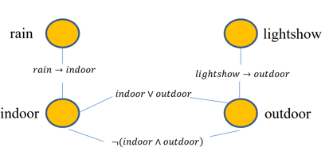
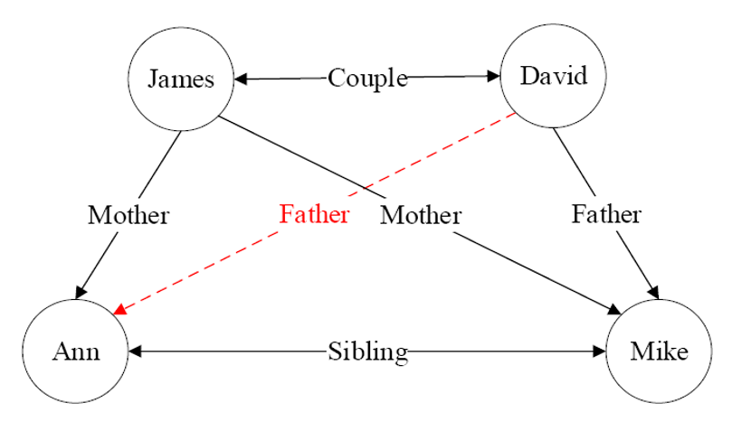
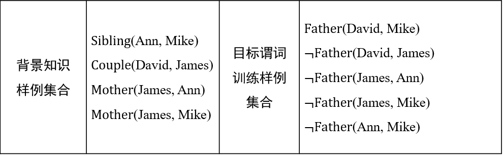
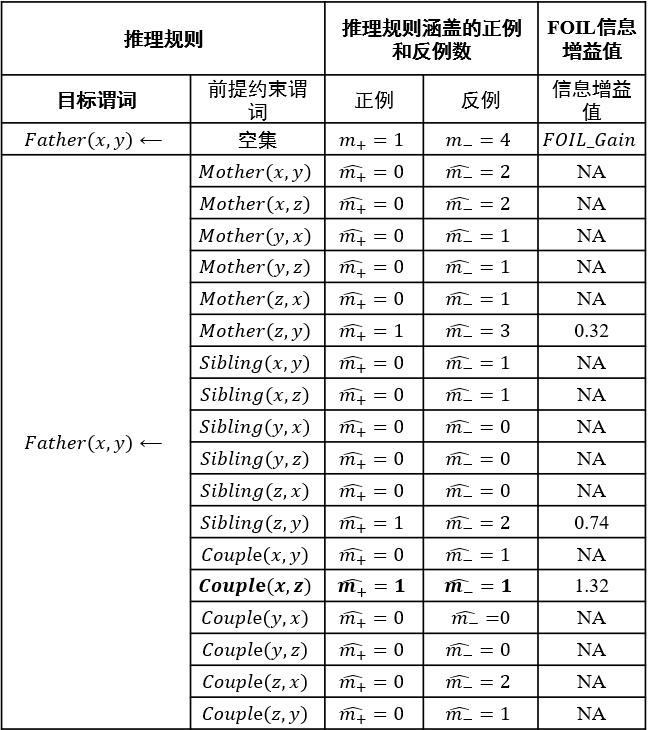
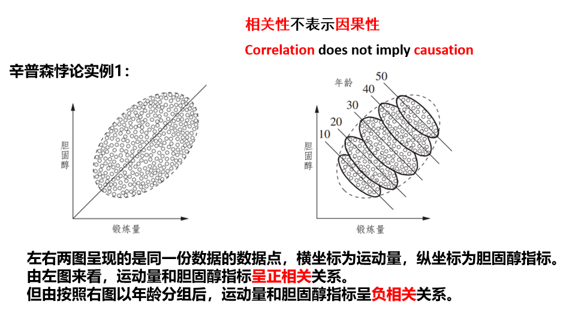

## 概率图谱推理
### 贝叶斯网络
- 用一个**有向无环**图（directed acyclic graph）来表示，其用有向边来表示节点与节点之间的单向概率依赖

> 局部马尔可夫性（local Markov property）,即在给定一个节点的父节点的情况下，该父亲节点有条件地独立于它的非后代节点。
W
### 马尔可夫网络
- 表示成一个**无向图**的结构，其用无向边来表示节点和节点之间的相互概率依赖

给定一个由若干规则构成的集合，集合中每条推理规则赋予一定权重，则可如下计算某个断言x成立的概率

$$P(X=x)=\frac{1}{Z}exp(\sum_iw_in_i(x)=\frac{1}{Z}\prod_i\phi_i(x_{\{i\}})^{n_i(x)}$$

其中$n_i(x)$式在推导$x$中所涉及第$i$条规则的逻辑取值（为1或0）,$w_i$是该规则对应的权重，$Z$是一个固定的常量，可由下式计算：

$$Z=\sum_{x\in X}exp(\sum_iw_in_i(x))$$

## 知识图谱推理
- 知识图谱（knowledge graph）由**有向图（directed graph）**构成，被用来描述现实世界中实体及实体之间的关系
    - 每个节点是一个实体，边表示关系
    - 两个节点和连接边可表示为形如 <left_node, relation, right_node \>的三元组形式，也可表示为一阶逻辑（first order logic, FOL）的形式

知识图谱推理中有两个具有代表性的方法：
### 归纳逻辑程序设计（inductive logic programming, ILP）
- ILP使用一阶谓词逻辑进行知识表示，通过修改和扩充逻辑表达式对现有知识进行归纳，完成推理内容

- FOIL(First Order Inductive Learner)算法是ILP的代表性算法，通过**序贯覆盖**学习推理规则

- 只能在已知两个实体的关系且确定其关系与目标谓词相悖时，才能将这两个实体用于构建目标谓词的反例.

在进行推理之前我们首先要定义**信息增益值(information gain)**

$$FOIL_Gain=\widehat{m_+}\cdot(log_2\frac{\widehat{m_+}}{\widehat{m_+}+\widehat{m_-}}-log_2\frac{m_+}{m_++m_-})$$

=== "Picture"
    {:align=left  width=400px}

## 因果推理
- **辛普森悖论**：在某个条件下的两组数据，分别讨论时都会满足某种趋势，可是一旦合并考虑，却可能导致相反的结论。（引入了混杂因素）

