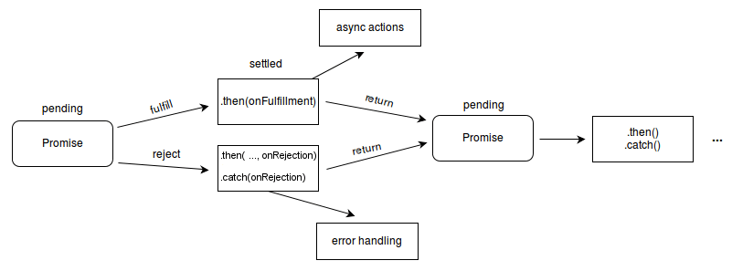

### Promise
- `Promise`对象表示异步操作最终的完成（或失败）以及其结果值

```ts title='异步示例' linenums='1'
let promise = windowClass.loadContent('pages/page1', storage);
promise.then(() => {
	console.info('Succeeded in loading the content.');
}).catch((errL BusinessError) => {
	console.error(`Failed to load the content. Cause code: ${err.code}, message: ${err.message}`);
})
```

**状态**
- *待定（pending）*:初始状态，既没有被兑现，也没有被拒绝
- *已兑现（fulfilled）*：意味着操作成功完成
- *已拒绝（rejected）*：意味着操作失败



一个待定的 Promise 最终状态可以已兑现并返回一个值，或者是已拒绝并返回一个原因（错误）。当其中任意一种情况发生时，通过Promise的`then`方法串联的处理程序将被调用。如果绑定相应处理程序时 Promise 已经兑现或拒绝，这处理程序将被立即调用。

