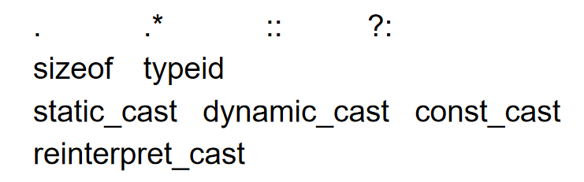

!!! attention "C and C++"
    - C语言是C++语言的一个子集
    - C语言与C++语言是兼容的

!!! info "面向对象程序设计的主要特征"
    封装、继承、多态

## 重载
- 要求参数个数不同。参数个数相同时，参数类型不同。参数中至少有一个类型不同

### 函数重载
```cpp title="函数重载" linenums="1"
void print(char * str, int width);
void print(double d, int width);
void print(long l, int width);
void print(int i, int width);
void print(char *str);
```

- 重载函数可以带有默认参数，但要注意二义性
```c++ title="二义性错误" linenums="1"
void func(int a);          // 版本A
void func(int a, int b = 0); // 版本B

func(10);  // 错误：二义性调用
```

### 操作符重载

- 只能重载存在的操作符，同时有部分操作符无法被重载
    - 保持操作数与顺序



- 不用对接收者做类型转换，可以隐式声明参数

```c++ title="成员变量形式" linenums="1"
const String String::operator+(const String& taht);
```

- 显式声明第一个参数
- 需要对两个参数做类型转换
- 可以做成友元

```c++ title="全局函数形式" linenums="1"
const String operator+(const String& r, const String& l);

// 友元函数声明 加全局实现

class Integer {
    friend const Integer operator+ (
        const Integer& lhs,
        const Integer& rhs);
    ...
}

const Integer operator+(
    const Integer& lhs,
    const Integer& rhs){
        return  Integer( lhs.i + rhs.i );
    }
```

- `= () [] -> ->*` 等重载必须是成员
- `++ --`区分前缀和后缀

```c++ linenums="1"
const Integer& operator++(); //prefix++
const Integer operator++(int); //postfix++

const Integer& Integer::operator++() {
    *this += 1;
    return *this;
}

const Integer Integer::operator++(int) {
    Integer old( *this );
    ++(*this);
    return old;
}

bool Integer::operator==( const Integer& rhs) const {
    return i == rhs.i;
}

bool Integer::operator!=( const Integer& rhs) const {
    return !(*this == rhs);
}


A = B = C;
// executed as
A = (B = C);
```

```c++ title="整数示例" linenums="1"
z = x + y; //yes
z = x + 3; //yes
z = 3 + y; //no
```

## 对象间通信
### 消息通信
组成部分：接收者对象、消息选择器/方法名、参数

## 多态（Polymorphism）
- 向上转型

```c++ linenums="1"
Ellipse elly(20F, 40F);
Circle circ(60F);
elly = circ;
```

- 只有那些能够被上层解析的部分被复制过去，部分被忽略
- 函数调用也归于上层

```c++ linenums="1"
Ellipse* elly = new Ellipse(20F, 40F);
Circle* circ = new Circle(60F);
elly = circ;
```

- 原先的elly实例丢失
- 两个都指向Circle实例

```c++ linenums="1"
void func(Ellipse& elly) {
    elly.render();
}

Circle circ(60F);
func(circ)
```

- 这里引用像指针一样运行，调用的是Circle的方法

```c++ linenums="1"
void Derived::func() {
    ...
    Base::func();
}
```

- 可以直接调用基类的方法而不用重复复制函数代码
- 重写必须重写所有的被重写函数变种
- 重写虚函数的时候，返回对象可以放松，可以返回衍生类，因为衍生类可以协变为基类
    - 用引用或指针方式

- 永远不要重定义被继承的非虚函数

- 动态绑定

## 协议类/接口类

- 抽象类
    - 所有的非静态成员变量都是纯虚函数，除了析构函数
    - 虚析构函数空函数体
    - 没有非静态成员变量

```c++ title="示例" linenums="1"
class CDevice { 
public: 
	virtual ~CDevice(); 
	virtual int read(...)   = 0; 
	virtual int write(...)  = 0; 
	virtual int open(...)   = 0; 
	virtual int close(...)  = 0; 
	virtual int ioctl(...)  = 0; 
};
```

### Virtual Bases

- 当出现菱形继承的情况时，编译器无法选择路径，最底下的类会包含两份重复的继承
- 这时使用`virtual public`就可以解决问题，只会保留一份继承


#### Stream extractor and inserter
- 必须为二参数全局函数
```c++ title="stream extractor and inserter" linenums="1"
istream& operator>>(istream& is, T& obj) {
    // specific code to read obj
    return is;
}

cin >> a >> b >> c;
// executed as
((cin >> a) >> b) >> c;

ostream& operator<<(ostream& os, const T& obj) {
    // specific code to write obj
    return os; 
}
```

#### manipulators

```c++ title="manipulators" linenums="1"
ostream& manip(ostream& out) {
    ...
    return out;
}
ostream& tab ( ostream& out ) {
    return out << "\t";
}
cout << "Hello" << tab << "World!" << endl;

```

#### Conversion operations
- 函数会被自动调用

```c++ title="Conversion operations" linenums="1"
Rational::operator double() const {
    return numerator_/(double)denominator_;
}
Rational r(1,3); double d = 1.3 * r;
// 通用格式
X::operator T()
```

- 尽量用函数形式转换，而不是隐式转换

## 基本语法
**头文件**
将声明插入`.cpp`文件

```c++ linenums="1"
#ifndef HEADER_FLAG
#define HEADER_FLAG
// Type declaration here...
#endif // HEADER_FLAG
防止头文件重复包含

#include <iostream>
```
**命名空间**
- 用于避免函数命名的冲突。
```c++ linenums="1"
// old1.h
namespace old1 {
    void f();
    void g();
}
// old2.h
namespace old2{
    void f();
    void g();
}
using namespace std;
using Mylib::foo;
using Mylib::cat
foo();
Cat c;
c.Meow();
```
**输出**
```
cout << "Hello World!" << endl; 
```
**注释**
```
...
int main() {
    /* 这是注释 */
 
    /* C++ 注释也可以
     * 跨行
     */ 
    cout << "Hello World!";
    cout << "Hello World!"; // 输出 Hello World!
    return 0;
}
```

## 数据类型
### 线性容器
- vector: variable array
- deque: dual-end	queue
- list: double-linked-list
- forward_list: as it
- array: as “array”
- string: char. array

### typedef 声明

```
typedef type newname;
typedef int feet;
feet distance;
```

几点说明:
* typedef只是对已经存在的类型增加一个类型名，而没有创造新的类型.
* 当不同源文件中用到同一类型数据(尤其像数组、指针、结构体、共用体等类型数据)时，常用typedef声明一些数据类型，把它们单独放在一个头文件中，然后再需要用到他们的文件中用#include命令把他们包含进来，以提高编程效率.

### 枚举类型
枚举类型中，more第一个名称值为0，以此类推，但也可以给予初值。
```
enum color {red, green=5, blue} c;
c = red;
```

* 不一定要在main中定义


### 类型转换
#### 静态转换 (Static Cast)
在转换时不做任何检查.
```
int i = 10;
float f = static_cast<float>(i);
```
#### 动态转换 (Dynamic Cast)
动态转换在运行时进行类型检查，不能转换则返回空指针或引发异常.
```
class Base {};
class Derived : public Base {};
Base* ptr_base = new Derived;
Derived* ptr_derived = dynamic_cast<Derived*>(ptr_base);// 将基类指针转换为派生类指针.
```

#### 常量转换 (Const Cast)
常量在编译时便确定，因此必须要初始化，除非时外部声明.

```c++ title="常量引用" linenums="1"
string p1("Fred");
const string* p = &p1; # 表示指向的对象为常量
sting const * p = &p1; # 同上
string *const p = &p1; # 表示指针为常量
```

用于将const类型的对象转换为非const类型的对象,只能用于转换掉const属性，不能改变对象的类型.
```
const int i = 10;
int& r =  const_cast<int&>(i);
```
#### 重新解释转换(Reinterpret Cast)
将一个数据类型的值重新解释为另一个数据类型的值.
```
int i = 10;
float f = reinterpret_cast<float>(i);
```

## 函数
### const 函数
函数声明中添加const修饰符，表示该函数不会修改函数参数。
```c
int add(const int a, const int b) {} 不修改传入参数
int add(int a, int b) const{} 不修改成员变量
```

## 引用

```c++ title="引用" linenums="1"
char c;
char* p = &c; 
char& r = c; # 相当于重命名
```

!!! tip "引用"
    - 绑定关系在运行过程中不能改变
    - 引用的目标一定要有具体的地址
    
    ```c++ linenums="1"
    void func(int &);
    func(i * 3); // Warning or error!
    ```

## 库
```c++ linenums="1"
#include <cstring>

size_t strlen(const char* str); # 不包括终止符

char *strcpy(char *dest, const char *src);
```

## 泛型类
`generic classes`

- 不指定具体类型的情况下定义类，然后在实例化时再指定具体的类型

## templates
- 需要相同代码但是不同的类型时，使用模板

- 类模板
- 函数模板


可能的替代方法

- 相同基类
- 复制代码
- 未指定类型的列表

```c++ title="swap templates" linenums="1"
template < class T >
void swap( T& x, T& y ){
    T temp = x;
    x = y;
    y = temp;
}
```

- 重载规则：先检查是否有唯一匹配的函数，再检查是哦福有唯一的匹配的模板

```c++ title="explicit templates" linenums="1"
template <class T>
void foo(void) { /* … */ }
foo<int>();  // type T is int
foo<float>();  // type T is float

```

- 只有声明后的类型能够被实例化

```c++ title="class template" linenums="1"
template <class T> class X { /* … */ };
X<int > x1;

//multiple types

template < class Key, class Value >
class Map { /* … */ };

// Non-Type parameters can have a default argument

template < class T, int bounds = 100 >
class Fixed Vector {
    ...
    private:
        T elements[bounds];
}
```

- Templates can inherit from non-template classes

```c++ 
template <class A>
class Derived : public Base(..0)
```

- Templates can inherit from template classes

```c++
template <class A>
class Derived : public List<A>(...)
```

- Non-template classes can inherit from templates


```c++
class SupervisorGroup : public List<Employee*>
```

#### 模板建造

- Get a	non-template	version	working	first
- Establish	a	good	set of test cases
- Measure	performance	and	tune

- Review implementation
    - Which types should be parameterized?
- Convert non-parameterized	version	into	template
- Test against established	test cases

## 一些函数
- `exit(22);`：终止程序运行