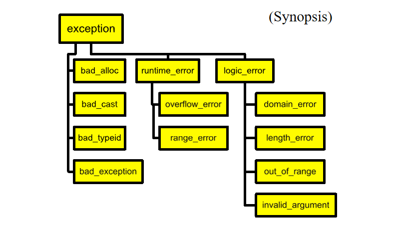

```c++ title="readFile.cpp" linenums="1"
errorCodeType readFile {
	initialize errorCode = 0;
	open the file;
	if ( theFilesOpen ) {
		determine its size;
		if ( gotTheFileLength ) {
			allocate that much memory;
			if ( gotEnoughMemory ) {
				read the file into memory;
				if ( readFailed ) {
					errorCode = -1;
				}
			} else {
				errorCode = -2;
			}
		} else {
			errorCode = -3;
		}
		close the file;
		if ( theFILEDidntClose && errorCode == 0 ) {
			errorCode = -4;
		} 	} else {
	errorCode = -5;
	}
	return errorCode;
}
```

- exception code可以帮助你了解想要执行的操作是什么

```c++ title="raise an exception" linenums="1"
template <class T>
T& Vector<T>::operator[](int indx) {
	if (indx < 0 || indx >= m_size) {
		// throw is a keyword
		// exception is raised at this point
		throw VectorIndexError(indx);
	}
	return m_elements[indx];
}

// What do you have? Data!
// Define a class to represent the error
class VectorIndexError {
public:
	VectorIndexError(int v) : m_badValue(v) { }
	~VectorIndexError() { }
	void diagnostic() {
		cerr << "index " << m_ badValue
		<< "out of range!"; }
private:
	int m_badValue;
};


int func() {
	Vector<int> v(12);
	v[3] = 5;
	int i = v[42]; // out of range
	// control never gets here!
	return i * 5;
}

void outer() {
	try {
		func(); func2();
	} catch (VectorIndexError& e) {
		e.diagnostic();
		// This exception does not propagate
	}
	cout << "Control is here after exception";
}

void outer2() {
    String err("exception caught");
    try {
        func();
    } catch (VectorIndexError) {
        cout << err;
        throw; // propagete the exception
    }
}

```

### Exception handlers
- C++的异常通过栈回退的方式去解决异常，找到匹配的catch块
- 如果一个异常被抛出但是没有被catch则会触发`std::terminate()`，使得程序中断，不过我们也可以自定义terminate的行为
- 通过类型来选择异常

```
catch (SomeType v){

}catch (...){

}
```

```c++ title="using inheritance" linenums="1"
class MathErr {
    ...
    virtual void diagnostic();
};

class OverflowErr : public MathErr {}

class UnderflowErr : public MathErr {}

class DivideByZeroErr : public MathErr {}

try {
    // code to exercise math options
    throw UnderflowErr();
} catch (DivideByZeroErr &e) {
    // handle zerp divide case
} catch (MathErr &e) {
    // handle other math errors;
} catch (...){
    // any other exceptions
}
```

#### Exceptions and new
- new 不会在失败的时候返回0，而是抛出一个`bad_alloc()`异常

```c++ title="new" linenums="1"
void func() {
    try {
        while(1) {
            char *p = new char[10000];
        }
    } catch (bad_alloc &e) {

    }
}
```

- 标准库异常



-  声明可能抛出的异常,如果未在列表中的异常抛出则触发`unexpceted`

```c++ title="throw" linenums="1"
Printer::print(Document&) : throw (BadDocument) {...}
```

- 不要用异常来代替良好的设计

#### Two stages construction

- Do nomal work
	- 初始化所有成员对象，首要成员，指针指向0，不要获取任何资源
- 在Init()中做额外的初始化工作

#### Exception	Hierarchies
- 先处理子类异常，再处理父类异常