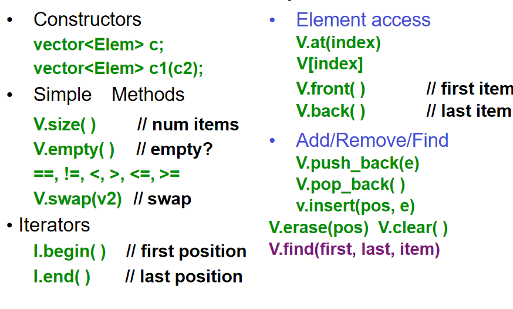

!!! attention "Attention"
    本文内容参考[菜鸟教程](https://www.runoob.com/cplusplus/cpp-vector.html)

> vector 是  C++ 标准模板库中的一种序列容器，可以在运行时动态地插入和删除元素.同时它可以自动管理内存的分配和释放.

**基本特性**
- 容器大小可变.
- 基于数组的数据结构，元素在内存中被连续存储，访问快速.
- 可for循环迭代访问元素.

在使用 vector 容器前，你需要引入头文件.
```c
#include <vector>
```

## 方法一览



#### 创建Vector容器

- type 为容器中元素的类型.
- 同时你可以指定初始化容器的大小，和初始值，以int为例.
```c
std::vector<type> vector_name;

std::vector<int> vector_name(size);
std::vector<int> vector_name(size, value);
std::vector<int> vector_name = {1, 2, 3, 4, 5};
```


#### 添加元素
- push_back() 函数，在容器尾部添加元素.

```c
vector_name.push_back(value);
```

#### 访问元素
可以用下标操作符\[\]或 at() 函数访问 vector 中的元素：
```c
int x = vector_name[index]; 
int x = vector_name.at(index);
```

#### 获取大小
- size() 函数，获取容器中元素的个数.
```c
int size = vector_name.size();
```

#### 迭代访问
你可以使用迭代器来遍历 vector 中的元素.
```c
for (auto it = vector_name.begin(); it != vector_name.end(); ++it) {
    std::cout << *it << " ";
}
```
或者使用范围循环：
```c
for (auto element : vector_name){
    std::cout << element << " ";
}
```
#### 删除元素
- pop_back() 函数，删除容器尾部的元素.
- erase() 函数，删除指定位置的元素.
```c
vector_name.pop_back();
vector_name.erase(vector_name.begin() + index);
vector_name.erase(vector_name.begin(), vector_name.begin() + index);
```

## List
- `push_back()` 函数，在容器尾部添加新的元素.`
- `push_front()` 函数，在容器头部添加新的元素.
- `remove(item)` 函数
- `pop_back()` 函数，删除容器尾部的元素.
- `pop_front()` 函数，删除容器头部的元素.
- `insert(pos, item)`


### 顺序插入
- 先找到列表的最后一个，然后进行插入
