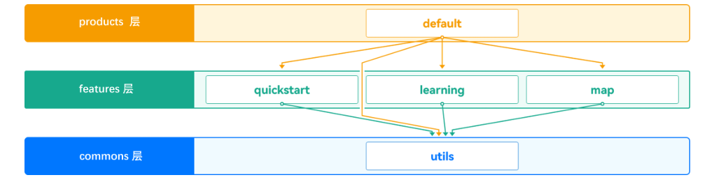
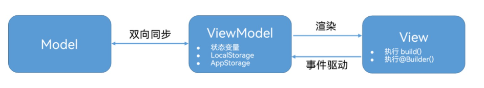

- `Index`是被`struct`关键字声明的一个数据结构
- `@Component`的修饰，使得`Index`能够组件化，并通过其实例的`build()`方法所描述的信息，生成对应的UI界面。
- `@Entry`修饰的`@Component`将作为UI页面的入口，同时单个UI页面中，只能使用一个`@Entry`修饰一个自定义组件。
- `@State`修饰的变量成为状态变量，其变量值的改变会引起相绑定的UI组件的刷新.
- `RelativeContainer`相对布局容器：允许容器内部子元素设置相对的位置关系
- `Text`:文本组件 | 紧跟一系列标识和属性
- `alignRules` : 指定设置相对容器中子组件的对齐规则，仅当父容器为`RelativeContainer`时有效
  - 前面的键表示子组件的对应位置`top`、`center`、`bottom`是竖直方向,`left`、`middle`、`right`是水平方向
  - `anchor`表示参照物，`align`表示对齐方式
```ts title="基础代码示例" linenums="1"
@Entry
@Component
struct Index {
  @State message: string = 'Hello World';

  build() {
    RelativeContainer() {
      Text(this.message)
        .id('HelloWorld') // 标识符
        .fontSize($r('app.float.page_text_font_size')) // 从/resource/base/element/float.json中获取值
        .fontWeight(FontWeight.Bold)
        .alignRules({
          center: { anchor: '__container__', align: VerticalAlign.Center },
          middle: { anchor: '__container__', align: HorizontalAlign.Center }
        })
        .onClick(() => {
          this.message = 'Welcome';
        })
    }
    .height('100%')
    .width('100%')
  }
}
```

```json title="float.json" linenums="1"
{
  "float": [
    {
      "name": "page_text_font_size",
      "value": "50fp"
    }
  ]
}

```

## 三层架构设计

- commons (公共能力层)：用于存放如工具库、公共配置等的公共基础能力集合
  - commons层可编译成一个或多个HAR包或HSP包，只可以被products和features依赖，不可以反向依赖

- features（基础特性层）：用于存放基础特性集合（如应用中相对独立的各个功能的UI及业务逻辑实现等）
  - 不需要单独部署的feature通常编译为HAR包或HSP包，供products或其它feature使用。
  - 需要单独部署的feature通常编译为Feature类型的HAP包，和products下Entry类型的HAP包进行组合部署
  - features层可以横向调用及依赖common层，同时可以被products层不同设备形态的HAP所依赖，但是不能反向依赖products层

- products（产品定制层）：用于针对不同设备形态进行功能和特性集成。products层各个子目录各自编译为一个Entry类型的HAP包，作为应用主入口。products层不可以横向调用



## 应用架构设计基础————MVVM模式

- 适用于单模块内文件组织

MVVM = Model + View + ViewModel



- 常见的数据结构放在model文件夹中,
- UI组件放在view文件夹中，并对组件命名

- 独立文件的内用要被使用则需要`export`

```ts title="export" linenums="1"
export class BannerClass {}
```

- 使用时则使用`import`

```ts title="import" linenums="1"
import {ArticleClass} from '../model/ArticleClass';
```

- rawfile目录中的资源文件会被直接打包进应用，不经过编译，也不会被赋予资源文件ID。通过指定文件路径和文件名引用。

### 获取数据
```ts title='获取数据示例' linenums='1'
getBannerDataFromJSON() {
    this.getUIContext().getHostContext()?.resourceManager.getRawFileContent('BannerData.json').then(value => {
      // 获取buffer内容并转换为字符串
      // 解析为数据结构
    });
  }
```

- resourceManager获得的时Uint8Arry类型，还需要将其转换成字符串
  - 新建util文件夹，创建公共方法

#### 获取字符串数据
```ts title='获取字符串数据示例' linenums='1'
import { util } from '@kit.ArkTS';
// 先导入工具包，再利用工具函数来返回结果
export function bufferToString(buffer: Uint8Array): string {
  let textDecoder = util.TextDecoder.create('utf-8', {
    ignoreBOM: true
  });
  let resultPut = textDecoder.decodeToString(buffer);
  return resultPut;

  // 获取buffer内容并转换为字符串
  let res: string = bufferToString(value);
  // 解析为数据结构
  this.bannerList = JSON.parse(res) as BannerClass[];
}
```
## 循环渲染

- `arr`:传入任意类型的数组
- `itemGenerator`: 按顺序读取数组中的每项，生成函数体中的组件
- `keyGenerator`: 当数组元素更新时，判断其渲染是否已经存在，是吓死你增量更新.
```ts title="循环渲染" linenums="1"
ForEach(
  arr: Array,
  itemGenerator: (item: any, index?: number) => void,
  keyGenerator?: (item: any, index?: number) => string
)
```

## 变量
- ResourceStr类型，其为Resource类型与string类型的联合类型。Resource类型在加载本地图片资源时会用到的，而string类型在加载网络图片资源时会用到
- 数组变量

```ts title="数组变量" linenums="1"
@State bannerList: Array<BannerClass> = [
    new BannerClass(...),
    ...
  ];
```
## 声明方式
- 变量声明 `id: string = '';`

- 函数声明

```ts title="函数声明" linenums="1"
constructor(id: string, imageSrc: ResourceStr, url: string) {
  this.id = id;
  this.imageSrc = imageSrc;
  this.url = url;
}
```
## 修饰器
- `@Preview`装饰组件可以单独预览组件
- `ImageFit.Contain`：保持宽高比缩放，小于等于容器边
- `ImageFit.Cover`：保持宽高比缩放，大于等于容器边

```ts title="预览" linenums="1"
@Preview
@Component
struct Banner {
  build(){
    Image($r('app.media.banner_pic1'))
      .objectFit(ImageFit.Contain) 
  }
}
```

- `@Prop`:装饰器，该装饰器用于从父组件接收数据
  - 加上后`@Preview`会失效

## 属性添加
### Text属性
- `.textOverflow({overflow: TextOverflow.Ellipsis})` : 超出的以...显示
- 色彩：`.fontColor('rgba(0, 0, 0, 0.6)')`
- value值要以字符串形式增加例如`.backgroundColor('#000000')`

### 容器属性
- `layoutWeight`:属性，取值为1，表示它们在任意尺寸的设备下自适应占满剩余空间。

- `entry/src/main/resources/base/element/string.json`中修改`EntryAbility_label`的值可以修改APP名称
## 调试
- Previewer工具栏的Inspector工具能够查看组件树，并与元素交互
## 组件

- Swiper组件能够提供滑动轮播的效果

## 容器
- Grid组件是网格容器，由“行”和“列”来分割单元格，容器中每一个条目对应一个GridItem组件，如果仅仅设置行列数量与占比之间的一个，元素就会按设置的方向来排列，超出显示范围后就能够滚动。
- Row容器，是水平布局的容器
- Column容器，是垂直布局的容器
- List容器，可以快速现实可滚动的信息
  - 适合用于呈现同类数据类型或数据类型集
  - 内部元素用`ListItem`声明
- Grid容器，网格布局容器：内部元素要用`GridItem`声明
  - `rowsTemplate和columnsTemplate`:属性值是一个由多个空格和'数字+fr'间隔拼接的字符串，fr的个数即网格布局的行或列数，fr前面的数值大小，用于计算该行或列在网格布局宽度上的占比
  - `.columnsGap(8)`：设置列间距
- Scroll容器，滚动容器
  - `.scrollBar(BarState.Off)`：消除滚动条的显示
  - 

## 常见问题
- hvigor Create hvigor server failed. No Idle daemon can be found. 
  - 网上的教程：目前只能使用Win10系统，或者将软件安装到默认盘
  - 实际上：Harmony JDK没装， 去settings里找Harmonyjdk 把该安装的安装了就行了
  - 第二天启动又出现相同问题：薛定谔的错误，重启后成功解决。|重复重启后，有几率失败（无法定位错误）

### 预览器的限制

- 预览器不支持JSON格式解析