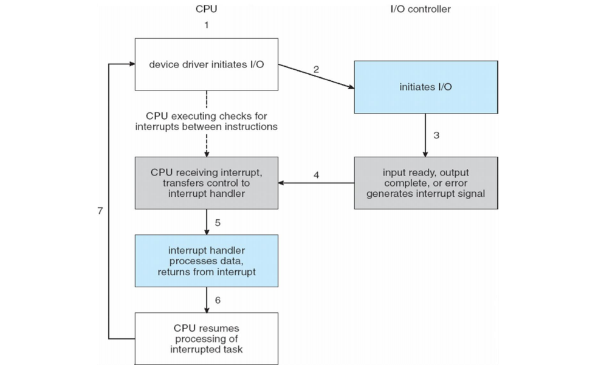
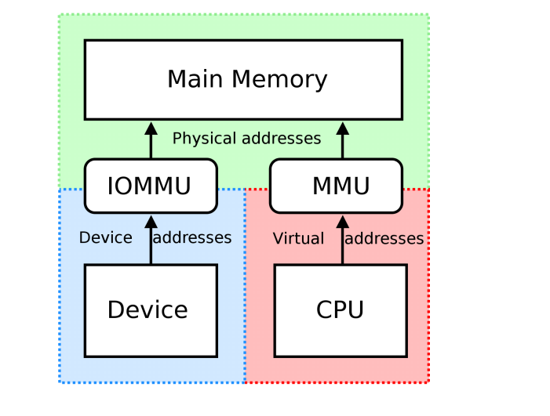

## I/O Hardware

基本概念

- 总线bus：和部件之间交流
- 端口port：和设备的连接点
- 控制器controller：控制设备

两种访问方式：轮询（polling）和中断（interrupt）

- 轮询：如果设备忙碌则等待，向设备控制器发送指令，读取寄存器状态直到指令被执行完毕，读取执行状态，可能重置设备状态

```c title="轮询" linenums="1"
static char ns16550a_getchar(){
	if (uart[UART_LSR) & UART_LSR_DA) {
		return uart[UART_RBR);
	} else {
		return -1;
	}
}

static void ns16550a_putchar(char ch) {
	while ((uart[UART_LSR) & UART_LSR_RE) == 0);
	uart[UART_THR) = ch;
}
```

- 中断：设备驱动向控制器发送指令，然后返回。处理器指令被中断，先处理IO

**SMP IRQ Affinity**



- 有些CPU架构有专门的 I/O 指令：x86：in,out,ins,outs
- 设备一般有为数据和控制I/O准备的寄存器
- 通常1-4比特，或是先进先出的缓冲


### Direct Memory Access

直接在I/O和内存之间传输数据

- 但是也会引发安全问题


- 向DMA控制器发送指令

**IOMMU**：将设备地址翻译成物理地址



### IO设备类型

- block I/O：在块中访问数据（例如磁盘驱动）read,write,seek
- character I/O:(Stream)
- memory-mapped file access
- network sockets
	- 将互联网协议和具体的互联网操作分离

Clocks and Timers ： 提供当前时间、经过时间

**Synchronous I/O**: 同步IO

- blocking IO: 进程悬挂直到IO完成
- non-blocking IO： 当能返回数据时就返回

锁：强制锁（一定要检查锁，遵循规则），咨询锁（有义务检查，但不强制）

**Asynchronous IO** ：异步IO

- 当IO执行时，进程也在执行

### 子系统

- IO调度
- 缓冲
- 缓存
- Spooling
- Device reservation