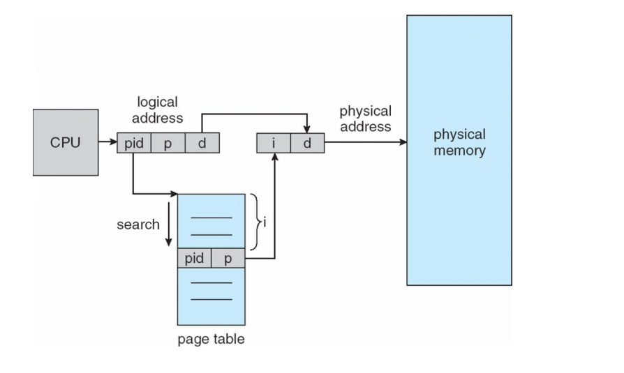
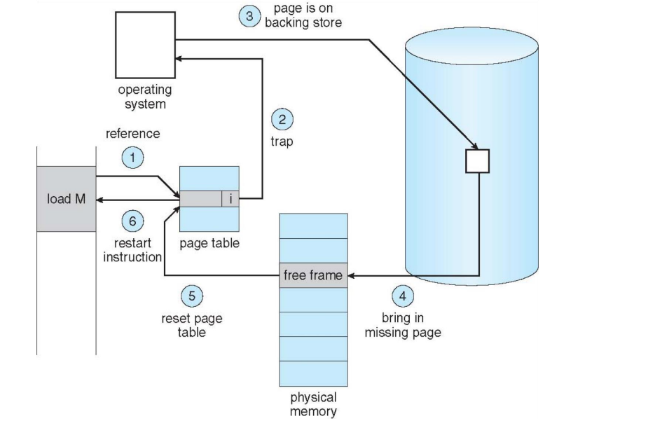

### 分页（Paging）

- 将物理内存分为固定大小的块称为帧frames
- 将逻辑内存分成同样大小的块称为页

逻辑地址分成：page number + page offset

#### 页表

实际中只有 48位的地址映射

- 用寄存器存储：虽然快，但太小
- 在主存中存储，使用页表基地址寄存器（PTBR）来指向页表
- 页表长度寄存器（PTLR）来表示页表的大小

**TLB 优化**:页表的缓存

多级页表：page directory number + page table number + page offset

反置页表：Inverted Page Table：所有进程共用同一个页表

### Demand Paging

- 仅当其被访问时，将页存到内存中

触发**page fault**

#### Copy-on-Write

- 子进程和父进程共享页，直到需要写入页

**页替换**：根据策略找到victim

- FIFO
- Optimal:交换最长时间不被使用的页
- LRU：Counter-based / Stack-based
	- Second-chance algorithm:Generally FIFO, 硬件提供引用位
		- 引用位为0则替换，引用位为1则置零，检查下一个
	- Enhanced Second-Chance（reference，modify）
- Page-Buffering 空闲帧的池，修改页的链表

- 全局替换或局部替换

Reclaiming Pages： 全局替换策略->当空闲链表低于一定阈值旧开始页替换，这样永远有足够的空间去满足新请求

**Major page fault**:页被引用但不在内存中

**Minor page fault**：页在内存中，但映射不存在

#### Thrashing摇摆问题

- 在增加并行性和CPU利用率时如果没有足够的页，则可能产生反复的page fault

**解决办法**

- 局部页替换，不影响其它进程
- 为一个进程尽可能提供他所需要的页

### Buddy System

二的整数倍内存分配，相邻空闲块可以合并成更大的

$TLB\_reach = (TLB\_size)\times(page\_size)$

**Lazy swapper**：仅当有需要时才替换内存中的页

##### Slab Allocator

- 申请内存与再划分
- 对象的缓存：包括一个或多个slabs
- 一个slab包括一个或多个页，被分为大小相同的对象
- 三个状态：
	- Full-all used
	- Empty - all free
	- Partial - mix of free and used

